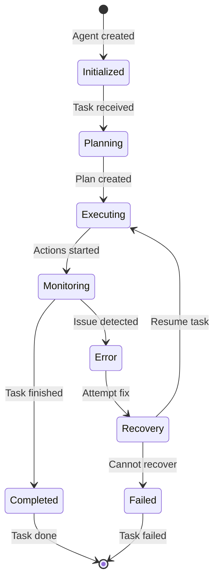

# Chapter 1: Getting Started with AgentGPT

Welcome to AgentGPT! If you've ever dreamed of building AI systems that can think, plan, and execute tasks autonomously, you're in the right place. AgentGPT opens up the fascinating world of autonomous AI agents - systems that can break down complex objectives and accomplish them with minimal human intervention.

## What Makes AgentGPT Special?

AgentGPT revolutionizes AI development by enabling:
- **Autonomous task execution** - Agents that work independently toward goals
- **Intelligent planning** - Breaking complex objectives into manageable steps
- **Tool integration** - Connecting to external APIs, databases, and services
- **Continuous learning** - Agents that improve through experience
- **Safe operation** - Built-in safeguards and monitoring systems

## Installing AgentGPT

### Local Development Setup

```bash
# Clone the AgentGPT repository
git clone https://github.com/reworkd/AgentGPT.git
cd AgentGPT

# Install dependencies
npm install
# or
yarn install

# Set up environment variables
cp .env.example .env.local

# Edit .env.local with your API keys
echo "OPENAI_API_KEY=your-openai-key-here" >> .env.local
echo "ANTHROPIC_API_KEY=your-anthropic-key-here" >> .env.local

# Start development server
npm run dev
# or
yarn dev
```

### Docker Setup

```bash
# Run with Docker Compose
docker-compose up -d

# Or build and run manually
docker build -t agentgpt .
docker run -p 3000:3000 -e OPENAI_API_KEY=your-key agentgpt
```

## Your First Autonomous Agent

Let's create your first AI agent that can work toward a goal:

### Step 1: Define Agent Configuration

```javascript
const agentConfig = {
  name: "ResearchAssistant",
  goal: "Research the latest developments in quantum computing",
  role: "You are a research assistant specializing in technology trends",
  capabilities: [
    "web_search",
    "data_analysis",
    "report_generation"
  ],
  constraints: [
    "Use only reputable sources",
    "Provide citations for all claims",
    "Complete research within 30 minutes"
  ],
  tools: [
    "web_browser",
    "calculator",
    "file_writer"
  ]
};
```

### Step 2: Initialize the Agent

```javascript
import { AgentGPT } from '@agentgpt/core';

const agent = new AgentGPT(agentConfig);

// Start the agent
await agent.initialize();
console.log(`Agent ${agent.name} initialized and ready to work!`);
```

### Step 3: Give the Agent a Task

```javascript
const task = {
  description: "Find and summarize the 5 most important quantum computing breakthroughs from 2023",
  priority: "high",
  deadline: new Date(Date.now() + 30 * 60 * 1000), // 30 minutes
  deliverables: [
    "Summary report",
    "Key findings",
    "Source citations"
  ]
};

// Execute the task
const result = await agent.executeTask(task);

console.log("Task completed!");
console.log("Results:", result);
```

## Understanding Agent Architecture

### Core Components

Every AgentGPT agent consists of several key components:

```
Agent System
├── Brain (LLM) - Decision making and reasoning
├── Memory - Context and experience storage
├── Tools - External capabilities and integrations
├── Planner - Task decomposition and strategy
├── Executor - Action implementation
└── Monitor - Performance tracking and safety
```

### Agent Lifecycle



## How Agents Think and Act

### The Reasoning Process

```javascript
class AgentReasoning {
  async think(task) {
    // 1. Analyze the task
    const analysis = await this.analyzeTask(task);

    // 2. Break down into subtasks
    const subtasks = await this.decomposeTask(analysis);

    // 3. Plan execution strategy
    const plan = await this.createPlan(subtasks);

    // 4. Identify required tools
    const tools = await this.selectTools(plan);

    return { plan, tools };
  }

  async act(plan, tools) {
    // Execute the plan step by step
    for (const step of plan.steps) {
      const result = await this.executeStep(step, tools);
      await this.updateProgress(result);
    }

    return this.compileResults();
  }
}
```

### Decision Making Flow

```javascript
async makeDecision(context) {
  // 1. Assess current situation
  const situation = await this.assessSituation(context);

  // 2. Consider available options
  const options = await this.generateOptions(situation);

  // 3. Evaluate each option
  const evaluations = await Promise.all(
    options.map(option => this.evaluateOption(option, context))
  );

  // 4. Choose best option
  const bestOption = this.selectBestOption(evaluations);

  // 5. Execute decision
  return await this.executeDecision(bestOption);
}
```

## Building Your First Custom Agent

Let's create a practical agent that can help with research tasks:

```javascript
import { BaseAgent, Tool, Memory } from '@agentgpt/core';

class ResearchAgent extends BaseAgent {
  constructor(config) {
    super(config);
    this.name = "ResearchAgent";
    this.expertise = "Technology Research";

    // Initialize tools
    this.tools = this.initializeTools();

    // Set up memory
    this.memory = new Memory({
      type: 'vector',
      capacity: 1000,
      persistence: true
    });
  }

  initializeTools() {
    return [
      new WebSearchTool({
        name: 'web_search',
        description: 'Search the web for information'
      }),
      new DataAnalysisTool({
        name: 'data_analysis',
        description: 'Analyze and summarize data'
      }),
      new ReportGeneratorTool({
        name: 'report_generator',
        description: 'Generate formatted reports'
      })
    ];
  }

  async executeTask(task) {
    try {
      // 1. Plan the research approach
      const plan = await this.createResearchPlan(task);

      // 2. Execute research steps
      const findings = await this.executeResearch(plan);

      // 3. Analyze and synthesize results
      const analysis = await this.analyzeFindings(findings);

      // 4. Generate final report
      const report = await this.generateReport(analysis, task);

      // 5. Store in memory for future reference
      await this.memory.store({
        type: 'research_result',
        task: task.description,
        findings: findings,
        report: report
      });

      return {
        success: true,
        report: report,
        sources: findings.sources,
        timestamp: new Date().toISOString()
      };

    } catch (error) {
      console.error('Research task failed:', error);
      return {
        success: false,
        error: error.message,
        timestamp: new Date().toISOString()
      };
    }
  }

  async createResearchPlan(task) {
    const prompt = `
    Create a research plan for: ${task.description}

    Break this down into specific, actionable steps.
    Consider:
    - What information do we need?
    - What sources should we check?
    - How should we validate findings?
    - What format should the final output be?

    Return a JSON object with 'steps' array containing research steps.
    `;

    const response = await this.llm.call(prompt);
    return JSON.parse(response.content);
  }

  async executeResearch(plan) {
    const findings = {
      sources: [],
      data: [],
      insights: []
    };

    for (const step of plan.steps) {
      console.log(`Executing: ${step.description}`);

      const result = await this.executeResearchStep(step);
      findings.sources.push(...result.sources);
      findings.data.push(...result.data);
      findings.insights.push(...result.insights);
    }

    return findings;
  }

  async executeResearchStep(step) {
    // Use appropriate tools based on step type
    switch (step.type) {
      case 'web_search':
        return await this.tools.find(t => t.name === 'web_search')
          .execute(step.query);

      case 'data_analysis':
        return await this.tools.find(t => t.name === 'data_analysis')
          .execute(step.data);

      default:
        return { sources: [], data: [], insights: [] };
    }
  }

  async analyzeFindings(findings) {
    const analysisPrompt = `
    Analyze these research findings and extract key insights:

    Sources: ${JSON.stringify(findings.sources)}
    Data: ${JSON.stringify(findings.data)}

    Provide:
    1. Key findings
    2. Patterns and trends
    3. Contradictions or gaps
    4. Recommendations
    `;

    const response = await this.llm.call(analysisPrompt);
    return response.content;
  }

  async generateReport(analysis, task) {
    const reportPrompt = `
    Generate a comprehensive research report for: ${task.description}

    Analysis: ${analysis}

    Format the report with:
    - Executive summary
    - Key findings
    - Detailed analysis
    - Conclusions
    - Recommendations
    - Sources cited
    `;

    const response = await this.llm.call(reportPrompt);
    return response.content;
  }
}

// Usage
const researchAgent = new ResearchAgent({
  llm: 'gpt-4',
  temperature: 0.3,
  maxTokens: 2000
});

const task = {
  description: "Analyze the impact of AI on software development productivity",
  priority: "high"
};

const result = await researchAgent.executeTask(task);
console.log("Research completed:", result.report);
```

## Agent Configuration and Customization

### Basic Configuration

```javascript
const agentConfig = {
  // Core settings
  name: "CustomAgent",
  version: "1.0.0",
  description: "A specialized AI agent",

  // LLM settings
  llm: {
    provider: "openai",
    model: "gpt-4",
    temperature: 0.7,
    maxTokens: 2000
  },

  // Capabilities
  capabilities: [
    "task_planning",
    "tool_usage",
    "memory_management",
    "error_recovery"
  ],

  // Tools
  tools: [
    {
      name: "web_browser",
      description: "Browse and extract information from websites",
      config: { timeout: 30000 }
    },
    {
      name: "calculator",
      description: "Perform mathematical calculations",
      config: { precision: 4 }
    }
  ],

  // Memory settings
  memory: {
    type: "vector",
    capacity: 1000,
    persistence: true,
    storagePath: "./agent_memory"
  },

  // Safety settings
  safety: {
    maxIterations: 50,
    timeout: 300000, // 5 minutes
    riskThreshold: 0.8,
    humanApproval: false
  },

  // Monitoring
  monitoring: {
    logLevel: "info",
    metrics: true,
    tracing: true
  }
};
```

### Advanced Configuration

```javascript
// Multi-agent configuration
const multiAgentConfig = {
  agents: [
    {
      name: "ResearchAgent",
      role: "Information gathering and analysis",
      capabilities: ["web_search", "data_analysis"]
    },
    {
      name: "PlanningAgent",
      role: "Task planning and strategy",
      capabilities: ["task_decomposition", "risk_assessment"]
    },
    {
      name: "ExecutionAgent",
      role: "Action execution and tool usage",
      capabilities: ["api_calls", "file_operations"]
    }
  ],

  collaboration: {
    communication: "message_passing",
    coordination: "central_planner",
    conflictResolution: "voting"
  },

  sharedResources: {
    memory: "distributed",
    tools: "shared_pool",
    knowledge: "common_base"
  }
};
```

## What We've Accomplished

Congratulations! 🎉 You've successfully:

1. **Installed AgentGPT** and set up your development environment
2. **Created your first autonomous AI agent** with goal-oriented behavior
3. **Understood the core architecture** of autonomous agent systems
4. **Built a custom research agent** with planning and execution capabilities
5. **Implemented tool integration** for external service access
6. **Set up memory management** for context retention and learning

## Next Steps

Now that you understand the basics of autonomous agents, let's explore the architectural patterns that make AgentGPT so powerful. In [Chapter 2: Agent Architecture & Design](02-agent-architecture.md), we'll dive into the design principles and patterns for building robust autonomous systems.

---

**Practice what you've learned:**
1. Modify the research agent to focus on a different domain
2. Add new tools to your agent (like email sending or file processing)
3. Create an agent that can learn from its mistakes and improve over time
4. Experiment with different planning strategies for complex tasks

*What kind of autonomous agent would you build first?* 🤖
