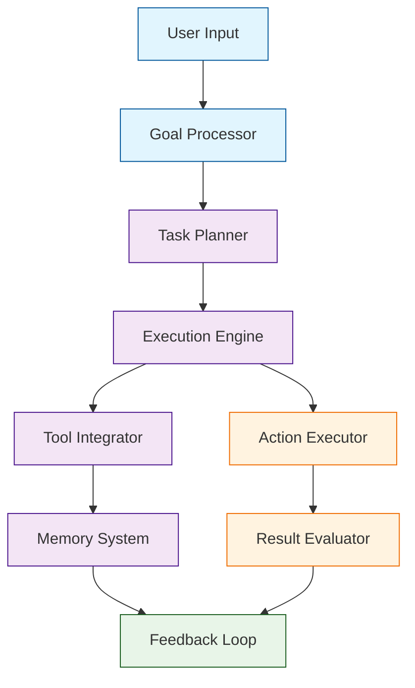

# Chapter 2: Agent Architecture & Design

This chapter explores the fundamental architecture of autonomous AI agents in AgentGPT, including agent components, design patterns, and core principles.

## 🏗️ Agent Architecture Overview

### Core Components

AgentGPT agents consist of several key components working together:



### Agent Types

#### 1. Task-Oriented Agents
```typescript
// Focused on completing specific tasks
const taskAgent = {
  role: "task_executor",
  capabilities: ["planning", "execution", "monitoring"],
  tools: ["web_search", "file_operations", "api_calls"],
  goal: "Complete assigned task efficiently"
}
```

#### 2. Research Agents
```typescript
// Specialized in information gathering and analysis
const researchAgent = {
  role: "researcher",
  capabilities: ["web_search", "data_analysis", "synthesis"],
  tools: ["search_engines", "databases", "analysis_tools"],
  goal: "Gather and synthesize information"
}
```

#### 3. Creative Agents
```typescript
// Focused on creative tasks and content generation
const creativeAgent = {
  role: "creator",
  capabilities: ["content_generation", "design", "innovation"],
  tools: ["writing_tools", "design_software", "creative_apis"],
  goal: "Generate creative content and solutions"
}
```

## 🎯 Agent Design Patterns

### Singleton Agent Pattern
```typescript
// Single-purpose agent for specific tasks
class SingletonAgent {
  constructor(config) {
    this.name = config.name
    this.capabilities = config.capabilities
    this.tools = config.tools
    this.memory = new MemorySystem()
  }

  async execute(task) {
    const plan = await this.plan(task)
    const result = await this.perform(plan)
    await this.memory.store(task, result)
    return result
  }
}
```

### Multi-Agent Collaboration Pattern
```typescript
// Multiple agents working together
class MultiAgentSystem {
  constructor() {
    this.agents = {
      planner: new PlanningAgent(),
      executor: new ExecutionAgent(),
      reviewer: new ReviewAgent()
    }
    this.communication = new AgentCommunication()
  }

  async collaborate(task) {
    const plan = await this.agents.planner.createPlan(task)
    const result = await this.agents.executor.executePlan(plan)
    const review = await this.agents.reviewer.evaluate(result)
    return { result, review }
  }
}
```

### Hierarchical Agent Pattern
```typescript
// Agents organized in hierarchy
class HierarchicalAgent {
  constructor() {
    this.manager = new ManagerAgent()
    this.workers = [
      new WorkerAgent('research'),
      new WorkerAgent('analysis'),
      new WorkerAgent('execution')
    ]
  }

  async process(task) {
    const subtasks = await this.manager.decompose(task)
    const results = await Promise.all(
      this.workers.map((worker, index) =>
        worker.process(subtasks[index])
      )
    )
    return await this.manager.synthesize(results)
  }
}
```

## 🧠 Agent Intelligence Levels

### Level 1: Reactive Agents
```typescript
// Simple stimulus-response agents
class ReactiveAgent {
  async respond(input) {
    const pattern = this.matchPattern(input)
    return this.getResponse(pattern)
  }
}
```

### Level 2: Goal-Oriented Agents
```typescript
// Agents with goals and planning
class GoalOrientedAgent {
  async achieve(goal) {
    const plan = await this.createPlan(goal)
    const actions = await this.decomposePlan(plan)
    return await this.executeActions(actions)
  }
}
```

### Level 3: Learning Agents
```typescript
// Agents that learn and adapt
class LearningAgent {
  constructor() {
    this.experience = new ExperienceBuffer()
    this.learning = new ReinforcementLearning()
  }

  async learn(experience) {
    this.experience.add(experience)
    await this.learning.update(this.experience.getBatch())
  }

  async decide(state) {
    const action = await this.learning.predict(state)
    const result = await this.execute(action)
    await this.learn({ state, action, result })
    return result
  }
}
```

## 🛠️ Agent Capabilities Framework

### Core Capabilities
```typescript
const agentCapabilities = {
  perception: {
    text: "Process and understand text input",
    vision: "Analyze images and visual content",
    audio: "Process speech and audio input"
  },

  cognition: {
    reasoning: "Logical reasoning and problem solving",
    planning: "Create and execute plans",
    learning: "Learn from experience and feedback"
  },

  action: {
    communication: "Send messages and notifications",
    manipulation: "Modify data and environments",
    integration: "Connect with external systems"
  }
}
```

### Capability Configuration
```typescript
// Configure agent capabilities
const agentConfig = {
  name: "AdvancedAgent",
  version: "2.0",
  capabilities: [
    "text_processing",
    "web_search",
    "data_analysis",
    "api_integration",
    "file_operations"
  ],
  constraints: {
    maxExecutionTime: 300000, // 5 minutes
    maxMemoryUsage: "512MB",
    rateLimit: 100 // requests per minute
  }
}
```

## 🎨 Agent Personality & Behavior

### Personality Traits
```typescript
// Define agent personality
const agentPersonality = {
  traits: {
    helpfulness: 0.9,
    creativity: 0.7,
    analytical: 0.8,
    cautious: 0.6
  },

  communication: {
    style: "professional",
    tone: "encouraging",
    verbosity: "concise"
  },

  decisionMaking: {
    riskTolerance: 0.4,
    confidenceThreshold: 0.7,
    fallbackStrategy: "ask_for_clarification"
  }
}
```

### Behavior Patterns
```typescript
// Define behavior patterns
const behaviorPatterns = {
  greeting: "Warm and professional welcome",
  error: "Helpful error explanation with solutions",
  success: "Positive reinforcement and next steps",
  uncertainty: "Seek clarification before proceeding",
  completion: "Summary of achievements and follow-up"
}
```

## 🔧 Agent Configuration Management

### Configuration Schema
```typescript
// Agent configuration schema
const agentSchema = {
  type: "object",
  properties: {
    name: { type: "string", minLength: 1 },
    description: { type: "string" },
    capabilities: {
      type: "array",
      items: { type: "string" }
    },
    tools: {
      type: "array",
      items: { type: "string" }
    },
    personality: {
      type: "object",
      properties: {
        helpfulness: { type: "number", minimum: 0, maximum: 1 },
        creativity: { type: "number", minimum: 0, maximum: 1 }
      }
    },
    constraints: {
      type: "object",
      properties: {
        maxExecutionTime: { type: "number" },
        maxMemoryUsage: { type: "string" }
      }
    }
  },
  required: ["name", "capabilities"]
}
```

### Configuration Validation
```typescript
// Validate agent configuration
function validateAgentConfig(config) {
  const errors = []

  if (!config.name) {
    errors.push("Agent name is required")
  }

  if (!config.capabilities || config.capabilities.length === 0) {
    errors.push("At least one capability must be specified")
  }

  if (config.constraints?.maxExecutionTime < 0) {
    errors.push("Max execution time must be positive")
  }

  return {
    valid: errors.length === 0,
    errors
  }
}
```

## 🚀 Advanced Agent Patterns

### Agent Factory Pattern
```typescript
// Create agents based on requirements
class AgentFactory {
  static createAgent(type, config) {
    switch (type) {
      case 'researcher':
        return new ResearchAgent(config)
      case 'executor':
        return new ExecutionAgent(config)
      case 'analyst':
        return new AnalysisAgent(config)
      default:
        throw new Error(`Unknown agent type: ${type}`)
    }
  }

  static createFromTemplate(templateName, overrides = {}) {
    const template = this.getTemplate(templateName)
    return this.createAgent(template.type, { ...template.config, ...overrides })
  }
}
```

### Agent Registry Pattern
```typescript
// Registry for managing multiple agents
class AgentRegistry {
  constructor() {
    this.agents = new Map()
    this.capabilities = new Map()
  }

  register(agent) {
    this.agents.set(agent.name, agent)

    // Index capabilities
    agent.capabilities.forEach(capability => {
      if (!this.capabilities.has(capability)) {
        this.capabilities.set(capability, [])
      }
      this.capabilities.get(capability).push(agent.name)
    })
  }

  findAgentsByCapability(capability) {
    return this.capabilities.get(capability) || []
  }

  getAgent(name) {
    return this.agents.get(name)
  }
}
```

## 📊 Agent Performance Metrics

### Performance Tracking
```typescript
// Track agent performance
const performanceTracker = {
  metrics: {
    tasksCompleted: 0,
    averageExecutionTime: 0,
    successRate: 0,
    errorRate: 0
  },

  trackExecution(agent, task, result, duration) {
    this.metrics.tasksCompleted++

    if (result.success) {
      this.metrics.successRate =
        (this.metrics.successRate + 1) / this.metrics.tasksCompleted
    } else {
      this.metrics.errorRate =
        (this.metrics.errorRate + 1) / this.metrics.tasksCompleted
    }

    this.metrics.averageExecutionTime =
      (this.metrics.averageExecutionTime + duration) / this.metrics.tasksCompleted
  },

  getMetrics() {
    return { ...this.metrics }
  }
}
```

## 📝 Chapter Summary

- ✅ Understood agent architecture components
- ✅ Explored different agent types and patterns
- ✅ Learned agent design principles
- ✅ Configured agent capabilities and constraints
- ✅ Defined agent personality and behavior
- ✅ Implemented advanced agent patterns
- ✅ Set up performance tracking

**Key Takeaways:**
- Agent architecture follows modular design principles
- Different agent types serve different purposes
- Capabilities define what agents can do
- Personality affects agent behavior and interaction
- Performance tracking enables optimization
- Design patterns provide reusable solutions
