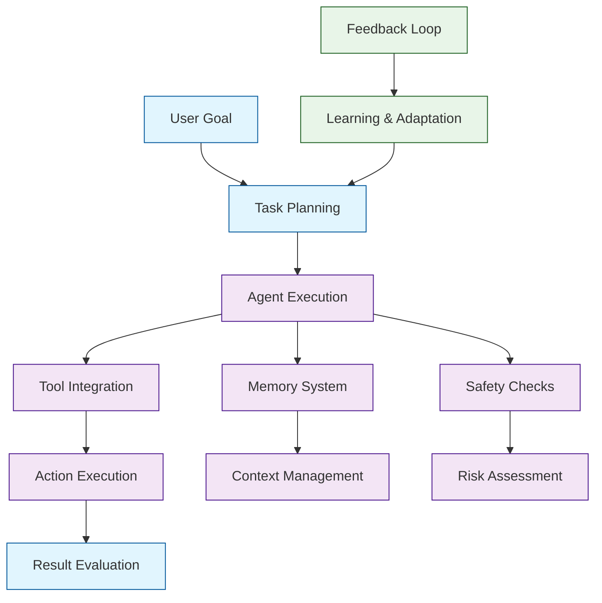

# AgentGPT Tutorial: Building Autonomous AI Agents

> This tutorial is AI-generated! To learn more, check out [Awesome Code Docs](https://github.com/johnxie/awesome-code-docs)

AgentGPT[View Repo](https://github.com/reworkd/AgentGPT) is a platform for creating and deploying autonomous AI agents that can perform complex tasks, make decisions, and execute actions independently. It demonstrates advanced patterns in AI agent development, including goal-oriented planning, tool integration, and autonomous execution.

AgentGPT shows how to build AI systems that can break down complex objectives into manageable tasks, use various tools and APIs, and execute plans autonomously while maintaining safety and reliability.

## Tutorial Chapters

Welcome to your journey through autonomous AI agent development! This tutorial explores how to build intelligent agents that can plan, execute, and learn autonomously.

1. **[Chapter 1: Getting Started with AgentGPT](01-getting-started.md)** - Installation, basic setup, and your first autonomous agent
2. **[Chapter 2: Agent Architecture & Design](02-agent-architecture.md)** - Understanding agent components and design patterns
3. **[Chapter 3: Task Planning & Goal Setting](03-task-planning.md)** - Breaking down objectives into executable plans
4. **[Chapter 4: Tool Integration & APIs](04-tool-integration.md)** - Connecting agents to external tools and services
5. **[Chapter 5: Memory & Context Management](05-memory-management.md)** - Managing agent state and conversation history
6. **[Chapter 6: Safety & Reliability](06-safety-reliability.md)** - Building safe and trustworthy autonomous systems
7. **[Chapter 7: Advanced Agent Patterns](07-advanced-patterns.md)** - Multi-agent systems and complex workflows
8. **[Chapter 8: Production Deployment](08-production-deployment.md)** - Scaling autonomous agents for real-world use

## What You'll Learn

By the end of this tutorial, you'll be able to:

- **Design autonomous AI agents** that can execute complex tasks independently
- **Implement goal-oriented planning** and task decomposition
- **Build tool integration systems** for external API access
- **Create memory management systems** for context retention
- **Develop safety mechanisms** for reliable agent operation
- **Deploy multi-agent systems** for collaborative problem-solving
- **Monitor and optimize agent performance** in production environments
- **Implement learning and adaptation** mechanisms for continuous improvement

## Prerequisites

- Intermediate Python programming knowledge
- Understanding of AI/ML concepts and APIs
- Familiarity with async programming patterns
- Basic knowledge of agent systems (helpful but not required)

## Learning Path

### 🟢 Beginner Track
Perfect for developers new to autonomous agents:
1. Chapters 1-2: Setup and basic agent architecture
2. Focus on understanding agent design principles

### 🟡 Intermediate Track
For developers building practical agent applications:
1. Chapters 3-5: Planning, tools, and memory systems
2. Learn to integrate agents with real-world systems

### 🔴 Advanced Track
For building production autonomous systems:
1. Chapters 6-8: Safety, multi-agent systems, and deployment
2. Master enterprise-grade autonomous agent development

---

**Ready to build autonomous AI agents? Let's begin with [Chapter 1: Getting Started](01-getting-started.md)!**

*Generated by [AI Codebase Knowledge Builder](https://github.com/The-Pocket/Tutorial-Codebase-Knowledge)*
