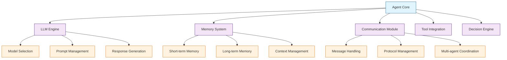

# Chapter 2: Agent Architecture & Roles

Welcome to the core of AutoGen! In this chapter, we'll explore the fundamental architecture of agents, understand different agent types, and learn how to design agents with specialized roles and capabilities. Understanding agent architecture is crucial for building effective multi-agent systems.

## Agent Architecture Fundamentals

### Core Components of an AutoGen Agent

Every AutoGen agent consists of several key architectural components that work together:



### Agent Lifecycle

```python
from autogen import AssistantAgent
from typing import Dict, Any, List
import time

class AgentLifecycle:
    def __init__(self, agent_config: Dict[str, Any]):
        self.agent = None
        self.state = "uninitialized"
        self.created_at = None
        self.last_active = None
        self.interaction_count = 0

    def initialize(self) -> bool:
        """Initialize the agent with given configuration"""
        try:
            self.agent = AssistantAgent(**self.agent_config)
            self.state = "initialized"
            self.created_at = time.time()
            return True
        except Exception as e:
            print(f"Failed to initialize agent: {e}")
            self.state = "failed"
            return False

    def activate(self) -> bool:
        """Activate the agent for interactions"""
        if self.state != "initialized":
            return False

        self.state = "active"
        self.last_active = time.time()
        return True

    def process_message(self, message: str) -> str:
        """Process an incoming message"""
        if self.state != "active":
            return "Agent is not active"

        self.interaction_count += 1
        self.last_active = time.time()

        # Process the message through the agent
        response = self.agent.generate_reply(
            messages=[{"role": "user", "content": message}]
        )

        return response

    def deactivate(self) -> bool:
        """Deactivate the agent"""
        if self.state == "active":
            self.state = "inactive"
            return True
        return False

    def get_status(self) -> Dict[str, Any]:
        """Get current agent status"""
        return {
            "state": self.state,
            "created_at": self.created_at,
            "last_active": self.last_active,
            "interaction_count": self.interaction_count,
            "uptime": time.time() - (self.created_at or time.time())
        }
```

## Agent Types and Roles

### 1. Assistant Agents

Assistant agents are the most common type, powered by large language models with specialized capabilities:

```python
from autogen import AssistantAgent
import os

# Basic assistant agent
basic_assistant = AssistantAgent(
    name="BasicAssistant",
    llm_config={
        "model": "gpt-4",
        "temperature": 0.7,
        "api_key": os.environ["OPENAI_API_KEY"]
    },
    system_message="You are a helpful AI assistant."
)

# Specialized assistant agent
technical_assistant = AssistantAgent(
    name="TechnicalAssistant",
    llm_config={
        "model": "gpt-4",
        "temperature": 0.3,
        "api_key": os.environ["OPENAI_API_KEY"]
    },
    system_message="""You are a technical assistant specializing in software development.
    You provide detailed, accurate technical information and code examples."""
)

# Creative assistant agent
creative_assistant = AssistantAgent(
    name="CreativeAssistant",
    llm_config={
        "model": "gpt-4",
        "temperature": 0.9,
        "api_key": os.environ["OPENAI_API_KEY"]
    },
    system_message="""You are a creative assistant who helps with content creation,
    brainstorming, and innovative problem-solving."""
)
```

### 2. User Proxy Agents

User proxy agents act as intermediaries between human users and other agents:

```python
from autogen import UserProxyAgent

# Basic user proxy
basic_proxy = UserProxyAgent(
    name="UserProxy",
    human_input_mode="ALWAYS",
    code_execution_config=False
)

# Automated user proxy (no human input)
automated_proxy = UserProxyAgent(
    name="AutomatedProxy",
    human_input_mode="NEVER",
    code_execution_config={
        "work_dir": "workspace",
        "use_docker": False
    }
)

# Code execution proxy
code_execution_proxy = UserProxyAgent(
    name="CodeExecutor",
    human_input_mode="TERMINATE",  # Ask for human input only on termination
    code_execution_config={
        "work_dir": "coding",
        "use_docker": "python:3.9-slim",
        "timeout": 60
    },
    system_message="""You are a coding assistant. When given a task:
    1. Analyze the requirements
    2. Write and test the code
    3. Provide clear explanations
    4. Handle errors gracefully"""
)
```

### 3. Function-Calling Agents

Function-calling agents can execute external functions and integrate with APIs:

```python
from autogen import AssistantAgent
import requests

def web_search(query: str) -> str:
    """Search the web for information"""
    # Implementation would use a search API
    return f"Search results for: {query}"

def calculate(expression: str) -> float:
    """Calculate mathematical expressions"""
    return eval(expression)

def get_weather(city: str) -> dict:
    """Get weather information for a city"""
    # Implementation would use a weather API
    return {"city": city, "temperature": 22, "condition": "sunny"}

# Function-calling agent
function_agent = AssistantAgent(
    name="FunctionAgent",
    llm_config={
        "model": "gpt-4",
        "api_key": os.environ["OPENAI_API_KEY"]
    },
    system_message="""You are an agent that can use various tools and functions.
    Always use the appropriate function when needed to complete tasks.""",
    function_map={
        "web_search": web_search,
        "calculate": calculate,
        "get_weather": get_weather
    }
)
```

### 4. Custom Agent Classes

For complex scenarios, you can create custom agent classes:

```python
from autogen import AssistantAgent
from typing import Dict, List, Any

class SpecializedAgent(AssistantAgent):
    def __init__(self, name: str, expertise: str, **kwargs):
        super().__init__(
            name=name,
            system_message=self._create_system_message(expertise),
            **kwargs
        )
        self.expertise = expertise
        self.knowledge_base = {}
        self.interaction_history = []

    def _create_system_message(self, expertise: str) -> str:
        return f"""You are a specialized agent with expertise in {expertise}.
        Your role is to provide accurate, detailed information about {expertise}.
        Always draw from your knowledge base and provide evidence for your claims."""

    def add_to_knowledge_base(self, topic: str, information: str):
        """Add information to the agent's knowledge base"""
        self.knowledge_base[topic] = information

    def search_knowledge_base(self, query: str) -> List[str]:
        """Search the knowledge base for relevant information"""
        relevant_info = []
        for topic, info in self.knowledge_base.items():
            if query.lower() in topic.lower() or query.lower() in info.lower():
                relevant_info.append(f"{topic}: {info}")
        return relevant_info

    def generate_reply(self, messages: List[Dict[str, Any]], **kwargs) -> str:
        """Override to add custom logic"""
        # Search knowledge base for relevant information
        user_message = messages[-1]["content"]
        relevant_knowledge = self.search_knowledge_base(user_message)

        # Add knowledge context to the message
        if relevant_knowledge:
            knowledge_context = "\n\nRelevant knowledge:\n" + "\n".join(relevant_knowledge)
            messages[-1]["content"] += knowledge_context

        # Record interaction
        self.interaction_history.append({
            "timestamp": time.time(),
            "user_message": user_message,
            "knowledge_used": len(relevant_knowledge)
        })

        # Generate response using parent method
        return super().generate_reply(messages, **kwargs)

# Usage
medical_agent = SpecializedAgent(
    name="MedicalAssistant",
    expertise="medical diagnosis and treatment",
    llm_config={"model": "gpt-4", "api_key": os.environ["OPENAI_API_KEY"]}
)

medical_agent.add_to_knowledge_base(
    "common_cold",
    "Common cold symptoms include runny nose, sore throat, cough, and mild fever"
)

medical_agent.add_to_knowledge_base(
    "flu_symptoms",
    "Flu symptoms include high fever, body aches, fatigue, and respiratory symptoms"
)
```

## Agent Role Design Patterns

### 1. Single Responsibility Principle

Each agent should have one primary responsibility:

```python
class DataAnalyzerAgent(AssistantAgent):
    def __init__(self):
        super().__init__(
            name="DataAnalyzer",
            system_message="""You are a data analysis specialist.
            Your ONLY responsibility is to analyze data and provide insights.
            Do not perform any other tasks.""",
            llm_config={"model": "gpt-4", "api_key": os.environ["OPENAI_API_KEY"]}
        )

class ReportWriterAgent(AssistantAgent):
    def __init__(self):
        super().__init__(
            name="ReportWriter",
            system_message="""You are a report writing specialist.
            Your ONLY responsibility is to create well-structured reports.
            Do not perform data analysis.""",
            llm_config={"model": "gpt-4", "api_key": os.environ["OPENAI_API_KEY"]}
        )
```

### 2. Hierarchical Agent Structure

```python
class ManagerAgent(AssistantAgent):
    def __init__(self, subordinates: List[AssistantAgent]):
        super().__init__(
            name="Manager",
            system_message="""You are a manager agent responsible for:
            1. Coordinating subordinate agents
            2. Assigning tasks based on agent capabilities
            3. Reviewing and synthesizing results
            4. Making final decisions""",
            llm_config={"model": "gpt-4", "api_key": os.environ["OPENAI_API_KEY"]}
        )
        self.subordinates = subordinates
        self.task_assignments = {}

    def assign_task(self, task: str, agent: AssistantAgent):
        """Assign a task to a specific agent"""
        self.task_assignments[task] = agent.name

    def get_agent_for_task(self, task: str) -> AssistantAgent:
        """Determine which agent should handle a task"""
        # Logic to match tasks to appropriate agents
        if "analyze" in task.lower():
            return self._find_agent_by_capability("analysis")
        elif "write" in task.lower():
            return self._find_agent_by_capability("writing")
        else:
            return self.subordinates[0]  # Default agent

    def _find_agent_by_capability(self, capability: str) -> AssistantAgent:
        """Find agent with specific capability"""
        for agent in self.subordinates:
            if hasattr(agent, 'capabilities') and capability in agent.capabilities:
                return agent
        return self.subordinates[0]
```

### 3. Collaborative Agent Teams

```python
from autogen import GroupChat, GroupChatManager

class CollaborativeTeam:
    def __init__(self):
        self.researcher = AssistantAgent(
            name="Researcher",
            system_message="Gather and analyze information",
            llm_config={"model": "gpt-4", "api_key": os.environ["OPENAI_API_KEY"]}
        )

        self.analyst = AssistantAgent(
            name="Analyst",
            system_message="Analyze data and draw conclusions",
            llm_config={"model": "gpt-4", "api_key": os.environ["OPENAI_API_KEY"]}
        )

        self.writer = AssistantAgent(
            name="Writer",
            system_message="Create clear, engaging content",
            llm_config={"model": "gpt-4", "api_key": os.environ["OPENAI_API_KEY"]}
        )

        self.reviewer = AssistantAgent(
            name="Reviewer",
            system_message="Review and improve quality",
            llm_config={"model": "gpt-4", "api_key": os.environ["OPENAI_API_KEY"]}
        )

    def create_group_chat(self):
        """Create a group chat for collaborative work"""
        groupchat = GroupChat(
            agents=[self.researcher, self.analyst, self.writer, self.reviewer],
            messages=[],
            max_round=10,
            speaker_selection_method="round_robin",
            allow_repeat_speaker=False
        )

        manager = GroupChatManager(
            groupchat=groupchat,
            llm_config={"model": "gpt-4", "api_key": os.environ["OPENAI_API_KEY"]}
        )

        return manager

    def execute_collaborative_task(self, task: str):
        """Execute a task using the collaborative team"""
        manager = self.create_group_chat()

        user_proxy = UserProxyAgent(
            name="ProjectManager",
            human_input_mode="NEVER",
            code_execution_config=False
        )

        result = user_proxy.initiate_chat(
            manager,
            message=task
        )

        return result
```

## Agent Configuration Best Practices

### Configuration Management

```python
import json
from typing import Dict, Any

class AgentConfigurationManager:
    def __init__(self):
        self.configurations = {}
        self.templates = {}

    def load_configuration(self, name: str, config_file: str):
        """Load agent configuration from file"""
        with open(config_file, 'r') as f:
            config = json.load(f)
            self.configurations[name] = config

    def create_agent_from_config(self, name: str) -> AssistantAgent:
        """Create agent from stored configuration"""
        if name not in self.configurations:
            raise ValueError(f"Configuration '{name}' not found")

        config = self.configurations[name]
        return AssistantAgent(**config)

    def save_template(self, name: str, template: Dict[str, Any]):
        """Save a configuration template"""
        self.templates[name] = template

    def create_agent_from_template(self, template_name: str, overrides: Dict[str, Any] = {}) -> AssistantAgent:
        """Create agent from template with optional overrides"""
        if template_name not in self.templates:
            raise ValueError(f"Template '{template_name}' not found")

        config = {**self.templates[template_name], **overrides}
        return AssistantAgent(**config)

# Usage
config_manager = AgentConfigurationManager()

# Save a template
config_manager.save_template("basic_assistant", {
    "name": "BasicAssistant",
    "llm_config": {
        "model": "gpt-4",
        "temperature": 0.7,
        "api_key": "${OPENAI_API_KEY}"
    },
    "system_message": "You are a helpful AI assistant."
})

# Create agent from template
agent = config_manager.create_agent_from_template("basic_assistant", {
    "name": "CustomAssistant",
    "system_message": "You are a specialized assistant."
})
```

### Environment-Based Configuration

```python
import os
from typing import Dict, Any

class EnvironmentConfig:
    @staticmethod
    def get_llm_config(model: str = "gpt-4") -> Dict[str, Any]:
        """Get LLM configuration from environment variables"""
        return {
            "model": model,
            "temperature": float(os.getenv("AGENT_TEMPERATURE", "0.7")),
            "max_tokens": int(os.getenv("AGENT_MAX_TOKENS", "2000")),
            "api_key": os.environ["OPENAI_API_KEY"]
        }

    @staticmethod
    def get_agent_config(agent_type: str) -> Dict[str, Any]:
        """Get agent configuration based on type and environment"""
        base_config = {
            "llm_config": EnvironmentConfig.get_llm_config(),
            "max_consecutive_auto_reply": int(os.getenv("MAX_AUTO_REPLY", "10")),
            "human_input_mode": os.getenv("HUMAN_INPUT_MODE", "NEVER")
        }

        # Type-specific configurations
        type_configs = {
            "assistant": {
                "system_message": "You are a helpful AI assistant."
            },
            "coder": {
                "system_message": "You are a coding assistant.",
                "code_execution_config": {
                    "work_dir": os.getenv("CODE_WORK_DIR", "workspace"),
                    "use_docker": os.getenv("USE_DOCKER", "false").lower() == "true"
                }
            },
            "researcher": {
                "system_message": "You are a research assistant.",
                "function_map": {
                    "web_search": lambda q: f"Searching for: {q}"  # Placeholder
                }
            }
        }

        if agent_type not in type_configs:
            raise ValueError(f"Unknown agent type: {agent_type}")

        return {**base_config, **type_configs[agent_type]}
```

## Advanced Agent Patterns

### Agent Factory Pattern

```python
class AgentFactory:
    @staticmethod
    def create_agent(agent_type: str, name: str, **kwargs) -> AssistantAgent:
        """Factory method for creating different types of agents"""
        if agent_type == "assistant":
            return AgentFactory._create_assistant_agent(name, **kwargs)
        elif agent_type == "coder":
            return AgentFactory._create_coder_agent(name, **kwargs)
        elif agent_type == "researcher":
            return AgentFactory._create_researcher_agent(name, **kwargs)
        else:
            raise ValueError(f"Unknown agent type: {agent_type}")

    @staticmethod
    def _create_assistant_agent(name: str, **kwargs) -> AssistantAgent:
        return AssistantAgent(
            name=name,
            system_message=kwargs.get("system_message", "You are a helpful assistant."),
            llm_config=kwargs.get("llm_config", EnvironmentConfig.get_llm_config())
        )

    @staticmethod
    def _create_coder_agent(name: str, **kwargs) -> AssistantAgent:
        return AssistantAgent(
            name=name,
            system_message=kwargs.get("system_message", "You are a coding assistant."),
            llm_config=kwargs.get("llm_config", EnvironmentConfig.get_llm_config()),
            code_execution_config=kwargs.get("code_execution_config", {
                "work_dir": "workspace",
                "use_docker": False
            })
        )

    @staticmethod
    def _create_researcher_agent(name: str, **kwargs) -> AssistantAgent:
        return AssistantAgent(
            name=name,
            system_message=kwargs.get("system_message", "You are a research assistant."),
            llm_config=kwargs.get("llm_config", EnvironmentConfig.get_llm_config()),
            function_map=kwargs.get("function_map", {
                "web_search": lambda q: f"Researching: {q}"
            })
        )
```

## What We've Accomplished

Congratulations! 🎉 You've successfully learned about:

1. **Agent Architecture Fundamentals** - Core components and lifecycle management
2. **Agent Types and Roles** - Assistant, User Proxy, Function-calling, and Custom agents
3. **Agent Role Design Patterns** - Single responsibility, hierarchical, and collaborative structures
4. **Agent Configuration Best Practices** - Configuration management and environment-based setup
5. **Advanced Agent Patterns** - Factory patterns and specialized agent creation

## Next Steps

Now that you understand agent architecture and roles, let's explore how agents communicate with each other. In [Chapter 3: Agent Communication](03-agent-communication.md), we'll dive into message passing, conversation protocols, and multi-agent coordination.

---

**Practice what you've learned:**
1. Create different types of agents (assistant, coder, researcher) with specialized roles
2. Implement a hierarchical agent structure with manager and worker agents
3. Build a collaborative team for a specific task domain
4. Experiment with agent configuration management and templates

*What kind of specialized agent would you create first?* 🤖
