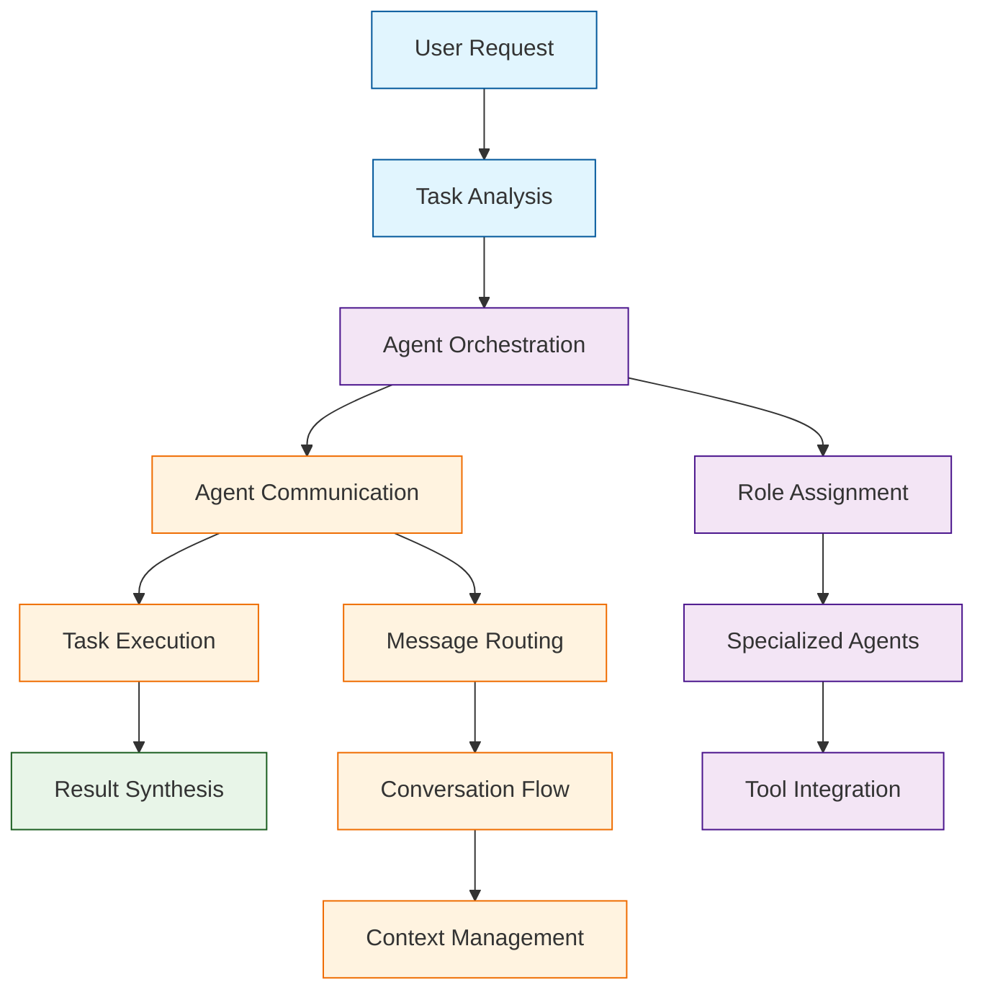

# Microsoft AutoGen Tutorial: Building Multi-Agent AI Systems

> This tutorial is AI-generated! To learn more, check out [Awesome Code Docs](https://github.com/johnxie/awesome-code-docs)

Microsoft AutoGen[View Repo](https://github.com/microsoft/autogen) is a framework for building multi-agent AI systems that can collaborate, communicate, and solve complex tasks autonomously. It enables the creation of customizable agents with specialized roles, tools, and communication patterns, making it easy to build sophisticated AI workflows and applications.

AutoGen provides a flexible architecture for creating agent-based systems that can work together to accomplish tasks that would be difficult or impossible for a single AI model.

## Tutorial Chapters

Welcome to your journey through multi-agent AI systems! This tutorial explores how to build collaborative AI agents that can work together to solve complex problems.

1. **[Chapter 1: Getting Started with AutoGen](01-getting-started.md)** - Installation, setup, and your first multi-agent conversation
2. **[Chapter 2: Agent Architecture & Roles](02-agent-architecture.md)** - Understanding different agent types and their capabilities
3. **[Chapter 3: Agent Communication](03-agent-communication.md)** - Building conversation flows between agents
4. **[Chapter 4: Tool Integration](04-tool-integration.md)** - Adding external tools and APIs to agents
5. **[Chapter 5: Task Decomposition](05-task-decomposition.md)** - Breaking complex tasks into manageable subtasks
6. **[Chapter 6: Custom Agent Development](06-custom-agents.md)** - Creating specialized agents for specific domains
7. **[Chapter 7: Multi-Agent Workflows](07-multi-agent-workflows.md)** - Orchestrating complex agent interactions
8. **[Chapter 8: Production Deployment](08-production-deployment.md)** - Scaling multi-agent systems for real-world applications

## What You'll Learn

By the end of this tutorial, you'll be able to:

- **Build collaborative AI systems** with multiple specialized agents
- **Design agent communication patterns** for effective task coordination
- **Integrate external tools and APIs** into agent workflows
- **Create custom agents** with specialized capabilities and knowledge
- **Implement complex task decomposition** and planning strategies
- **Deploy multi-agent systems** at scale with proper monitoring
- **Optimize agent performance** through conversation management
- **Build enterprise-grade AI applications** with agent orchestration

## Prerequisites

- Python 3.8+
- Basic understanding of AI/LLM concepts
- Familiarity with async programming (helpful but not required)
- Knowledge of API integration patterns

## Learning Path

### 🟢 Beginner Track
Perfect for developers new to multi-agent systems:
1. Chapters 1-2: Setup and basic agent concepts
2. Focus on understanding agent roles and communication

### 🟡 Intermediate Track
For developers building agent applications:
1. Chapters 3-5: Communication, tools, and task decomposition
2. Learn to build sophisticated multi-agent workflows

### 🔴 Advanced Track
For production multi-agent system development:
1. Chapters 6-8: Custom agents, complex workflows, and deployment
2. Master enterprise-grade multi-agent architectures

---

**Ready to build collaborative AI systems with AutoGen? Let's begin with [Chapter 1: Getting Started](01-getting-started.md)!**

*Generated by [AI Codebase Knowledge Builder](https://github.com/The-Pocket/Tutorial-Codebase-Knowledge)*
