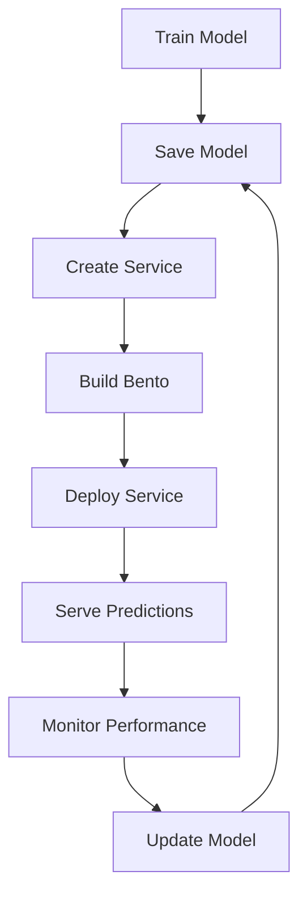

# Chapter 1: Getting Started with BentoML

Welcome to BentoML! If you've ever wanted to deploy machine learning models to production with ease, you're in the right place. BentoML makes it simple to package, serve, and scale ML models with high performance and reliability.

## What Makes BentoML Special?

BentoML revolutionizes ML deployment by:
- **Unified Framework** - Works with any ML framework (TensorFlow, PyTorch, Scikit-learn, etc.)
- **Production Ready** - Built for high-performance, scalable serving
- **Easy Packaging** - Turns models into deployable artifacts
- **Multiple Deployment Options** - Docker, Kubernetes, cloud platforms
- **Monitoring & Observability** - Built-in performance monitoring
- **Version Management** - Track and manage model versions

## Installation Options

### Basic Installation

```bash
# Install BentoML via pip
pip install bentoml

# Or install from source
git clone https://github.com/bentoml/BentoML.git
cd BentoML
pip install -e .
```

### Development Setup

```bash
# Clone the repository
git clone https://github.com/bentoml/BentoML.git
cd BentoML

# Install in development mode with all dependencies
pip install -e ".[dev,all]"

# Run tests to verify installation
pytest tests/
```

### Docker Installation

```bash
# Run BentoML with Docker
docker run --rm -p 3000:3000 bentoml/bentoml:latest

# Or build from source
docker build -t bentoml .
docker run --rm -p 3000:3000 bentoml
```

## Your First BentoML Service

Let's create your first ML service with BentoML:

### Step 1: Create a Simple Model

```python
import bentoml
from sklearn.ensemble import RandomForestClassifier
from sklearn.datasets import make_classification

# Create a sample model
X, y = make_classification(n_samples=1000, n_features=20, random_state=42)
model = RandomForestClassifier(n_estimators=100, random_state=42)
model.fit(X, y)

print("✅ Model trained successfully!")
```

### Step 2: Create a BentoML Service

```python
import bentoml
import numpy as np
from bentoml.io import JSON, NumpyNdarray

# Create a BentoML service
@bentoml.service
class MyMLService:
    def __init__(self):
        from sklearn.ensemble import RandomForestClassifier
        # In practice, you'd load a pre-trained model
        self.model = RandomForestClassifier(n_estimators=100, random_state=42)
        # Load your actual model here
        # self.model = bentoml.sklearn.load_model("my_model:latest")

    @bentoml.api
    def predict(self, input_data: NumpyNdarray) -> NumpyNdarray:
        """Predict using the trained model"""
        predictions = self.model.predict(input_data)
        return predictions

    @bentoml.api
    def predict_proba(self, input_data: NumpyNdarray) -> NumpyNdarray:
        """Get prediction probabilities"""
        probabilities = self.model.predict_proba(input_data)
        return probabilities

# Save the service
bentoml_model = bentoml.sklearn.save_model("my_rf_model", model)
print(f"Model saved: {bentoml_model}")

# Create the service
svc = MyMLService()
print("✅ BentoML service created!")
```

### Step 3: Save and Package the Service

```python
# Save the BentoML service
saved_path = bentoml.save(MyMLService, path="./my_ml_service")
print(f"Service saved to: {saved_path}")

# Build a Bento (deployable package)
bento = bentoml.build(
    service="service:MyMLService",
    name="my-ml-service",
    description="A simple ML service for classification",
    labels={
        "owner": "ml-team",
        "project": "classification-service"
    }
)

print(f"✅ Bento built: {bento.tag}")
```

### Step 4: Serve Your Model

```python
# Start the BentoML server
bentoml serve MyMLService:latest

# Or serve a specific bento
bentoml serve my-ml-service:latest

# The service will be available at http://localhost:3000
```

### Step 5: Test Your API

```bash
# Test the prediction endpoint
curl -X POST "http://localhost:3000/predict" \
     -H "Content-Type: application/json" \
     -d '{
       "input_data": [[1.2, 3.4, 5.6, 7.8, 9.0, 1.1, 2.2, 3.3, 4.4, 5.5,
                      6.6, 7.7, 8.8, 9.9, 1.0, 2.0, 3.0, 4.0, 5.0, 6.0]]
     }'

# Test with Python client
import requests

response = requests.post(
    "http://localhost:3000/predict",
    json={
        "input_data": [[1.2, 3.4, 5.6, 7.8, 9.0, 1.1, 2.2, 3.3, 4.4, 5.5,
                       6.6, 7.7, 8.8, 9.9, 1.0, 2.0, 3.0, 4.0, 5.0, 6.0]]
    }
)

print("Prediction:", response.json())
```

## Understanding BentoML Architecture

### Core Components

```
BentoML System
├── Service - Your ML service definition
├── Models - Saved and versioned ML models
├── Runners - Model execution environments
├── APIs - HTTP endpoints for your service
├── Bentos - Deployable ML service packages
└── Yatai - Model management and deployment platform
```

### Service Lifecycle



### Key Concepts

```python
# Models - Versioned ML models
model = bentoml.sklearn.save_model("my_model", trained_model)

# Services - ML service definitions
@bentoml.service
class MyService:
    @bentoml.api
    def predict(self, input):
        return self.model.predict(input)

# Runners - Model execution environments
runner = bentoml.sklearn.load_runner("my_model:latest")

# Bentos - Deployable packages
bento = bentoml.build("service:MyService", name="my-service")
```

## Working with Different ML Frameworks

### Scikit-learn

```python
import bentoml.sklearn
from sklearn.linear_model import LogisticRegression

# Train model
model = LogisticRegression()
model.fit(X_train, y_train)

# Save model
saved_model = bentoml.sklearn.save_model("logreg_model", model)

# Load model
loaded_model = bentoml.sklearn.load_model("logreg_model:latest")
```

### TensorFlow/Keras

```python
import bentoml.tensorflow
import tensorflow as tf

# Train model
model = tf.keras.Sequential([
    tf.keras.layers.Dense(64, activation='relu'),
    tf.keras.layers.Dense(10, activation='softmax')
])
model.compile(optimizer='adam', loss='sparse_categorical_crossentropy')
model.fit(X_train, y_train, epochs=10)

# Save model
saved_model = bentoml.tensorflow.save_model("tf_model", model)

# Load model
loaded_model = bentoml.tensorflow.load_model("tf_model:latest")
```

### PyTorch

```python
import bentoml.pytorch
import torch
import torch.nn as nn

# Define model
class Net(nn.Module):
    def __init__(self):
        super(Net, self).__init__()
        self.fc1 = nn.Linear(784, 64)
        self.fc2 = nn.Linear(64, 10)

    def forward(self, x):
        x = torch.relu(self.fc1(x))
        x = self.fc2(x)
        return x

# Train model
model = Net()
# ... training code ...

# Save model
saved_model = bentoml.pytorch.save_model("pytorch_model", model)

# Load model
loaded_model = bentoml.pytorch.load_model("pytorch_model:latest")
```

## API Definition and Input/Output

### Input/Output Types

```python
from bentoml.io import JSON, NumpyNdarray, PandasDataFrame, File, Image

@bentoml.service
class AdvancedService:
    @bentoml.api
    def predict_json(self, input_data: JSON) -> JSON:
        """Handle JSON input/output"""
        data = input_data["features"]
        prediction = self.model.predict([data])
        return {"prediction": prediction.tolist()}

    @bentoml.api
    def predict_numpy(self, input_data: NumpyNdarray) -> NumpyNdarray:
        """Handle NumPy arrays"""
        return self.model.predict(input_data)

    @bentoml.api
    def predict_dataframe(self, input_data: PandasDataFrame) -> JSON:
        """Handle pandas DataFrames"""
        predictions = self.model.predict(input_data.values)
        return {"predictions": predictions.tolist()}

    @bentoml.api
    def process_image(self, image: Image) -> JSON:
        """Handle image inputs"""
        # Process image
        result = self.image_processor.process(image)
        return {"result": result}
```

### Custom Input/Output

```python
from bentoml.io import IODescriptor
from typing import Any, Dict

class CustomInput(IODescriptor):
    def __init__(self, **kwargs):
        super().__init__(**kwargs)

    def openapi_request_schema(self):
        return {"type": "object", "properties": {"data": {"type": "string"}}}

    def openapi_responses_schema(self):
        return {"type": "object", "properties": {"result": {"type": "string"}}}

    def from_http_request(self, request):
        import json
        data = json.loads(request.data.decode())
        return self.from_dict(data)

    def to_http_response(self, obj):
        import json
        return json.dumps(self.to_dict(obj))

    def from_dict(self, obj: Dict[str, Any]):
        return obj

    def to_dict(self, obj: Any):
        return {"result": str(obj)}
```

## Configuration and Environment

### Basic Configuration

```python
# Service configuration
@bentoml.service(
    name="my-service",
    version="1.0.0",
    resources={
        "cpu": "2",
        "memory": "4Gi"
    },
    envs=[
        {"name": "MODEL_PATH", "value": "/opt/models"},
        {"name": "LOG_LEVEL", "value": "INFO"}
    ]
)
class ConfiguredService:
    pass
```

### Environment Variables

```python
import os

# Configure BentoML
bentoml.config.set("api_server.host", "0.0.0.0")
bentoml.config.set("api_server.port", 3000)
bentoml.config.set("runners.cpu", 4)
bentoml.config.set("runners.memory", "8Gi")

# Use environment variables
model_path = os.environ.get("MODEL_PATH", "./models")
log_level = os.environ.get("LOG_LEVEL", "INFO")
```

### Dependency Management

```python
# requirements.txt
bentoml>=1.0.0
scikit-learn>=1.3.0
pandas>=2.0.0
numpy>=1.24.0

# Or use pyproject.toml
[project]
dependencies = [
    "bentoml>=1.0.0",
    "scikit-learn>=1.3.0",
    "pandas>=2.0.0",
    "numpy>=1.24.0"
]
```

## Monitoring and Logging

### Built-in Monitoring

```python
import bentoml

# Enable metrics
bentoml.config.set("monitoring.enabled", True)
bentoml.config.set("monitoring.metrics_port", 3001)

# Add custom metrics
from bentoml.metrics import counter, histogram

prediction_counter = counter("predictions_total", "Total predictions")
prediction_duration = histogram("prediction_duration", "Prediction duration")

@bentoml.service
class MonitoredService:
    @bentoml.api
    def predict(self, input_data):
        with prediction_duration.time():
            prediction_counter.inc()
            return self.model.predict(input_data)
```

### Logging

```python
import logging

# Configure logging
logging.basicConfig(level=logging.INFO)
logger = logging.getLogger(__name__)

@bentoml.service
class LoggedService:
    @bentoml.api
    def predict(self, input_data):
        logger.info(f"Received prediction request with input shape: {input_data.shape}")

        try:
            result = self.model.predict(input_data)
            logger.info("Prediction completed successfully")
            return result
        except Exception as e:
            logger.error(f"Prediction failed: {str(e)}")
            raise
```

## What We've Accomplished

Congratulations! 🎉 You've successfully:

1. **Installed BentoML** and set up your development environment
2. **Created your first ML service** with BentoML decorators
3. **Understood the core architecture** and component relationships
4. **Worked with different ML frameworks** (Scikit-learn, TensorFlow, PyTorch)
5. **Defined APIs** with various input/output types
6. **Configured services** for production deployment
7. **Set up monitoring and logging** for observability

## Next Steps

Now that you have a working BentoML service, let's explore how to package and deploy your models at scale. In [Chapter 2: Model Packaging & Services](02-model-packaging.md), we'll dive into creating production-ready BentoML services with advanced features.

---

**Practice what you've learned:**
1. Create services for different ML frameworks
2. Experiment with various input/output types
3. Set up monitoring and logging for your services
4. Configure services for different deployment environments

*What's the most interesting ML model you want to deploy with BentoML?* 🤖
