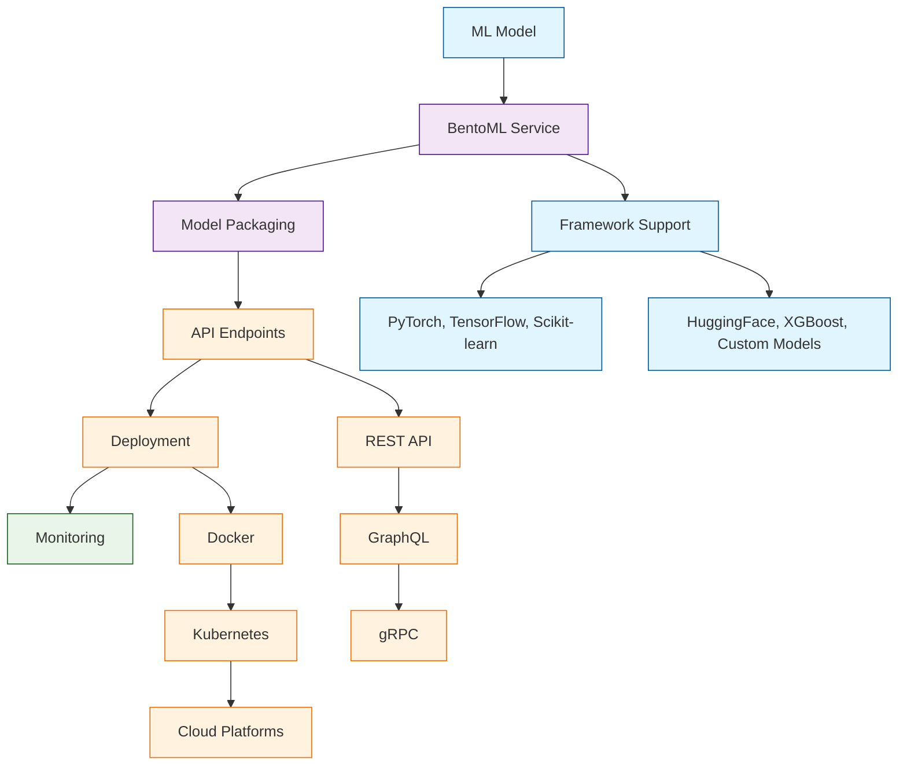

# BentoML Tutorial: Building Production-Ready ML Services

> This tutorial is AI-generated! To learn more, check out [Awesome Code Docs](https://github.com/johnxie/awesome-code-docs)

BentoML[View Repo](https://github.com/bentoml/BentoML) is the unified MLOps platform for building, deploying, and managing machine learning models in production. It provides a complete framework for serving ML models with high performance, scalability, and reliability, supporting any ML framework and deployment target.

BentoML simplifies the ML deployment process by providing tools for model packaging, API serving, monitoring, and scaling, making it easy to take models from development to production.

## Tutorial Chapters

Welcome to your journey through production ML deployment! This tutorial explores how to build, deploy, and manage machine learning models at scale with BentoML.

1. **[Chapter 1: Getting Started with BentoML](01-getting-started.md)** - Installation, setup, and your first ML service
2. **[Chapter 2: Model Packaging & Services](02-model-packaging.md)** - Creating BentoML services and packaging models
3. **[Chapter 3: API Development](03-api-development.md)** - Building REST and custom API endpoints
4. **[Chapter 4: Framework Integration](04-framework-integration.md)** - Working with PyTorch, TensorFlow, and other frameworks
5. **[Chapter 5: Testing & Validation](05-testing-validation.md)** - Testing ML services and ensuring reliability
6. **[Chapter 6: Deployment Strategies](06-deployment-strategies.md)** - Docker, Kubernetes, and cloud deployment
7. **[Chapter 7: Monitoring & Observability](07-monitoring-observability.md)** - Performance monitoring and logging
8. **[Chapter 8: Production Scaling](08-production-scaling.md)** - Scaling ML services for high traffic

## What You'll Learn

By the end of this tutorial, you'll be able to:

- **Package ML models** into production-ready services with BentoML
- **Build REST APIs** for model inference with automatic scaling
- **Deploy models** to various platforms including Docker and Kubernetes
- **Monitor model performance** and system health in production
- **Integrate with popular ML frameworks** seamlessly
- **Implement testing and validation** for ML services
- **Scale ML applications** to handle high-throughput workloads
- **Manage model versions** and rollbacks in production

## Prerequisites

- Python 3.8+
- Basic understanding of machine learning concepts
- Familiarity with Docker and containerization
- Knowledge of REST APIs and web services

## Learning Path

### 🟢 Beginner Track
Perfect for developers new to ML deployment:
1. Chapters 1-2: Setup and basic model packaging
2. Focus on getting models into production

### 🟡 Intermediate Track
For developers building ML services:
1. Chapters 3-5: API development, framework integration, and testing
2. Learn to build robust ML applications

### 🔴 Advanced Track
For production ML system development:
1. Chapters 6-8: Deployment, monitoring, and scaling
2. Master enterprise-grade ML operations

---

**Ready to deploy ML models to production with BentoML? Let's begin with [Chapter 1: Getting Started](01-getting-started.md)!**

*Generated by [AI Codebase Knowledge Builder](https://github.com/The-Pocket/Tutorial-Codebase-Knowledge)*
