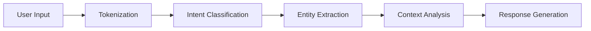

# Chapter 3: Natural Language Understanding

This chapter explores Botpress's Natural Language Understanding (NLU) capabilities, teaching you how to train intents, extract entities, and build intelligent conversational experiences.

## 🧠 NLU Fundamentals

### What is NLU?

Natural Language Understanding enables bots to:
- **Recognize Intent**: Understand what users want to do
- **Extract Entities**: Pull out specific information from messages
- **Handle Variations**: Understand different ways to say the same thing
- **Context Awareness**: Maintain conversation context

### NLU Pipeline



## 🎯 Intent Management

### Creating Intents

```typescript
// Define an intent for ordering food
const orderIntent = {
  name: "order_food",
  utterances: [
    "I want to order a pizza",
    "Can I get some food delivered?",
    "I'd like to place an order",
    "Hungry, let's order something",
    "Food delivery please"
  ],
  entities: ["food_type", "quantity"]
}
```

### Training Examples

```typescript
// Comprehensive training data
const intentTraining = {
  greeting: {
    utterances: [
      "Hello",
      "Hi there",
      "Good morning",
      "Hey",
      "What's up",
      "Good afternoon",
      "Good evening"
    ]
  },
  booking: {
    utterances: [
      "I want to book a table",
      "Can I make a reservation?",
      "I'd like to reserve a spot",
      "Table for two please",
      "Booking for tonight"
    ]
  },
  support: {
    utterances: [
      "I need help",
      "Can you assist me?",
      "I'm having trouble",
      "Customer support",
      "Help me please"
    ]
  }
}
```

## 🏷️ Entity Extraction

### Built-in Entities

```typescript
// Botpress built-in entities
const builtInEntities = {
  amountOfMoney: "Monetary values ($100, €50)",
  date: "Dates (tomorrow, next week)",
  time: "Times (3 PM, 15:00)",
  number: "Numbers (1, 2, 3)",
  email: "Email addresses",
  phoneNumber: "Phone numbers",
  url: "Web URLs"
}
```

### Custom Entities

```typescript
// Define custom entities
const customEntities = {
  food_type: {
    type: "list",
    values: [
      { value: "pizza", synonyms: ["pie", "za"] },
      { value: "burger", synonyms: ["hamburger", "cheeseburger"] },
      { value: "pasta", synonyms: ["spaghetti", "noodles"] },
      { value: "salad", synonyms: ["greens", "lettuce"] }
    ]
  },
  cuisine: {
    type: "pattern",
    pattern: "(italian|chinese|mexican|american|japanese)",
    examples: ["Italian food", "Chinese cuisine", "Mexican dishes"]
  }
}
```

### Entity Training

```typescript
// Training examples with entities
const entityTraining = [
  {
    text: "I want a large pepperoni pizza",
    entities: [
      {
        entity: "size",
        value: "large",
        start: 7,
        end: 12
      },
      {
        entity: "food_type",
        value: "pizza",
        start: 21,
        end: 26
      },
      {
        entity: "topping",
        value: "pepperoni",
        start: 13,
        end: 22
      }
    ]
  }
]
```

## 🎨 Training Best Practices

### Diverse Utterances

```typescript
// Good: Diverse training examples
const goodTraining = {
  intent: "book_hotel",
  utterances: [
    "I need to book a hotel room",
    "Can you help me find accommodation?",
    "Looking for a place to stay",
    "Hotel reservation needed",
    "Want to book lodging",
    "Need somewhere to sleep tonight",
    "Accommodation booking",
    "Find me a hotel"
  ]
}

// Avoid: Repetitive examples
const badTraining = {
  utterances: [
    "Book hotel",
    "Book a hotel",
    "I want to book hotel",
    "Please book hotel"
  ]
}
```

### Entity Coverage

```typescript
// Comprehensive entity training
const comprehensiveEntities = {
  date: {
    variations: [
      "tomorrow",
      "next week",
      "March 15th",
      "15/03/2024",
      "this Friday"
    ]
  },
  location: {
    variations: [
      "New York",
      "NYC",
      "Manhattan",
      "downtown NY"
    ]
  }
}
```

## 🔧 NLU Configuration

### Model Settings

```typescript
// NLU configuration
const nluConfig = {
  language: "en",
  model: {
    type: "intent-classifier",
    threshold: 0.7,
    fallbackIntent: "nlu_fallback"
  },
  entities: {
    extraction: "enabled",
    confidence: 0.8
  }
}
```

### Confidence Thresholds

```typescript
// Handle low confidence predictions
const handleLowConfidence = (prediction) => {
  if (prediction.confidence < 0.7) {
    // Ask for clarification
    return {
      type: "clarification",
      message: "I'm not sure what you mean. Could you please rephrase?"
    }
  }

  return prediction
}
```

## 🎯 Context and Memory

### Conversation Context

```typescript
// Maintain conversation context
class ConversationContext {
  constructor() {
    this.context = {
      currentIntent: null,
      entities: {},
      history: [],
      userProfile: {}
    }
  }

  updateContext(prediction) {
    this.context.currentIntent = prediction.intent
    this.context.entities = { ...this.context.entities, ...prediction.entities }
    this.context.history.push(prediction)
  }

  getContext() {
    return this.context
  }
}
```

### Contextual Responses

```typescript
// Use context for better responses
const contextualResponse = (intent, context) => {
  const responses = {
    greeting: {
      first_time: "Hello! Welcome to our service!",
      returning: "Welcome back! How can I help you today?"
    },
    booking: {
      has_previous: "Continuing with your previous booking...",
      new_booking: "Let's get started with your booking!"
    }
  }

  const userType = context.isReturning ? 'returning' : 'first_time'
  return responses[intent][userType]
}
```

## 🔍 Testing and Validation

### NLU Testing

```typescript
// Test NLU predictions
const testNLU = async (utterances, expectedIntent) => {
  const results = []

  for (const utterance of utterances) {
    const prediction = await predictIntent(utterance)
    const isCorrect = prediction.intent === expectedIntent

    results.push({
      utterance,
      predicted: prediction.intent,
      confidence: prediction.confidence,
      correct: isCorrect
    })
  }

  return results
}

// Example test
const testResults = await testNLU([
  "I want to order pizza",
  "Can I get some food?",
  "Hungry, let's eat"
], "order_food")
```

### Confusion Matrix

```typescript
// Analyze intent confusion
const analyzeConfusion = (predictions) => {
  const matrix = {}

  predictions.forEach(pred => {
    const actual = pred.actualIntent
    const predicted = pred.predictedIntent

    if (!matrix[actual]) matrix[actual] = {}
    if (!matrix[actual][predicted]) matrix[actual][predicted] = 0

    matrix[actual][predicted]++
  })

  return matrix
}
```

## 🚀 Advanced NLU Features

### Multi-Intent Detection

```typescript
// Handle multiple intents in one message
const multiIntentDetection = (message) => {
  const intents = []

  // Check for compound intents
  if (message.includes("book") && message.includes("cancel")) {
    intents.push("modify_booking")
  }

  if (message.includes("price") && message.includes("location")) {
    intents.push("price_inquiry")
  }

  return intents.length > 0 ? intents : [classifyIntent(message)]
}
```

### Dynamic Entity Extraction

```typescript
// Extract entities based on context
const dynamicEntityExtraction = (message, context) => {
  const entities = {}

  // Context-aware extraction
  if (context.currentIntent === "booking") {
    entities.date = extractDate(message)
    entities.time = extractTime(message)
    entities.party_size = extractNumber(message)
  }

  return entities
}
```

## 📊 NLU Analytics

### Performance Metrics

```typescript
// Track NLU performance
const nluMetrics = {
  intentAccuracy: 0,
  entityPrecision: 0,
  entityRecall: 0,
  averageConfidence: 0,
  fallbackRate: 0
}

// Calculate metrics
const calculateMetrics = (predictions) => {
  const total = predictions.length
  const correct = predictions.filter(p => p.correct).length

  nluMetrics.intentAccuracy = correct / total
  nluMetrics.averageConfidence = predictions.reduce((sum, p) => sum + p.confidence, 0) / total
}
```

### Training Data Insights

```typescript
// Analyze training data quality
const analyzeTrainingData = (intents) => {
  const insights = {
    totalUtterances: 0,
    averageUtterancesPerIntent: 0,
    intentsWithFewExamples: [],
    entityCoverage: {}
  }

  intents.forEach(intent => {
    insights.totalUtterances += intent.utterances.length

    if (intent.utterances.length < 5) {
      insights.intentsWithFewExamples.push(intent.name)
    }
  })

  insights.averageUtterancesPerIntent = insights.totalUtterances / intents.length

  return insights
}
```

## 🔧 NLU Optimization

### Continuous Learning

```typescript
// Implement continuous learning
class ContinuousLearning {
  constructor() {
    this.feedbackQueue = []
  }

  collectFeedback(prediction, actualIntent, userFeedback) {
    this.feedbackQueue.push({
      prediction,
      actualIntent,
      userFeedback,
      timestamp: new Date()
    })
  }

  async retrainModel() {
    const feedback = this.feedbackQueue.splice(0)

    if (feedback.length > 10) { // Minimum batch size
      await updateTrainingData(feedback)
      await retrainModel()
    }
  }
}
```

### A/B Testing

```typescript
// Test different NLU configurations
const nluABTest = {
  versionA: {
    threshold: 0.7,
    model: "intent-classifier-v1"
  },
  versionB: {
    threshold: 0.8,
    model: "intent-classifier-v2"
  }
}

const testNLUVersion = async (version, utterances) => {
  const results = []

  for (const utterance of utterances) {
    const prediction = await predictWithVersion(utterance, version)
    results.push(prediction)
  }

  return results
}
```

## 📝 Chapter Summary

- ✅ Understood NLU fundamentals and pipeline
- ✅ Created and trained intents with diverse utterances
- ✅ Configured entity extraction for custom data
- ✅ Applied best practices for training data
- ✅ Handled context and conversation memory
- ✅ Tested and validated NLU performance
- ✅ Implemented continuous learning and optimization

**Key Takeaways:**
- Diverse training data improves intent recognition
- Entity extraction enables structured data capture
- Context awareness enhances conversation quality
- Regular testing and validation ensure accuracy
- Continuous learning adapts to user patterns
- A/B testing optimizes NLU performance
