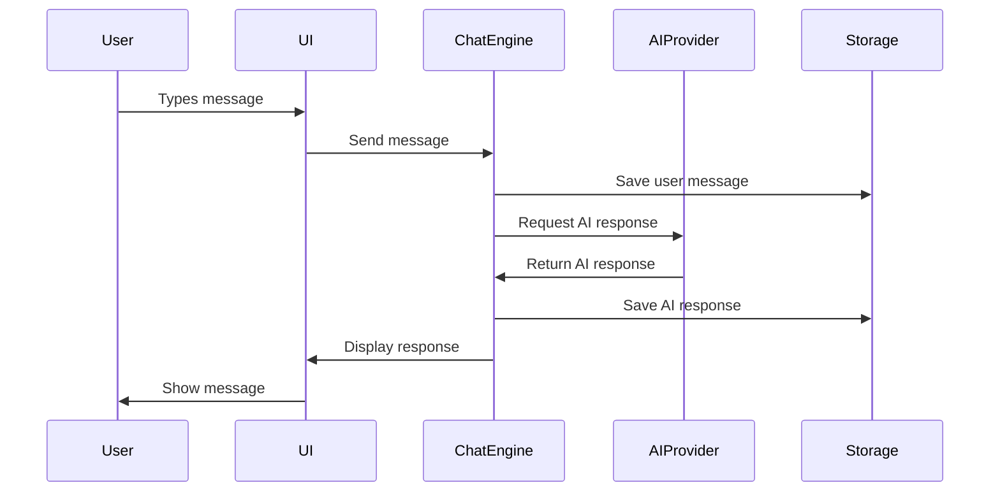

# Chapter 1: Getting Started with Chatbox

Welcome to Chatbox! If you've ever wanted to build beautiful, functional AI chat interfaces, you're in the right place. Chatbox demonstrates how to create modern conversational AI applications that users actually enjoy using.

## What Makes Chatbox Special?

Chatbox stands out from other chat applications because it:
- **Supports multiple AI providers** - OpenAI, Anthropic, local models, and more
- **Offers beautiful, modern UI** - Clean design with excellent user experience
- **Runs on multiple platforms** - Desktop, web, and mobile
- **Provides extensive customization** - Themes, plugins, and personalizations
- **Handles complex conversations** - Context management and message threading

## Installing Chatbox

### Desktop Installation

```bash
# Clone the Chatbox repository
git clone https://github.com/chatboxai/chatbox.git
cd chatbox

# Install dependencies
npm install

# Start development server
npm run dev

# Or build for production
npm run build
```

### Web Version

```bash
# For web deployment
npm run build:web

# Serve the built files
npm run serve
```

### Using Pre-built Releases

```bash
# Download from GitHub releases
# Visit: https://github.com/chatboxai/chatbox/releases

# For macOS
open Chatbox-1.0.0.dmg

# For Windows
# Run the .exe installer

# For Linux
# Extract and run the AppImage
```

## Your First Chat Session

Let's set up your first AI conversation:

### Step 1: Configure AI Provider

```javascript
// Basic Chatbox configuration
const chatboxConfig = {
  provider: 'openai',
  apiKey: 'your-openai-api-key-here',
  model: 'gpt-3.5-turbo',
  temperature: 0.7,
  maxTokens: 1000
};

// Initialize Chatbox
const chatbox = new Chatbox(chatboxConfig);
```

### Step 2: Create a Simple Chat Interface

```html
<!DOCTYPE html>
<html>
<head>
    <title>My First Chatbox</title>
    <link rel="stylesheet" href="chatbox.css">
</head>
<body>
    <div id="chat-container">
        <div id="messages"></div>
        <div id="input-area">
            <input type="text" id="message-input" placeholder="Type your message...">
            <button id="send-button">Send</button>
        </div>
    </div>

    <script src="chatbox.js"></script>
    <script>
        // Initialize chat
        const chatbox = new Chatbox({
            container: '#chat-container',
            provider: 'openai',
            apiKey: 'your-key-here'
        });

        // Handle sending messages
        document.getElementById('send-button').addEventListener('click', () => {
            const input = document.getElementById('message-input');
            chatbox.sendMessage(input.value);
            input.value = '';
        });
    </script>
</body>
</html>
```

### Step 3: Send Your First Message

```javascript
// Send a message and handle response
chatbox.sendMessage("Hello! Can you help me learn about AI?")
    .then(response => {
        console.log("AI Response:", response.content);
    })
    .catch(error => {
        console.error("Error:", error);
    });
```

## Understanding the Core Architecture

### Basic Chatbox Structure

```
Chatbox Application
├── UI Layer (React/Vue Components)
├── Chat Engine (Message Processing)
├── AI Providers (API Integrations)
├── Storage Layer (Conversation History)
└── Plugin System (Extensions)
```

### Key Components

1. **UI Layer**: Handles user interface and interactions
2. **Chat Engine**: Processes messages and manages conversations
3. **AI Providers**: Interfaces with different AI services
4. **Storage Layer**: Persists conversations and settings
5. **Plugin System**: Allows extending functionality

## How Chatbox Works Under the Hood

### Message Flow



### State Management

```javascript
// Chatbox state structure
const chatboxState = {
  conversations: [
    {
      id: 'conv-1',
      title: 'AI Learning Session',
      messages: [
        {
          id: 'msg-1',
          role: 'user',
          content: 'Hello!',
          timestamp: Date.now()
        },
        {
          id: 'msg-2',
          role: 'assistant',
          content: 'Hi there! How can I help?',
          timestamp: Date.now()
        }
      ],
      metadata: {
        provider: 'openai',
        model: 'gpt-3.5-turbo',
        createdAt: Date.now(),
        updatedAt: Date.now()
      }
    }
  ],
  currentConversation: 'conv-1',
  settings: {
    theme: 'light',
    fontSize: 'medium',
    autoSave: true
  }
};
```

## Building Your First Chat Component

Let's create a reusable chat component:

```javascript
class ChatInterface {
  constructor(container, config) {
    this.container = container;
    this.config = config;
    this.messages = [];
    this.init();
  }

  init() {
    this.createUI();
    this.bindEvents();
    this.loadConversationHistory();
  }

  createUI() {
    const html = `
      <div class="chatbox">
        <div class="chat-header">
          <h3>AI Assistant</h3>
          <div class="chat-controls">
            <button id="clear-chat">Clear</button>
            <button id="export-chat">Export</button>
          </div>
        </div>
        <div class="messages-container" id="messages">
          <div class="welcome-message">
            <p>👋 Hello! I'm your AI assistant. How can I help you today?</p>
          </div>
        </div>
        <div class="input-area">
          <div class="input-container">
            <textarea
              id="message-input"
              placeholder="Type your message here..."
              rows="1"
            ></textarea>
            <button id="send-button" disabled>
              <svg width="20" height="20" viewBox="0 0 24 24">
                <path d="M2 21l21-9L2 3v7l15 2-15 2z"/>
              </svg>
            </button>
          </div>
          <div class="input-hints">
            <span>Press Enter to send, Shift+Enter for new line</span>
          </div>
        </div>
      </div>
    `;

    this.container.innerHTML = html;
  }

  bindEvents() {
    const input = this.container.querySelector('#message-input');
    const sendButton = this.container.querySelector('#send-button');

    // Auto-resize textarea
    input.addEventListener('input', () => {
      this.adjustTextareaHeight(input);
      this.updateSendButton(input, sendButton);
    });

    // Send on Enter
    input.addEventListener('keydown', (e) => {
      if (e.key === 'Enter' && !e.shiftKey) {
        e.preventDefault();
        this.sendMessage(input.value.trim());
        input.value = '';
        this.adjustTextareaHeight(input);
      }
    });

    // Send on button click
    sendButton.addEventListener('click', () => {
      this.sendMessage(input.value.trim());
      input.value = '';
      this.adjustTextareaHeight(input);
    });
  }

  adjustTextareaHeight(textarea) {
    textarea.style.height = 'auto';
    textarea.style.height = Math.min(textarea.scrollHeight, 120) + 'px';
  }

  updateSendButton(input, button) {
    button.disabled = !input.value.trim();
  }

  async sendMessage(content) {
    if (!content) return;

    // Add user message
    this.addMessage('user', content);

    // Show typing indicator
    this.showTypingIndicator();

    try {
      // Send to AI provider
      const response = await this.callAIProvider(content);

      // Hide typing indicator
      this.hideTypingIndicator();

      // Add AI response
      this.addMessage('assistant', response.content);

    } catch (error) {
      this.hideTypingIndicator();
      this.addMessage('system', `Error: ${error.message}`);
    }
  }

  addMessage(role, content) {
    const messagesContainer = this.container.querySelector('#messages');
    const messageDiv = document.createElement('div');
    messageDiv.className = `message ${role}`;

    messageDiv.innerHTML = `
      <div class="message-avatar">
        ${role === 'user' ? '👤' : '🤖'}
      </div>
      <div class="message-content">
        <div class="message-text">${this.formatMessage(content)}</div>
        <div class="message-time">${new Date().toLocaleTimeString()}</div>
      </div>
    `;

    messagesContainer.appendChild(messageDiv);
    messagesContainer.scrollTop = messagesContainer.scrollHeight;

    // Store message
    this.messages.push({ role, content, timestamp: Date.now() });
  }

  formatMessage(text) {
    // Basic markdown-like formatting
    return text
      .replace(/\*\*(.*?)\*\*/g, '<strong>$1</strong>')
      .replace(/\*(.*?)\*/g, '<em>$1</em>')
      .replace(/`(.*?)`/g, '<code>$1</code>')
      .replace(/\n/g, '<br>');
  }

  showTypingIndicator() {
    const messagesContainer = this.container.querySelector('#messages');
    const indicator = document.createElement('div');
    indicator.className = 'message assistant typing';
    indicator.id = 'typing-indicator';
    indicator.innerHTML = `
      <div class="message-avatar">🤖</div>
      <div class="message-content">
        <div class="typing-dots">
          <span></span>
          <span></span>
          <span></span>
        </div>
      </div>
    `;

    messagesContainer.appendChild(indicator);
    messagesContainer.scrollTop = messagesContainer.scrollHeight;
  }

  hideTypingIndicator() {
    const indicator = this.container.querySelector('#typing-indicator');
    if (indicator) {
      indicator.remove();
    }
  }

  async callAIProvider(message) {
    // This would integrate with actual AI provider
    // For now, return a mock response
    await new Promise(resolve => setTimeout(resolve, 1000));

    return {
      content: `I received your message: "${message}". This is a mock response from the AI provider.`,
      usage: { prompt_tokens: 10, completion_tokens: 20, total_tokens: 30 }
    };
  }

  loadConversationHistory() {
    // Load previous messages from storage
    const history = localStorage.getItem('chatbox-history');
    if (history) {
      this.messages = JSON.parse(history);
      this.messages.forEach(msg => {
        this.addMessage(msg.role, msg.content);
      });
    }
  }

  saveConversationHistory() {
    localStorage.setItem('chatbox-history', JSON.stringify(this.messages));
  }
}

// Usage
const chatInterface = new ChatInterface(
  document.getElementById('chat-container'),
  {
    provider: 'openai',
    apiKey: 'your-api-key-here',
    model: 'gpt-3.5-turbo'
  }
);
```

## Configuration and Customization

### Basic Configuration

```javascript
const chatboxConfig = {
  // AI Provider Settings
  provider: 'openai', // 'anthropic', 'local', etc.
  apiKey: 'your-api-key',
  model: 'gpt-3.5-turbo',
  temperature: 0.7,
  maxTokens: 1000,

  // UI Settings
  theme: 'light', // 'dark', 'auto'
  fontSize: 'medium', // 'small', 'medium', 'large'
  showTimestamps: true,
  enableMarkdown: true,

  // Conversation Settings
  maxHistoryLength: 100,
  autoSave: true,
  exportFormat: 'json', // 'json', 'txt', 'md'

  // Advanced Settings
  enableStreaming: true,
  retryAttempts: 3,
  timeout: 30000
};
```

### Environment Variables

```bash
# .env file
CHATBOX_PROVIDER=openai
CHATBOX_API_KEY=your-api-key-here
CHATBOX_MODEL=gpt-3.5-turbo
CHATBOX_THEME=light
CHATBOX_DEBUG=false
```

## What We've Accomplished

Congratulations! 🎉 You've successfully:

1. **Installed Chatbox** and set up your development environment
2. **Created your first chat interface** with modern UI components
3. **Understood the core architecture** and message flow
4. **Built a reusable chat component** with TypeScript/JavaScript
5. **Implemented message handling** and conversation management
6. **Added basic theming and customization** options

## Next Steps

Now that you have a working chat interface, let's explore the UI architecture that makes Chatbox so polished. In [Chapter 2: UI Architecture & Components](02-ui-architecture.md), we'll dive into building modern, responsive chat interfaces.

---

**Practice what you've learned:**
1. Customize the chat interface with different themes and colors
2. Add support for different message types (images, files, etc.)
3. Implement conversation saving and loading
4. Add keyboard shortcuts for better user experience

*What's the most important feature for a modern chat application?* 💬
