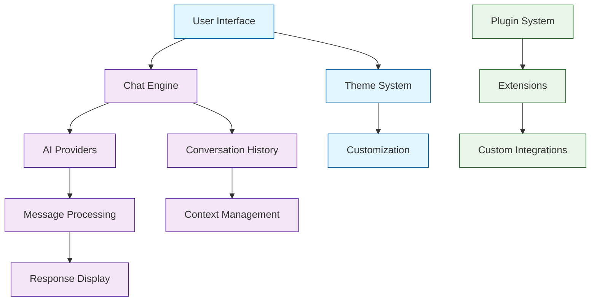

# Chatbox Tutorial: Building Modern AI Chat Interfaces

> This tutorial is AI-generated! To learn more, check out [Awesome Code Docs](https://github.com/johnxie/awesome-code-docs)

Chatbox[View Repo](https://github.com/chatboxai/chatbox) is a modern, cross-platform AI chat interface that supports multiple AI providers and offers a polished user experience. It demonstrates best practices for building conversational AI applications with clean interfaces, multi-provider support, and excellent user experience design.

Chatbox combines the best of modern web technologies with native desktop capabilities, showing how to build AI applications that users actually enjoy using.

## Tutorial Chapters

Welcome to your journey through modern AI chat interface development! This tutorial explores how to build polished, user-friendly conversational AI applications.

1. **[Chapter 1: Getting Started with Chatbox](01-getting-started.md)** - Installation, setup, and first conversations
2. **[Chapter 2: UI Architecture & Components](02-ui-architecture.md)** - Building modern chat interfaces
3. **[Chapter 3: AI Provider Integration](03-ai-providers.md)** - Connecting multiple AI services
4. **[Chapter 4: Conversation Management](04-conversation-management.md)** - Handling chat history and context
5. **[Chapter 5: Message Processing Pipeline](05-message-processing.md)** - Text processing and formatting
6. **[Chapter 6: Theme & Customization System](06-theme-system.md)** - Building flexible UI theming
7. **[Chapter 7: Plugin Architecture](07-plugin-system.md)** - Extending functionality
8. **[Chapter 8: Production Deployment](08-production-deployment.md)** - Building and distributing chat applications

## What You'll Learn

By the end of this tutorial, you'll be able to:

- **Build modern chat interfaces** with excellent user experience
- **Integrate multiple AI providers** seamlessly
- **Manage conversation context** and history effectively
- **Create responsive UI components** for real-time messaging
- **Implement theme systems** for customization
- **Develop plugin architectures** for extensibility
- **Deploy cross-platform applications** with native performance
- **Handle real-time messaging** with proper state management

## Prerequisites

- Basic JavaScript/TypeScript knowledge
- Familiarity with React or similar UI frameworks
- Understanding of API integration patterns
- Basic knowledge of build tools and package management

## Learning Path

### 🟢 Beginner Track
Perfect for developers new to chat applications:
1. Chapters 1-2: Setup and basic UI components
2. Focus on understanding chat interface patterns

### 🟡 Intermediate Track
For developers building AI-integrated applications:
1. Chapters 3-5: AI integration and message processing
2. Learn to handle complex conversational flows

### 🔴 Advanced Track
For building production chat platforms:
1. Chapters 6-8: Advanced theming, plugins, and deployment
2. Master enterprise-grade chat application development

---

**Ready to build modern AI chat interfaces? Let's begin with [Chapter 1: Getting Started](01-getting-started.md)!**

*Generated by [AI Codebase Knowledge Builder](https://github.com/The-Pocket/Tutorial-Codebase-Knowledge)*
