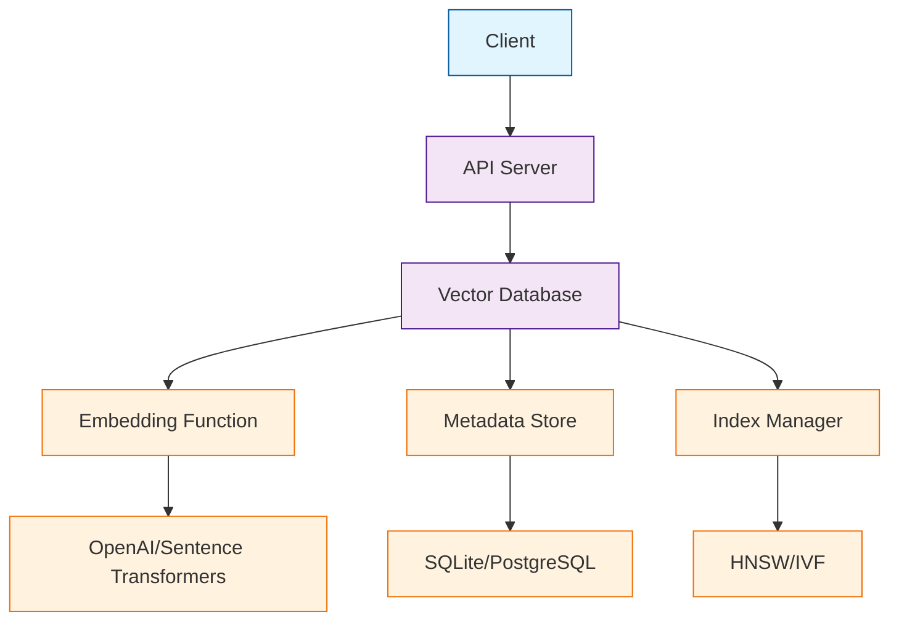

# Chapter 1: Getting Started with Chroma

Welcome to Chroma! If you've ever wanted to build AI applications with a sophisticated memory system, you're in the right place. Chroma is the AI-native open-source embedding database that makes it easy to add persistent memory and fast retrieval to your AI applications.

## What Makes Chroma Special?

Chroma revolutionizes how we think about data storage for AI applications by:

- **AI-Native Design** - Built specifically for embeddings and vector operations
- **Simple API** - Easy to use with minimal setup required
- **Fast Retrieval** - Optimized for similarity search and nearest neighbor queries
- **Metadata Support** - Rich filtering and organization capabilities
- **Multi-Modal** - Supports text, images, and structured data
- **Production Ready** - Scalable architecture with persistence and backup

## Installing Chroma

### Local Installation

```bash
# Install Chroma using pip
pip install chromadb

# Or install with additional dependencies
pip install chromadb[all]

# For development and testing
pip install chromadb[dev]
```

### Docker Setup

```bash
# Run Chroma with Docker
docker run -p 8000:8000 chromadb/chroma

# Or use Docker Compose
docker-compose up chroma
```

### Cloud Deployment

```bash
# Deploy to cloud platforms
# Chroma supports various cloud deployments
pip install chromadb[cloud]
```

## Your First Chroma Collection

Let's create your first vector database and add some data:

```python
import chromadb

# Initialize Chroma client
client = chromadb.Client()

# Create a collection (like a table in traditional databases)
collection = client.create_collection(name="my_first_collection")

# Add some documents with metadata
documents = [
    "The quick brown fox jumps over the lazy dog",
    "Python is a programming language",
    "Machine learning is fascinating",
    "Chroma is great for AI applications"
]

metadata = [
    {"source": "example", "category": "animal"},
    {"source": "example", "category": "programming"},
    {"source": "example", "category": "ai"},
    {"source": "example", "category": "ai"}
]

ids = ["doc1", "doc2", "doc3", "doc4"]

# Add documents to the collection
collection.add(
    documents=documents,
    metadatas=metadata,
    ids=ids
)

print(f"Added {len(documents)} documents to collection")
```

## Understanding Embeddings

### What are Embeddings?

Embeddings are numerical representations of data that capture semantic meaning:

```python
# Chroma automatically generates embeddings for your documents
# Let's see what the embeddings look like
results = collection.get(include=['embeddings'])
print("Embedding dimensions:", len(results['embeddings'][0]))

# Embeddings are high-dimensional vectors
print("Sample embedding:", results['embeddings'][0][:5], "...")
```

### Custom Embedding Functions

```python
import chromadb
from chromadb.utils import embedding_functions

# Use different embedding models
openai_ef = embedding_functions.OpenAIEmbeddingFunction(
    api_key="your-openai-key",
    model_name="text-embedding-ada-002"
)

# Create collection with custom embeddings
collection = client.create_collection(
    name="custom_embeddings",
    embedding_function=openai_ef
)

# Add documents (embeddings generated automatically)
collection.add(
    documents=["Hello world", "How are you?"],
    ids=["doc1", "doc2"]
)
```

## Basic Queries

### Similarity Search

```python
# Query for similar documents
results = collection.query(
    query_texts=["fast animals"],
    n_results=2
)

print("Query results:")
for i, doc in enumerate(results['documents'][0]):
    print(f"{i+1}. {doc}")
```

### Metadata Filtering

```python
# Query with metadata filters
results = collection.query(
    query_texts=["artificial intelligence"],
    n_results=3,
    where={"category": "ai"}
)

print("Filtered results:")
for doc in results['documents'][0]:
    print(f"- {doc}")
```

## Chroma Architecture

### Core Components



### Data Flow

1. **Document Input** - You provide text documents
2. **Embedding Generation** - Chroma converts text to vectors
3. **Storage** - Vectors stored with metadata
4. **Indexing** - Efficient search structures created
5. **Query Processing** - Fast similarity search
6. **Results** - Relevant documents returned

## Persistence and Configuration

### Persistent Storage

```python
# Persistent client (data survives restarts)
client = chromadb.PersistentClient(path="./chroma_db")

# Create collection
collection = client.create_collection(name="persistent_collection")

# Data persists between sessions
collection.add(
    documents=["Persistent storage example"],
    ids=["persistent_doc"]
)
```

### Configuration Options

```python
# Advanced configuration
client = chromadb.Client(Settings(
    chroma_server_host="localhost",
    chroma_server_http_port=8000,
    chroma_api_impl="rest",
    anonymized_telemetry=False
))
```

## Working with Collections

### Collection Management

```python
# List all collections
collections = client.list_collections()
print("Available collections:", [c.name for c in collections])

# Get existing collection
collection = client.get_collection(name="my_collection")

# Delete collection
client.delete_collection(name="old_collection")

# Collection info
print(f"Collection: {collection.name}")
print(f"Count: {collection.count()}")
```

### Collection Metadata

```python
# Add collection-level metadata
collection = client.create_collection(
    name="advanced_collection",
    metadata={"description": "Advanced AI collection", "version": "1.0"}
)

# Update collection metadata
collection.modify(metadata={"version": "1.1"})
```

## Error Handling and Best Practices

### Error Handling

```python
try:
    collection = client.create_collection(name="test_collection")
    collection.add(
        documents=["Test document"],
        ids=["test_id"]
    )
    print("Success!")
except Exception as e:
    print(f"Error: {e}")
```

### Best Practices

```python
# Use meaningful IDs
collection.add(
    documents=["Important document"],
    ids=["important_doc_001"]  # Not just "1"
)

# Add comprehensive metadata
collection.add(
    documents=["Document content"],
    metadatas=[{
        "source": "user_input",
        "timestamp": "2024-01-01",
        "category": "important",
        "tags": ["urgent", "review"]
    }],
    ids=["doc_001"]
)

# Use batch operations for performance
batch_size = 100
for i in range(0, len(all_documents), batch_size):
    batch = all_documents[i:i+batch_size]
    collection.add(
        documents=batch,
        ids=[f"doc_{j}" for j in range(i, i+len(batch))]
    )
```

## Integration Examples

### With LangChain

```python
from langchain.vectorstores import Chroma
from langchain.embeddings import OpenAIEmbeddings

# Create Chroma vectorstore
embeddings = OpenAIEmbeddings()
vectorstore = Chroma(
    collection_name="langchain_collection",
    embedding_function=embeddings
)

# Add documents
vectorstore.add_texts([
    "LangChain is a framework for developing applications powered by language models",
    "Chroma provides the vector storage backend"
])

# Query
results = vectorstore.similarity_search("language model framework", k=2)
```

### With LlamaIndex

```python
from llama_index import VectorStoreIndex, SimpleDirectoryReader
from llama_index.vector_stores import ChromaVectorStore
from llama_index.storage import StorageContext

# Create Chroma vector store
chroma_store = ChromaVectorStore(chroma_collection=collection)

# Create storage context
storage_context = StorageContext.from_defaults(vector_store=chroma_store)

# Create index
index = VectorStoreIndex.from_documents(
    documents=documents,
    storage_context=storage_context
)

# Query
query_engine = index.as_query_engine()
response = query_engine.query("What is Chroma?")
```

## What We've Accomplished

Congratulations! 🎉 You've successfully:

1. **Installed Chroma** and set up your development environment
2. **Created your first collection** and added documents with metadata
3. **Generated embeddings** and understood their role in AI applications
4. **Performed similarity searches** to find relevant documents
5. **Implemented metadata filtering** for advanced queries
6. **Set up persistent storage** for production use
7. **Integrated Chroma** with popular AI frameworks

## Next Steps

Now that you understand Chroma's fundamentals, let's explore more advanced features. In [Chapter 2: Collections & Documents](02-collections-documents.md), we'll dive deeper into managing collections, handling different document types, and optimizing storage strategies.

---

**Practice what you've learned:**
1. Create a collection for your personal notes or documents
2. Experiment with different embedding functions
3. Try various query patterns and metadata filters
4. Build a simple document search application

*What kind of AI application are you excited to build with Chroma?* 🤖
