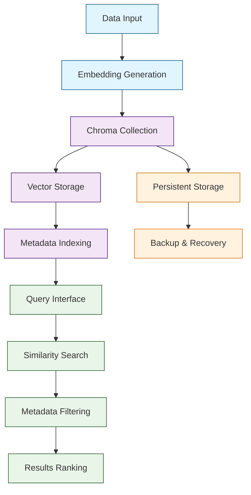

# Chroma Tutorial: Building AI-Native Vector Databases

> This tutorial is AI-generated! To learn more, check out [Awesome Code Docs](https://github.com/johnxie/awesome-code-docs)

Chroma[View Repo](https://github.com/chroma-core/chroma) is the AI-native open-source embedding database designed specifically for AI applications. It provides a simple, fast, and scalable solution for storing and retrieving embeddings with advanced features like metadata filtering, multimodal support, and seamless integration with popular AI frameworks.

Chroma enables developers to build sophisticated AI applications with persistent memory, fast retrieval, and powerful querying capabilities without the complexity of traditional databases.

## Tutorial Chapters

Welcome to your journey through AI-native vector databases! This tutorial explores how to build powerful AI applications with Chroma's embedding database.

1. **[Chapter 1: Getting Started with Chroma](01-getting-started.md)** - Installation, setup, and your first vector database
2. **[Chapter 2: Collections & Documents](02-collections-documents.md)** - Managing data collections and document operations
3. **[Chapter 3: Embeddings & Indexing](03-embeddings-indexing.md)** - Working with embeddings and vector indexing
4. **[Chapter 4: Querying & Retrieval](04-querying-retrieval.md)** - Advanced querying patterns and similarity search
5. **[Chapter 5: Metadata & Filtering](05-metadata-filtering.md)** - Using metadata for advanced filtering and search
6. **[Chapter 6: Integration Patterns](06-integration-patterns.md)** - Integrating Chroma with AI frameworks and applications
7. **[Chapter 7: Production Deployment](07-production-deployment.md)** - Scaling Chroma for production workloads
8. **[Chapter 8: Performance Optimization](08-performance-optimization.md)** - Tuning and optimizing Chroma performance

## What You'll Learn

By the end of this tutorial, you'll be able to:

- **Build AI applications** with persistent vector memory and fast retrieval
- **Manage collections** of embeddings with advanced metadata support
- **Implement similarity search** with filtering and ranking capabilities
- **Integrate Chroma** with popular AI frameworks and LLMs
- **Scale Chroma deployments** for production workloads
- **Optimize performance** through indexing and architectural choices
- **Handle multimodal data** including text, images, and structured data
- **Implement advanced querying** with complex filters and aggregations

## Prerequisites

- Python 3.8+
- Basic understanding of vectors and embeddings
- Familiarity with database concepts
- Knowledge of AI/ML frameworks (helpful but not required)

## Learning Path

### 🟢 Beginner Track
Perfect for developers new to vector databases:
1. Chapters 1-2: Setup and basic collection management
2. Focus on understanding Chroma fundamentals

### 🟡 Intermediate Track
For developers building AI applications:
1. Chapters 3-5: Embeddings, querying, and metadata
2. Learn to build sophisticated retrieval systems

### 🔴 Advanced Track
For production AI system development:
1. Chapters 6-8: Integration, deployment, and optimization
2. Master enterprise-grade vector database solutions

---

**Ready to build AI applications with Chroma? Let's begin with [Chapter 1: Getting Started](01-getting-started.md)!**

*Generated by [AI Codebase Knowledge Builder](https://github.com/The-Pocket/Tutorial-Codebase-Knowledge)*
