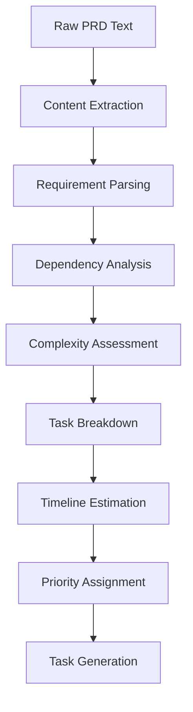

# Chapter 2: PRD Analysis & Task Generation

Now that you have Task Master set up, let's dive into how it analyzes Product Requirements Documents (PRDs) and generates actionable tasks. This is where Task Master truly shines - transforming high-level requirements into detailed, executable task lists.

## Understanding PRD Analysis

### What Makes a Good PRD?

Task Master works best with well-structured PRDs that include:

```markdown
# Product Requirements Document

## Executive Summary
Brief overview of the product/feature

## Objectives
- Business objectives
- User goals
- Success metrics

## Requirements
### Functional Requirements
- User authentication
- Data storage
- API endpoints

### Non-Functional Requirements
- Performance requirements
- Security requirements
- Scalability needs

## User Stories
- As a [user type], I want [goal] so that [benefit]
- Acceptance criteria for each story

## Technical Considerations
- Technology stack
- Integration points
- Data architecture

## Timeline & Milestones
- Phase 1: MVP features
- Phase 2: Enhanced features
- Phase 3: Optimization
```

### PRD Analysis Process

Task Master uses AI to analyze your PRD through several stages:



## Task Generation Examples

### E-commerce Platform PRD

**Input PRD Excerpt:**
```
Build a modern e-commerce platform with user authentication, product catalog, shopping cart, and payment processing.
```

**Task Master Analysis:**
```
📋 Analyzing PRD...

🎯 Identified Objectives:
- User authentication system
- Product catalog with search/filtering
- Shopping cart functionality
- Payment processing integration
- Order management system

🔧 Technical Requirements:
- Frontend: React with TypeScript
- Backend: Node.js with Express
- Database: PostgreSQL
- Authentication: JWT
- Payment: Stripe API

⚡ Estimated Complexity: High
⏱️ Estimated Timeline: 12-16 weeks
👥 Team Size: 4-6 developers
```

**Generated Tasks:**
```
Phase 1: Foundation (Weeks 1-4)
├── Set up project structure and CI/CD
├── Implement user authentication
├── Create database schema
└── Set up basic API endpoints

Phase 2: Core Features (Weeks 5-10)
├── Build product catalog
├── Implement shopping cart
├── Integrate payment processing
└── Create order management

Phase 3: Enhancement (Weeks 11-12)
├── Add search and filtering
├── Implement user reviews
└── Performance optimization
```

### Mobile App Development PRD

**Input PRD Excerpt:**
```
Develop a fitness tracking mobile app with workout logging, progress tracking, and social features.
```

**Task Master Analysis:**
```
📋 Analyzing PRD...

🎯 Identified Features:
- Workout logging and tracking
- Progress visualization
- Social sharing features
- User profiles and goals
- Offline functionality

🔧 Technical Stack:
- Frontend: React Native
- Backend: Node.js/Express
- Database: MongoDB
- Real-time: Socket.io
- Storage: AWS S3

⚡ Estimated Complexity: Medium-High
⏱️ Estimated Timeline: 8-12 weeks
👥 Team Size: 3-4 developers
```

## Advanced PRD Analysis Features

### Multi-Objective Analysis

Task Master can handle complex PRDs with multiple objectives:

```bash
# Analyze PRD with multiple focus areas
task-master analyze-prd complex-prd.md --focus "technical,security,performance"

# Generate tasks for specific team roles
task-master analyze-prd prd.md --roles "frontend,backend,design,qa"
```

### Dependency Mapping

```bash
# Analyze task dependencies
task-master analyze-dependencies prd.md

# Output:
🔗 Task Dependencies Identified:
├── User Authentication → Product Catalog
├── Database Setup → All Backend Tasks
├── API Design → Frontend Integration
├── Payment Integration → Order Processing
└── User Testing → Deployment
```

### Risk Assessment

```bash
# Assess project risks
task-master assess-risks prd.md

# Output:
⚠️ Risk Assessment:
├── High Risk: Payment integration complexity
├── Medium Risk: Mobile performance optimization
├── Low Risk: Basic CRUD operations
└── Mitigation Strategies: Phase implementation, extensive testing
```

## Custom Task Templates

### Technology-Specific Templates

```bash
# Use React-specific task template
task-master generate-tasks prd.md --template react-webapp

# Use Node.js API template
task-master generate-tasks prd.md --template nodejs-api

# Use mobile app template
task-master generate-tasks prd.md --template react-native
```

### Industry-Specific Templates

```bash
# E-commerce template
task-master generate-tasks prd.md --industry ecommerce

# SaaS platform template
task-master generate-tasks prd.md --industry saas

# Data analytics template
task-master generate-tasks prd.md --industry analytics
```

## Task Refinement & Iteration

### Task Breakdown Strategies

```bash
# Break down large tasks
task-master breakdown-task "Implement user authentication" --max-hours 8

# Output:
📋 Task Breakdown:
├── Set up authentication routes
├── Implement JWT token generation
├── Create user registration endpoint
├── Build login/logout functionality
├── Add password reset feature
└── Implement session management
```

### Task Estimation Refinement

```bash
# Refine time estimates based on team experience
task-master refine-estimates tasks.json --team-experience intermediate

# Adjust for project constraints
task-master refine-estimates tasks.json --timeline "3 months" --resources 5
```

## Integration with Development Tools

### GitHub Integration

```bash
# Create GitHub issues from tasks
task-master export-github-issues tasks.json --repo "myorg/myproject"

# Sync task status with GitHub
task-master sync-github --repo "myorg/myproject"
```

### Jira Integration

```bash
# Export to Jira
task-master export-jira tasks.json --project "PROJ" --server "company.atlassian.net"

# Import from Jira
task-master import-jira --project "PROJ" --server "company.atlassian.net"
```

### Slack Integration

```bash
# Send task updates to Slack
task-master notify-slack tasks.json --channel "#development" --webhook-url "https://hooks.slack.com/..."

# Daily standup reminders
task-master daily-standup --slack-webhook "https://hooks.slack.com/..."
```

## Advanced Analysis Features

### Code Complexity Analysis

```bash
# Analyze technical complexity
task-master analyze-complexity prd.md --tech-stack "react,nodejs,postgresql"

# Output:
🧩 Complexity Analysis:
├── Frontend Complexity: Medium (React components, state management)
├── Backend Complexity: High (API design, data processing)
├── Database Complexity: Medium (Schema design, query optimization)
└── Integration Complexity: High (Payment processing, third-party APIs)
```

### Resource Estimation

```bash
# Estimate resource requirements
task-master estimate-resources prd.md

# Output:
👥 Resource Estimation:
├── Frontend Developers: 2 (React specialists)
├── Backend Developers: 2 (Node.js/API experts)
├── DevOps Engineer: 1 (Deployment specialist)
├── QA Engineers: 1 (Testing specialist)
└── Product Manager: 1 (Requirements management)
```

### Timeline Optimization

```bash
# Optimize project timeline
task-master optimize-timeline prd.md --deadline "2024-06-01"

# Output:
⏱️ Timeline Optimization:
├── Parallel Development: Frontend/Backend can run simultaneously
├── Critical Path: Payment integration (Weeks 8-10)
├── Buffer Time: 2 weeks for unexpected issues
├── Milestone Dates: MVP (Week 6), Beta (Week 10), Launch (Week 12)
```

## Real-World PRD Examples

### SaaS Dashboard PRD

```markdown
# Analytics Dashboard PRD

## Overview
Build a comprehensive analytics dashboard for SaaS companies to track user metrics, revenue, and product performance.

## Key Features
- Real-time user activity monitoring
- Revenue and subscription analytics
- Custom dashboard builder
- Automated report generation
- Integration with popular data sources

## Technical Requirements
- Real-time data processing
- Scalable architecture
- Advanced visualization components
- API integrations
- Mobile-responsive design
```

**Task Master Generated Tasks:**
```
🎯 High-Level Objectives:
├── Real-time Analytics System
├── Custom Dashboard Builder
├── Automated Reporting Engine
└── Third-party Integrations

📋 Detailed Tasks:
├── Set up real-time data pipeline (Week 1-2)
├── Implement dashboard components (Week 2-4)
├── Build analytics API endpoints (Week 3-5)
├── Create report generation system (Week 4-6)
├── Add data source integrations (Week 5-7)
└── Performance optimization (Week 7-8)
```

### API Platform PRD

```markdown
# API Management Platform PRD

## Overview
Develop a comprehensive API management platform with gateway, analytics, and developer portal.

## Requirements
- API Gateway with rate limiting
- Request/response transformation
- Analytics and monitoring
- Developer documentation
- API versioning and lifecycle management

## Success Metrics
- Support 10,000+ API calls per minute
- 99.9% uptime SLA
- Sub-100ms response times
```

**Task Master Generated Tasks:**
```
🎯 Technical Architecture:
├── API Gateway Implementation
├── Analytics & Monitoring System
├── Developer Portal
└── Deployment & Operations

📋 Implementation Tasks:
├── Design API gateway architecture (Week 1)
├── Implement rate limiting and security (Week 2-3)
├── Build analytics pipeline (Week 3-4)
├── Create developer portal (Week 4-5)
├── Add API documentation features (Week 5-6)
├── Performance testing and optimization (Week 6-7)
└── Production deployment (Week 7-8)
```

## Best Practices for PRD Writing

### Structure Guidelines

```markdown
# PRD Title

## Executive Summary (1 paragraph)
What the product/feature does and why it matters

## Objectives & Success Metrics
- Business objectives with measurable outcomes
- User goals and success criteria
- Key performance indicators

## Requirements (Detailed but concise)
### Functional Requirements
- Must-have features with acceptance criteria
- Nice-to-have features clearly marked

### Non-Functional Requirements
- Performance requirements
- Security requirements
- Scalability requirements

## User Stories & Use Cases
- Primary user journeys
- Edge cases and error scenarios
- Integration points

## Technical Considerations
- Technology stack decisions
- Architecture constraints
- Integration requirements

## Timeline & Resources
- Realistic timeline with milestones
- Resource requirements
- Risk assessment and mitigation
```

### Common PRD Pitfalls to Avoid

```bash
# ❌ Too vague
"Build a user dashboard"

# ✅ Specific and measurable
"Build a user dashboard with real-time metrics, customizable widgets, and export functionality supporting PDF and CSV formats"
```

```bash
# ❌ Missing acceptance criteria
"User can log in"

# ✅ Clear acceptance criteria
"User can log in with email/password or OAuth providers. Login form validates input, shows clear error messages, and redirects to dashboard on success."
```

## Advanced Task Master Features

### Collaborative PRD Analysis

```bash
# Multi-user PRD review
task-master collaborative-analysis prd.md --team "alice,bob,charlie"

# Generate consensus tasks
task-master generate-consensus-tasks analysis-results.json
```

### Iterative Refinement

```bash
# Refine tasks based on feedback
task-master refine-tasks tasks.json --feedback "add-mobile-support"

# Update PRD and regenerate
task-master update-prd prd.md --changes "new-requirements.md"
task-master regenerate-tasks updated-prd.md
```

### Project Templates

```bash
# Use proven project templates
task-master create-from-template "ecommerce-platform" --customize

# Available templates:
# - web-application
# - mobile-app
# - api-platform
# - data-pipeline
# - ml-platform
# - devops-infrastructure
```

## Integration with Popular Tools

### VS Code Extension

```json
// .vscode/settings.json
{
  "taskmaster": {
    "autoSync": true,
    "defaultTemplate": "web-application",
    "integrations": {
      "github": true,
      "jira": false,
      "slack": true
    }
  }
}
```

### CI/CD Integration

```yaml
# .github/workflows/taskmaster.yml
name: Task Master Analysis
on:
  push:
    paths:
      - 'docs/prd.md'
jobs:
  analyze:
    runs-on: ubuntu-latest
    steps:
      - uses: actions/checkout@v3
      - uses: johnxie/taskmaster-action@v1
        with:
          prd-path: docs/prd.md
          output-format: markdown
```

## What We've Accomplished

Congratulations! 🎉 You've learned how to:

1. **Write effective PRDs** that Task Master can analyze effectively
2. **Use Task Master's AI analysis** to break down complex requirements
3. **Generate detailed task lists** with dependencies and time estimates
4. **Apply industry-specific templates** for faster project setup
5. **Integrate with development tools** like GitHub, Jira, and Slack
6. **Refine and optimize** generated tasks based on project constraints
7. **Assess project risks** and create mitigation strategies
8. **Scale task management** for team collaboration

## Next Steps

Now that you understand how Task Master analyzes PRDs and generates tasks, let's explore how to manage and execute these tasks effectively. In [Chapter 3: Task Management & Execution](03-task-management.md), we'll dive into task lifecycle management, progress tracking, and team collaboration features.

---

**Practice what you've learned:**
1. Write a PRD for a project you're planning
2. Use Task Master to analyze it and generate tasks
3. Experiment with different templates and refinement options
4. Try integrating with your preferred development tools

*What's the most complex PRD you've written, and how could Task Master improve the process?* 📋
