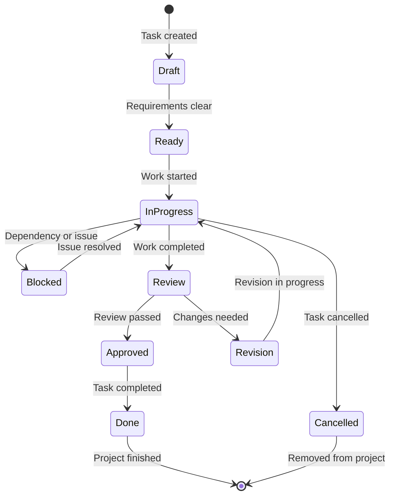

# Chapter 3: Task Management & Execution

Now that you have tasks generated from your PRD, let's explore how to effectively manage and execute them using Task Master's comprehensive task management features.

## Task Lifecycle Management

### Task States & Transitions



### Task Status Management

```bash
# Start working on a task
task-master start-task 5

# Mark task as blocked with reason
task-master block-task 5 --reason "Waiting for API documentation"

# Update task progress
task-master update-progress 5 --progress 75 --notes "Core functionality implemented"

# Mark task as ready for review
task-master submit-review 5

# Approve task completion
task-master approve-task 5

# Move task back to revision
task-master request-revision 5 --feedback "Add error handling"
```

## Advanced Task Operations

### Bulk Task Management

```bash
# Start multiple tasks
task-master start-tasks 1,2,3

# Update multiple tasks
task-master bulk-update --status completed --tasks "4,5,6"

# Move tasks between sprints
task-master move-sprint current-sprint next-sprint --tasks "7,8,9"
```

### Task Templates & Automation

```bash
# Create task template
task-master create-template "api-endpoint" \
  --description "Implement REST API endpoint" \
  --checklist "Define schema, Write tests, Add documentation"

# Apply template to task
task-master apply-template "api-endpoint" --to-task 10

# Generate recurring tasks
task-master create-recurring "daily-standup" \
  --frequency daily \
  --description "Daily team standup meeting"
```

## Dependency Management

### Understanding Dependencies

```bash
# View task dependencies
task-master show-dependencies 5

# Output:
📋 Task Dependencies for "Implement User Authentication":
├── Depends On:
│   ├── Task 2: Set up database schema
│   └── Task 3: Create user model
└── Blocks:
    ├── Task 6: Build user profile page
    ├── Task 7: Implement password reset
    └── Task 8: Add user settings
```

### Managing Complex Dependencies

```bash
# Add dependency
task-master add-dependency 8 --depends-on 5

# Remove dependency
task-master remove-dependency 8 --depends-on 5

# View dependency graph
task-master graph-dependencies --format mermaid

# Find critical path
task-master critical-path
```

## Time Tracking & Estimation

### Time Estimation Features

```bash
# Update time estimate
task-master estimate-time 5 --hours 12 --confidence high

# Log actual time spent
task-master log-time 5 --hours 8 --date "2024-01-15"

# View time tracking report
task-master time-report --user alice --period "last-week"

# Generate burndown chart
task-master burndown-chart --sprint current
```

### Effort Tracking

```bash
# Track effort by category
task-master track-effort 5 \
  --design 2 \
  --development 6 \
  --testing 2 \
  --documentation 1

# View effort distribution
task-master effort-breakdown --project current

# Compare estimated vs actual effort
task-master effort-comparison --tasks "1-10"
```

## Quality Assurance & Review

### Code Review Integration

```bash
# Submit task for review
task-master submit-review 5 \
  --description "Implemented user authentication with JWT" \
  --files "auth.py,tests/test_auth.py"

# Assign reviewer
task-master assign-reviewer 5 --reviewer bob

# Add review feedback
task-master add-feedback 5 \
  --reviewer bob \
  --comments "Good implementation, but add input validation" \
  --rating 4

# Approve review
task-master approve-review 5
```

### Quality Checklist

```bash
# Define quality checklist for task type
task-master create-checklist "backend-api" \
  --items "Input validation,Error handling,Unit tests,Documentation,Security review"

# Apply checklist to task
task-master apply-checklist "backend-api" --to-task 5

# Update checklist progress
task-master update-checklist 5 \
  --item "Input validation" --status completed \
  --item "Unit tests" --status in-progress

# View checklist status
task-master show-checklist 5
```

## Team Collaboration Features

### Task Assignment & Ownership

```bash
# Assign task to team member
task-master assign-task 5 --assignee alice

# Reassign task
task-master reassign-task 5 --from alice --to bob

# View team workload
task-master team-workload --period "next-week"

# Balance team assignments
task-master balance-workload
```

### Communication & Updates

```bash
# Add task comment
task-master add-comment 5 --message "Working on JWT implementation"

# @mention team members
task-master add-comment 5 --message "@bob can you review the auth logic?"

# View task activity feed
task-master activity-feed 5 --limit 10

# Get task notifications
task-master notifications --unread
```

## Progress Tracking & Reporting

### Sprint Management

```bash
# Create sprint
task-master create-sprint "Sprint 1" \
  --start-date "2024-01-15" \
  --end-date "2024-01-28" \
  --goal "Complete user authentication system"

# Add tasks to sprint
task-master add-to-sprint "Sprint 1" --tasks "1,2,3,4,5"

# View sprint progress
task-master sprint-progress "Sprint 1"

# Generate sprint report
task-master sprint-report "Sprint 1" --format pdf
```

### Project Dashboard

```bash
# View project overview
task-master dashboard

# Output:
📊 Project Dashboard - Current Sprint
━━━━━━━━━━━━━━━━━━━━━━━━━━━━━━━━━━━━━━━━
🎯 Sprint Goal: Complete user authentication system
📅 Period: Jan 15 - Jan 28 (11 days remaining)
📈 Progress: ████████░░░░ 65% (13/20 tasks completed)

📋 Task Status:
✅ Completed: 13 tasks
🔄 In Progress: 4 tasks
⏳ Ready: 2 tasks
🚫 Blocked: 1 task

👥 Team Performance:
Alice: ████████░░ 8/10 tasks (2h remaining)
Bob: ███████░░░ 7/10 tasks (4h remaining)
Charlie: █████░░░░░ 5/10 tasks (8h remaining)

⚠️ Risk Alerts:
• Task 15 blocked by external dependency
• Sprint capacity exceeded by 15%
```

### Custom Reports

```bash
# Generate burndown chart
task-master burndown-chart --sprint "Sprint 1" --format png

# Create velocity report
task-master velocity-report --period "last-3-sprints"

# Export project data
task-master export-project --format json --include-history

# Generate stakeholder report
task-master stakeholder-report \
  --audience "executives" \
  --focus "timeline, budget, risks"
```

## Integration Features

### Git Integration

```bash
# Link task to Git branch
task-master link-branch 5 --branch "feature/user-auth"

# Track commits per task
task-master commits-per-task 5

# Create branch from task
task-master create-branch 5

# Generate PR description from task
task-master pr-description 5
```

### External Tool Integration

```bash
# Sync with Jira
task-master sync-jira --project "PROJ" --update-bidirectional

# Export to Trello
task-master export-trello --board "Development Board"

# Import from Asana
task-master import-asana --workspace "My Workspace"

# Connect to Slack
task-master slack-integration --webhook-url "https://hooks.slack.com/..."
```

## Advanced Task Features

### Task Templates Library

```bash
# Browse available templates
task-master list-templates

# Output:
📚 Available Task Templates:
├── web-development
│   ├── react-component
│   ├── api-endpoint
│   ├── database-migration
│   └── unit-tests
├── mobile-development
│   ├── screen-implementation
│   ├── api-integration
│   └── offline-sync
└── devops
    ├── ci-cd-pipeline
    ├── docker-setup
    └── monitoring-setup
```

### Smart Task Suggestions

```bash
# Get task suggestions based on current work
task-master suggest-next-tasks

# Output:
💡 Suggested Next Tasks:
├── Task 8: Implement password reset flow (High priority)
├── Task 12: Add user profile page (Medium priority)
├── Task 15: Set up email notifications (Low priority)

📊 Reasoning:
• Task 8 depends on current authentication work
• Task 12 is frequently requested user feature
• Task 15 enhances user experience
```

### Automated Task Creation

```bash
# Create tasks from code analysis
task-master analyze-code --path "src/auth" --create-tasks

# Generate tasks from API spec
task-master analyze-api-spec openapi.yaml --create-tasks

# Create tasks from user feedback
task-master analyze-feedback "user-feedback.csv" --create-tasks
```

## Performance & Productivity Features

### Focus Mode

```bash
# Start focus session
task-master focus-mode 5 --duration 2h

# During focus mode:
# - Notifications muted
# - Progress auto-tracked
# - Distractions minimized
# - Time blocking enforced
```

### Pomodoro Integration

```bash
# Enable Pomodoro timer
task-master pomodoro --work-duration 25m --break-duration 5m

# Link to current task
task-master pomodoro --task 5 --auto-log-time
```

### Productivity Analytics

```bash
# View personal productivity metrics
task-master productivity-report --user alice --period "last-month"

# Output:
📈 Productivity Report - Alice (Last Month)
━━━━━━━━━━━━━━━━━━━━━━━━━━━━━━━━━━━━━━━━
⏱️ Total Time Logged: 120 hours
🎯 Tasks Completed: 24
⚡ Average Task Completion: 5 hours
📊 Productivity Score: 8.5/10

📈 Trends:
• Most productive: Tuesday-Thursday (avg 6.5h/day)
• Peak hours: 10 AM - 2 PM
• Best performing task type: Feature development

💡 Recommendations:
• Consider more breaks on Friday afternoons
• Try time-blocking for complex tasks
• Review task estimation accuracy
```

## What We've Accomplished

Congratulations! 🎉 You've mastered Task Master's task management and execution features:

1. **Task Lifecycle Management** - Complete control over task states and transitions
2. **Advanced Operations** - Bulk operations, templates, and automation
3. **Dependency Management** - Complex dependency graphs and critical path analysis
4. **Time Tracking** - Accurate effort tracking and time estimation
5. **Quality Assurance** - Integrated code reviews and quality checklists
6. **Team Collaboration** - Assignment, communication, and coordination features
7. **Progress Tracking** - Sprint management and comprehensive reporting
8. **Integration Features** - Git, external tools, and seamless workflows
9. **Productivity Features** - Focus mode, Pomodoro, and analytics

## Next Steps

Now that you can effectively manage and execute tasks, let's explore how to leverage multiple AI models for different aspects of development. In [Chapter 4: Multi-Model Integration](04-multi-model-integration.md), we'll dive into using specialized AI models for different types of tasks and workflows.

---

**Practice what you've learned:**
1. Set up a sprint and assign tasks to team members
2. Use dependency management for a complex multi-step task
3. Generate a comprehensive project report
4. Try focus mode for uninterrupted work sessions

*What's your biggest challenge in managing development tasks, and how could Task Master help?* 📋
