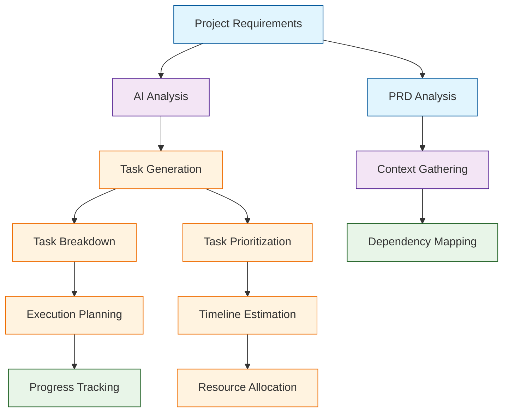

# Claude Task Master Tutorial: AI-Powered Task Management for Developers

> This tutorial is AI-generated! To learn more, check out [Awesome Code Docs](https://github.com/johnxie/awesome-code-docs)

Claude Task Master[View Repo](https://github.com/eyaltoledano/claude-task-master) is an AI-powered task-management system designed specifically for developers. It integrates seamlessly with popular editors like Cursor, Windsurf, and Roo Code, providing intelligent project planning, task breakdown, and progress tracking powered by advanced AI models.

Task Master transforms how developers approach complex projects by using AI to analyze requirements, create detailed task plans, and maintain focus throughout the development process.

## Tutorial Chapters

Welcome to your journey through AI-powered task management! This tutorial explores how to leverage Claude Task Master for intelligent project planning and execution.

1. **[Chapter 1: Getting Started with Task Master](01-getting-started.md)** - Installation, setup, and first project initialization
2. **[Chapter 2: PRD Analysis & Task Generation](02-prd-analysis.md)** - Converting requirements into actionable tasks
3. **[Chapter 3: Task Management & Execution](03-task-management.md)** - Working with tasks, dependencies, and progress tracking
4. **[Chapter 4: Multi-Model Integration](04-multi-model-integration.md)** - Leveraging different AI models for specialized tasks
5. **[Chapter 5: Editor Integrations](05-editor-integrations.md)** - Using Task Master with Cursor, Windsurf, and other editors
6. **[Chapter 6: Advanced Workflows](06-advanced-workflows.md)** - Complex project structures and team collaboration
7. **[Chapter 7: Customization & Extensions](07-customization.md)** - Adapting Task Master for specific workflows
8. **[Chapter 8: Production Project Management](08-production-management.md)** - Scaling Task Master for large projects

## What You'll Learn

By the end of this tutorial, you'll be able to:

- **Set up AI-powered task management** in your development environment
- **Convert project requirements** into detailed, actionable task lists
- **Manage complex projects** with intelligent dependency tracking
- **Integrate multiple AI models** for different aspects of development
- **Use Task Master with popular editors** for seamless workflow
- **Scale task management** for team collaboration and large projects
- **Customize workflows** for specific development methodologies
- **Optimize project execution** with AI-driven insights and planning

## Prerequisites

- Node.js 16+ and npm
- Git for version control
- Familiarity with your preferred code editor (Cursor, Windsurf, VS Code, etc.)
- Basic understanding of project management concepts
- Experience with software development workflows

## Learning Path

### 🟢 Beginner Track
Perfect for developers new to AI-assisted project management:
1. Chapters 1-2: Setup and basic PRD-to-task conversion
2. Focus on understanding Task Master's core functionality

### 🟡 Intermediate Track
For developers managing complex projects:
1. Chapters 3-5: Task execution, multi-model integration, and editor workflows
2. Learn to integrate Task Master into your development process

### 🔴 Advanced Track
For teams and large-scale project management:
1. Chapters 6-8: Advanced workflows, customization, and production scaling
2. Master enterprise-grade AI-powered project management

---

**Ready to revolutionize your project management with AI? Let's begin with [Chapter 1: Getting Started](01-getting-started.md)!**

*Generated by [AI Codebase Knowledge Builder](https://github.com/The-Pocket/Tutorial-Codebase-Knowledge)*
