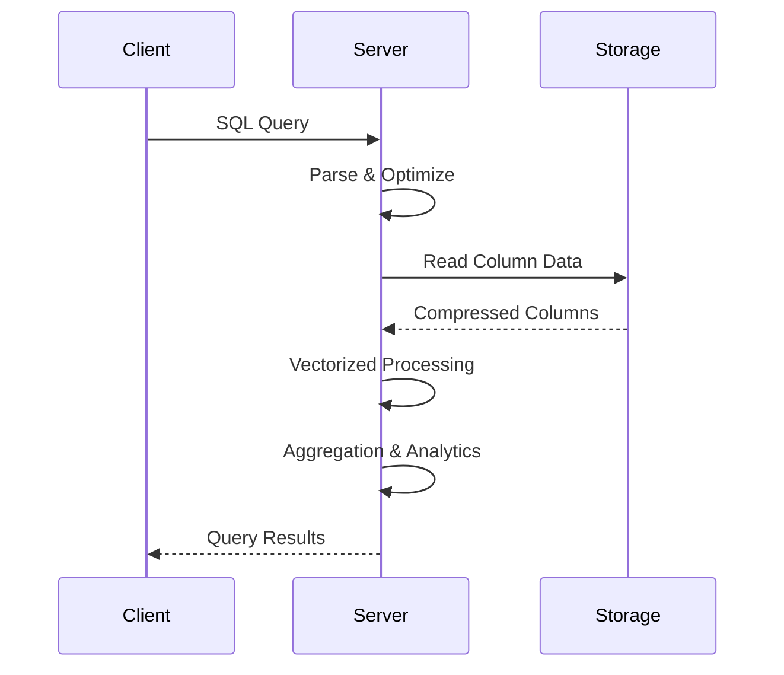

# Chapter 1: Getting Started with ClickHouse

Welcome to ClickHouse! If you've ever needed to analyze massive datasets with lightning-fast performance, you're in the right place. ClickHouse is designed specifically for analytical workloads, providing unparalleled speed for complex queries on large datasets.

## What Makes ClickHouse Special?

ClickHouse revolutionizes analytical databases by:
- **Column-Oriented Storage** - Optimized for analytical queries and aggregations
- **Vectorized Query Execution** - Processes data in CPU vector registers for maximum speed
- **Massive Parallel Processing** - Utilizes all available CPU cores simultaneously
- **Efficient Compression** - Reduces storage costs while maintaining query performance
- **Real-Time Ingestion** - Handles continuous data streams with minimal latency
- **Horizontal Scaling** - Distributes queries across multiple nodes seamlessly

## Installation Options

### Option 1: Docker Installation (Recommended)

```bash
# Pull and run ClickHouse server
docker run -d --name clickhouse-server \
  --ulimit nofile=262144:262144 \
  -p 8123:8123 -p 9000:9000 \
  clickhouse/clickhouse-server:latest

# Access ClickHouse CLI
docker exec -it clickhouse-server clickhouse-client
```

### Option 2: Native Linux Installation

```bash
# Ubuntu/Debian
sudo apt-get install clickhouse-server clickhouse-client

# CentOS/RHEL/Fedora
sudo yum install clickhouse-server clickhouse-client

# Start the service
sudo systemctl start clickhouse-server
sudo systemctl enable clickhouse-server

# Connect to ClickHouse
clickhouse-client
```

### Option 3: macOS Installation

```bash
# Using Homebrew
brew install clickhouse

# Start ClickHouse server
clickhouse server

# In another terminal, connect
clickhouse client
```

### Option 4: Windows Installation

```bash
# Using Docker (recommended for Windows)
docker run -d --name clickhouse-server \
  -p 8123:8123 -p 9000:9000 \
  clickhouse/clickhouse-server:latest

# Access via Docker
docker exec -it clickhouse-server clickhouse-client
```

## Your First ClickHouse Database

Let's create your first analytical database:

### Step 1: Connect to ClickHouse

```bash
# Connect using HTTP interface (port 8123)
curl "http://localhost:8123/" \
  --data-binary "SELECT 1"

# Or use the native client
clickhouse-client

# In the client, you should see:
# ClickHouse client version 23.8.1.1.
# Connecting to localhost:9000 as user default.
# Connected to ClickHouse server version 23.8.1.

# :)
```

### Step 2: Create Your First Database

```sql
-- Create a new database
CREATE DATABASE analytics;

-- Switch to the database
USE analytics;

-- Verify database creation
SHOW DATABASES;
```

### Step 3: Create Your First Table

```sql
-- Create a table for user events
CREATE TABLE user_events (
    user_id UInt64,
    event_type String,
    event_time DateTime,
    event_data String,
    session_id String,
    user_agent String,
    ip_address String
) ENGINE = MergeTree()
ORDER BY (user_id, event_time)
PARTITION BY toYYYYMM(event_time);
```

### Step 4: Insert Sample Data

```sql
-- Insert some sample events
INSERT INTO user_events VALUES
(1, 'page_view', '2023-12-01 10:00:00', '{"page": "/home", "duration": 30}', 'session_123', 'Chrome/91.0', '192.168.1.1'),
(1, 'click', '2023-12-01 10:00:15', '{"element": "button", "page": "/home"}', 'session_123', 'Chrome/91.0', '192.168.1.1'),
(2, 'page_view', '2023-12-01 10:05:00', '{"page": "/products", "duration": 45}', 'session_456', 'Firefox/89.0', '192.168.1.2'),
(3, 'purchase', '2023-12-01 10:10:00', '{"product_id": 123, "amount": 99.99}', 'session_789', 'Safari/14.0', '192.168.1.3');
```

### Step 5: Run Your First Analytical Query

```sql
-- Count total events
SELECT count() FROM user_events;

-- Count events by type
SELECT event_type, count() as event_count
FROM user_events
GROUP BY event_type
ORDER BY event_count DESC;

-- Find top users by activity
SELECT user_id, count() as total_events
FROM user_events
GROUP BY user_id
ORDER BY total_events DESC
LIMIT 10;

-- Analyze events over time
SELECT
    toStartOfHour(event_time) as hour,
    event_type,
    count() as event_count
FROM user_events
GROUP BY hour, event_type
ORDER BY hour, event_type;
```

## Understanding ClickHouse Architecture

### Core Components

```
ClickHouse System
├── Server (clickhouse-server)
│   ├── Query Processor
│   ├── Storage Engine
│   └── Network Interface
├── Client Tools
│   ├── clickhouse-client (CLI)
│   ├── HTTP Interface (port 8123)
│   └── Native Protocol (port 9000)
├── Storage Layer
│   ├── MergeTree Engine
│   ├── Column Storage
│   └── Compression
└── Distributed Layer
    ├── Sharding
    ├── Replication
    └── Load Balancing
```

### Data Flow in ClickHouse



### Table Engines

ClickHouse uses different storage engines for different use cases:

```sql
-- MergeTree (most common for analytical data)
CREATE TABLE events (
    id UInt64,
    data String,
    timestamp DateTime
) ENGINE = MergeTree()
ORDER BY (id, timestamp);

-- ReplacingMergeTree (handles duplicate data)
CREATE TABLE user_profiles (
    user_id UInt64,
    name String,
    email String,
    updated_at DateTime
) ENGINE = ReplacingMergeTree(updated_at)
ORDER BY user_id;

-- SummingMergeTree (automatic aggregation)
CREATE TABLE metrics (
    date Date,
    metric_name String,
    value UInt64
) ENGINE = SummingMergeTree()
ORDER BY (date, metric_name);
```

## Data Types in ClickHouse

### Numeric Types

```sql
-- Integers
CREATE TABLE numbers (
    tiny TinyInt,      -- 8-bit: -128 to 127
    small SmallInt,    -- 16-bit: -32,768 to 32,767
    medium MediumInt,  -- 24-bit: -8,388,608 to 8,388,607
    normal Int32,      -- 32-bit: -2^31 to 2^31-1
    big UInt64         -- 64-bit unsigned: 0 to 2^64-1
);

-- Floating Point
CREATE TABLE measurements (
    temperature Float32,  -- 32-bit float
    pressure Float64,     -- 64-bit float (double)
    accuracy Decimal(10,2) -- Fixed precision decimal
);
```

### String Types

```sql
-- String types
CREATE TABLE text_data (
    short_text FixedString(100),  -- Fixed length string
    long_text String,             -- Variable length string
    json_data String              -- JSON as string
);
```

### Date and Time Types

```sql
-- Temporal types
CREATE TABLE temporal_data (
    event_date Date,                    -- Date only (YYYY-MM-DD)
    event_time DateTime,                -- Date and time
    event_timestamp DateTime64(3),      -- High precision timestamp
    duration UInt32                     -- Duration in seconds
);
```

### Array and Nested Types

```sql
-- Complex data structures
CREATE TABLE complex_data (
    tags Array(String),                    -- Array of strings
    properties Map(String, String),        -- Key-value pairs
    coordinates Tuple(Float64, Float64),   -- Latitude, longitude
    metadata Nested(                      -- Nested structure
        key String,
        value String,
        timestamp DateTime
    )
);
```

## Basic Query Patterns

### Data Ingestion

```sql
-- Insert single row
INSERT INTO user_events VALUES (4, 'login', '2023-12-01 11:00:00', '{}', 'session_999', 'Chrome/91.0', '192.168.1.4');

-- Insert multiple rows
INSERT INTO user_events VALUES
(5, 'signup', '2023-12-01 11:05:00', '{}', 'session_1000', 'Firefox/89.0', '192.168.1.5'),
(6, 'page_view', '2023-12-01 11:10:00', '{"page": "/dashboard"}', 'session_1001', 'Safari/14.0', '192.168.1.6');

-- Bulk insert from file
INSERT INTO user_events FROM INFILE '/path/to/events.csv' FORMAT CSV;
```

### Analytical Queries

```sql
-- Time-based aggregations
SELECT
    toStartOfDay(event_time) as day,
    event_type,
    count() as events,
    uniqExact(user_id) as unique_users
FROM user_events
WHERE event_time >= '2023-12-01'
GROUP BY day, event_type
ORDER BY day, events DESC;

-- User behavior analysis
SELECT
    user_id,
    countIf(event_type = 'page_view') as page_views,
    countIf(event_type = 'click') as clicks,
    countIf(event_type = 'purchase') as purchases,
    max(event_time) as last_activity
FROM user_events
GROUP BY user_id
HAVING page_views > 0
ORDER BY purchases DESC, page_views DESC;

-- Session analysis
SELECT
    session_id,
    user_id,
    min(event_time) as session_start,
    max(event_time) as session_end,
    count() as total_events,
    session_end - session_start as session_duration
FROM user_events
GROUP BY session_id, user_id
ORDER BY session_duration DESC;
```

### Advanced Analytics

```sql
-- Rolling window analysis
SELECT
    user_id,
    event_time,
    event_type,
    count() OVER (PARTITION BY user_id ORDER BY event_time ROWS BETWEEN 9 PRECEDING AND CURRENT ROW) as rolling_count_10
FROM user_events
ORDER BY user_id, event_time;

-- Cohort analysis
SELECT
    toStartOfMonth(first_event) as cohort_month,
    toStartOfMonth(event_time) as activity_month,
    count(distinct user_id) as active_users,
    cohort_month = activity_month as is_first_month
FROM (
    SELECT
        user_id,
        min(event_time) as first_event,
        event_time
    FROM user_events
    GROUP BY user_id, event_time
)
GROUP BY cohort_month, activity_month
ORDER BY cohort_month, activity_month;
```

## Performance Characteristics

### Why ClickHouse is Fast

1. **Column Storage**: Only reads required columns
2. **Vectorized Execution**: Processes data in CPU vectors
3. **Parallel Processing**: Uses all CPU cores
4. **Efficient Compression**: Reduces I/O operations
5. **Pre-aggregated Data**: MergeTree engine pre-sorts data
6. **Memory Efficient**: Minimizes memory allocations

### Benchmarking Your Setup

```sql
-- Test basic performance
SELECT count() FROM user_events;

-- Test aggregation performance
SELECT
    event_type,
    count() as cnt
FROM user_events
GROUP BY event_type;

-- Test complex analytical query
SELECT
    user_id,
    toStartOfHour(event_time) as hour,
    count() as events_per_hour
FROM user_events
WHERE event_time >= today()
GROUP BY user_id, hour
ORDER BY user_id, hour;
```

## Data Import and Export

### Importing Data

```bash
# Import from CSV
cat data.csv | clickhouse-client --query="INSERT INTO table_name FORMAT CSV"

# Import from TSV
clickhouse-client --query="INSERT INTO table_name FORMAT TabSeparated" < data.tsv

# Import from JSON
clickhouse-client --query="INSERT INTO table_name FORMAT JSONEachRow" < data.json
```

### Exporting Data

```sql
-- Export to CSV
SELECT * FROM user_events INTO OUTFILE 'events.csv' FORMAT CSV;

-- Export query results
SELECT user_id, count() as events
FROM user_events
GROUP BY user_id
INTO OUTFILE 'user_stats.csv' FORMAT CSVWithNames;
```

## Monitoring and Maintenance

### System Tables

```sql
-- View system information
SELECT * FROM system.databases;
SELECT * FROM system.tables;
SELECT * FROM system.processes;  -- Currently running queries

-- Monitor performance
SELECT * FROM system.metrics;
SELECT * FROM system.events;
```

### Basic Maintenance

```sql
-- Optimize table (merge parts)
OPTIMIZE TABLE user_events;

-- Check table size
SELECT
    database,
    table,
    sum(bytes) as size_bytes,
    formatReadableSize(sum(bytes)) as size_readable
FROM system.parts
WHERE database = 'analytics' AND table = 'user_events'
GROUP BY database, table;
```

## What We've Accomplished

Congratulations! 🎉 You've successfully:

1. **Installed ClickHouse** using Docker or native installation
2. **Created your first analytical database** with proper schema design
3. **Loaded sample data** and performed basic analytical queries
4. **Understood ClickHouse's architecture** and performance characteristics
5. **Learned essential data types** and table engines
6. **Implemented basic analytical patterns** for time-series and user behavior data
7. **Explored performance optimization** techniques
8. **Set up monitoring and maintenance** procedures

## Next Steps

Now that you have ClickHouse running and understand the basics, let's dive deeper into data modeling and schema design. In [Chapter 2: Data Modeling & Schemas](02-data-modeling.md), we'll explore ClickHouse's powerful table engines, partitioning strategies, and advanced schema design patterns.

---

**Practice what you've learned:**
1. Load a larger dataset and experiment with different analytical queries
2. Try different table engines (ReplacingMergeTree, SummingMergeTree)
3. Implement time-based partitioning for better performance
4. Create a real-time dashboard using ClickHouse's query capabilities

*What kind of analytical workload are you most excited to implement with ClickHouse?* 📊
