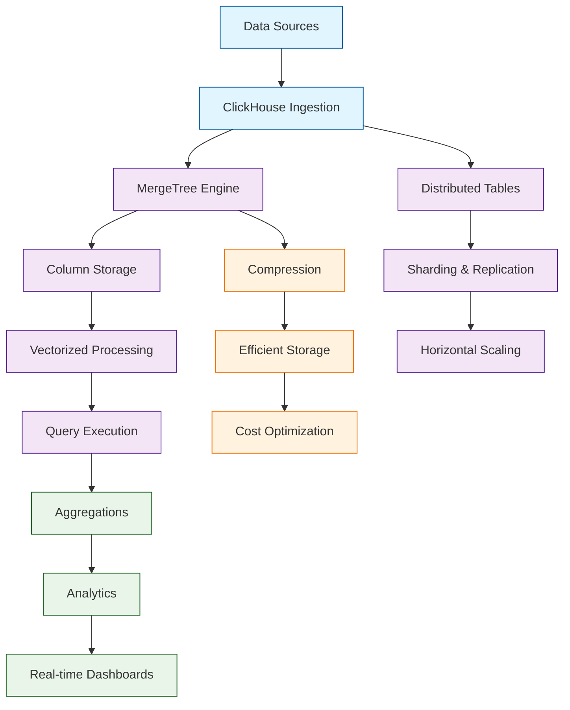

# ClickHouse Tutorial: High-Performance Analytical Database

> This tutorial is AI-generated! To learn more, check out [Awesome Code Docs](https://github.com/johnxie/awesome-code-docs)

ClickHouse[View Repo](https://github.com/ClickHouse/ClickHouse) is an open-source column-oriented database management system designed for online analytical processing (OLAP) workloads. It excels at processing massive amounts of data with lightning-fast query performance, making it ideal for real-time analytics, log analysis, and time-series data.

ClickHouse provides unparalleled performance for analytical queries while maintaining simplicity in deployment and management, making it a go-to solution for modern data analytics platforms.

## Tutorial Chapters

Welcome to your journey through high-performance analytical databases! This tutorial explores how to master ClickHouse for building fast, scalable analytics systems.

1. **[Chapter 1: Getting Started with ClickHouse](01-getting-started.md)** - Installation, basic setup, and first queries
2. **[Chapter 2: Data Modeling & Schemas](02-data-modeling.md)** - Table engines, data types, and schema design
3. **[Chapter 3: Data Ingestion & ETL](03-data-ingestion.md)** - Loading data from various sources
4. **[Chapter 4: Query Optimization](04-query-optimization.md)** - Writing efficient analytical queries
5. **[Chapter 5: Aggregation & Analytics](05-aggregation-analytics.md)** - Advanced analytical functions and patterns
6. **[Chapter 6: Distributed ClickHouse](06-distributed-setup.md)** - Clustering, sharding, and high availability
7. **[Chapter 7: Performance Tuning](07-performance-tuning.md)** - Optimization techniques and monitoring
8. **[Chapter 8: Production Deployment](08-production-deployment.md)** - Scaling, backup, and enterprise features

## What You'll Learn

By the end of this tutorial, you'll be able to:

- **Set up and configure ClickHouse** for high-performance analytics
- **Design efficient data schemas** using ClickHouse's table engines
- **Ingest data at scale** from various sources and formats
- **Write optimized analytical queries** leveraging ClickHouse's strengths
- **Implement advanced analytics** with window functions and aggregations
- **Deploy distributed clusters** for horizontal scaling
- **Monitor and tune performance** for production workloads
- **Build real-time analytical applications** with streaming data

## Prerequisites

- Basic SQL knowledge
- Understanding of database concepts
- Familiarity with Linux command line
- Basic understanding of analytical workloads (helpful but not required)

## Learning Path

### 🟢 Beginner Track
Perfect for developers new to analytical databases:
1. Chapters 1-2: Installation and basic data modeling
2. Focus on understanding ClickHouse fundamentals

### 🟡 Intermediate Track
For developers building analytical applications:
1. Chapters 3-5: Data ingestion, query optimization, and analytics
2. Learn to build efficient analytical pipelines

### 🔴 Advanced Track
For production analytical system development:
1. Chapters 6-8: Distributed deployment, performance tuning, and scaling
2. Master enterprise-grade analytical databases

---

**Ready to unlock the power of high-performance analytics with ClickHouse? Let's begin with [Chapter 1: Getting Started](01-getting-started.md)!**

*Generated by [AI Codebase Knowledge Builder](https://github.com/The-Pocket/Tutorial-Codebase-Knowledge)*
