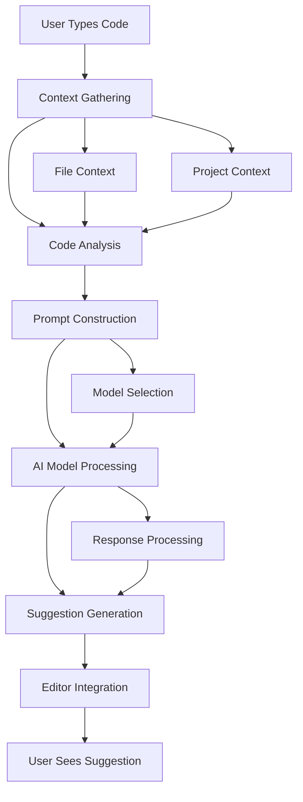

# Chapter 1: Getting Started with Continue

Welcome to Continue! If you've ever wished for an AI coding assistant that understands your codebase, anticipates your needs, and helps you write better code faster, you're in the right place. Continue provides open-source AI-powered coding assistance that rivals commercial tools while giving you full control and customization.

## What Makes Continue Special?

Continue revolutionizes coding assistance by:
- **Open-Source & Customizable** - Full control over your AI coding assistant
- **Multi-Model Support** - Choose from various AI models including local options
- **Deep Code Understanding** - Context-aware suggestions based on your entire codebase
- **Seamless Integration** - Works with your favorite editors and tools
- **Privacy-Focused** - Keep your code secure and private
- **Extensible Architecture** - Build custom extensions and integrations

## Installation Options

### VS Code Extension (Most Popular)

```bash
# Install via VS Code Marketplace
# 1. Open VS Code
# 2. Go to Extensions (Ctrl+Shift+X)
# 3. Search for "Continue"
# 4. Click Install
# 5. Reload VS Code

# Or install via command line
code --install-extension Continue.continue
```

### JetBrains IDEs

```bash
# Install Continue plugin
# 1. Open your JetBrains IDE (IntelliJ, PyCharm, etc.)
# 2. Go to Settings/Preferences → Plugins
# 3. Search for "Continue"
# 4. Click Install
# 5. Restart IDE
```

### Vim/Neovim

```bash
# Install Continue for Vim
# Add to your .vimrc or init.vim:

Plug 'github/copilot.vim'  # If using GitHub Copilot
# Continue configuration will be added here

# Then run:
# :PlugInstall
```

### Manual Installation

```bash
# Clone the repository
git clone https://github.com/continuedev/continue.git
cd continue

# Install dependencies
npm install

# Build the extension
npm run build

# Install locally
npm run install-extension
```

## Your First AI Coding Session

Let's set up Continue and experience AI-powered coding:

### Step 1: Initial Configuration

```json
// .vscode/settings.json or continue config
{
  "continue": {
    "models": [
      {
        "title": "GPT-4",
        "provider": "openai",
        "model": "gpt-4",
        "apiKey": "your-openai-api-key"
      }
    ],
    "contextProviders": [
      {
        "name": "file",
        "type": "file"
      },
      {
        "name": "open",
        "type": "open"
      }
    ]
  }
}
```

### Step 2: API Key Setup

```bash
# Set your OpenAI API key
export OPENAI_API_KEY="your-api-key-here"

# Or configure in VS Code settings
# Cmd/Ctrl + Shift + P → "Continue: Add Model"
```

### Step 3: Your First AI Code Generation

```python
# Open a new Python file and type:
# def calculate_fibonacci(n):
#     """Calculate the nth Fibonacci number"""

# Then press Tab to trigger Continue
# Continue will suggest the complete implementation:

def calculate_fibonacci(n):
    """Calculate the nth Fibonacci number"""
    if n <= 1:
        return n
    else:
        return calculate_fibonacci(n-1) + calculate_fibonacci(n-2)

# Press Tab again for more suggestions
```

### Step 4: Context-Aware Suggestions

```javascript
// Create a React component
function TodoApp() {
  // Type: const [todos, setTodos] = useState([])
  // Continue will suggest the complete component:

  const [todos, setTodos] = useState([])
  const [inputValue, setInputValue] = useState('')

  const addTodo = () => {
    if (inputValue.trim()) {
      setTodos([...todos, { id: Date.now(), text: inputValue, completed: false }])
      setInputValue('')
    }
  }

  const toggleTodo = (id) => {
    setTodos(todos.map(todo =>
      todo.id === id ? { ...todo, completed: !todo.completed } : todo
    ))
  }

  return (
    <div className="todo-app">
      <h1>Todo App</h1>
      <div className="add-todo">
        <input
          type="text"
          value={inputValue}
          onChange={(e) => setInputValue(e.target.value)}
          placeholder="Add a new todo"
        />
        <button onClick={addTodo}>Add</button>
      </div>
      <ul className="todo-list">
        {todos.map(todo => (
          <li key={todo.id} className={todo.completed ? 'completed' : ''}>
            <input
              type="checkbox"
              checked={todo.completed}
              onChange={() => toggleTodo(todo.id)}
            />
            {todo.text}
          </li>
        ))}
      </ul>
    </div>
  )
}
```

## Understanding Continue's Architecture

### Core Components

```
Continue System
├── AI Models - Various LLM providers and local models
├── Context Providers - Code and file context gathering
├── Prompt Engineering - Intelligent prompt construction
├── Code Generation - AI-powered code completion
├── Integration Layer - Editor and tool integrations
└── Extension System - Customizable plugins and features
```

### How Continue Works



### Context Types

```javascript
// File Context - Current file content
const fileContext = {
  filepath: "/src/components/App.js",
  content: "function App() { ... }",
  cursorPosition: { line: 5, column: 10 },
  language: "javascript"
}

// Project Context - Project structure and dependencies
const projectContext = {
  rootPath: "/my-project",
  dependencies: ["react", "typescript", "@types/react"],
  framework: "React",
  configFiles: ["tsconfig.json", "package.json"]
}

// Git Context - Recent changes and commits
const gitContext = {
  recentCommits: ["feat: add user authentication"],
  modifiedFiles: ["src/auth.js", "src/App.js"],
  currentBranch: "feature/auth"
}
```

## Advanced Configuration

### Multiple Model Setup

```json
{
  "continue": {
    "models": [
      {
        "title": "GPT-4 (Primary)",
        "provider": "openai",
        "model": "gpt-4",
        "apiKey": "your-openai-key",
        "contextLength": 8192,
        "maxTokens": 2048
      },
      {
        "title": "Claude 3",
        "provider": "anthropic",
        "model": "claude-3-sonnet-20240229",
        "apiKey": "your-anthropic-key",
        "contextLength": 200000,
        "maxTokens": 4096
      },
      {
        "title": "Local Model",
        "provider": "ollama",
        "model": "codellama:7b",
        "baseUrl": "http://localhost:11434"
      }
    ]
  }
}
```

### Custom Prompts and Templates

```json
{
  "continue": {
    "customPrompts": [
      {
        "name": "React Component",
        "prompt": "Create a React functional component with TypeScript for: {{description}}. Include proper typing, error handling, and best practices."
      },
      {
        "name": "API Route",
        "prompt": "Create an Express.js API route handler for {{endpoint}} with input validation, error handling, and proper HTTP status codes."
      }
    ],
    "completionOptions": {
      "maxTokens": 1000,
      "temperature": 0.7,
      "topP": 0.9,
      "frequencyPenalty": 0.0,
      "presencePenalty": 0.0
    }
  }
}
```

## Key Features & Commands

### Code Completion

```javascript
// Basic completion - Press Tab after typing
function calculateTotal(items) {
  // Type: return items.reduce(
  // Continue suggests: return items.reduce((sum, item) => sum + item.price, 0)
}

// Multi-line completion
function processData(data) {
  // Type: if (data) {
  // Continue suggests complete conditional block
  if (data && Array.isArray(data)) {
    return data.map(item => ({
      id: item.id,
      name: item.name,
      processed: true
    }));
  } else {
    throw new Error('Invalid data provided');
  }
}
```

### Inline Suggestions

```python
# Type: def fetch_user(user_id):
# Continue suggests the complete function
def fetch_user(user_id):
    """Fetch user data from database"""
    try:
        user = db.query(User).filter(User.id == user_id).first()
        if user:
            return {
                "id": user.id,
                "name": user.name,
                "email": user.email,
                "created_at": user.created_at.isoformat()
            }
        else:
            return None
    except Exception as e:
        logger.error(f"Error fetching user {user_id}: {str(e)}")
        return None
```

### Chat Interface

```bash
# Open Continue chat (Cmd/Ctrl + Shift + L)
# Ask questions about your code:

# "Explain what this function does"
# "How can I optimize this code?"
# "Add error handling to this function"
# "Convert this to async/await"
# "Write tests for this component"
```

## Working with Different Languages

### Python Support

```python
# Django model completion
class Article(models.Model):
    # Continue suggests complete model with fields
    title = models.CharField(max_length=200)
    content = models.TextField()
    author = models.ForeignKey(User, on_delete=models.CASCADE)
    published_date = models.DateTimeField(auto_now_add=True)
    tags = models.ManyToManyField(Tag)

    def __str__(self):
        return self.title

    class Meta:
        ordering = ['-published_date']
```

### JavaScript/TypeScript

```typescript
// React component with TypeScript
interface User {
  id: number;
  name: string;
  email: string;
}

function UserProfile({ user }: { user: User }) {
  // Continue suggests complete component
  const [isEditing, setIsEditing] = useState(false);
  const [editedUser, setEditedUser] = useState(user);

  const handleSave = () => {
    // Save logic here
    setIsEditing(false);
  };

  if (isEditing) {
    return (
      <div className="user-profile editing">
        <input
          type="text"
          value={editedUser.name}
          onChange={(e) => setEditedUser({...editedUser, name: e.target.value})}
        />
        <button onClick={handleSave}>Save</button>
        <button onClick={() => setIsEditing(false)}>Cancel</button>
      </div>
    );
  }

  return (
    <div className="user-profile">
      <h2>{user.name}</h2>
      <p>{user.email}</p>
      <button onClick={() => setIsEditing(true)}>Edit</button>
    </div>
  );
}
```

### Go Support

```go
// HTTP handler completion
func createUser(w http.ResponseWriter, r *http.Request) {
    // Continue suggests complete handler
    var user User
    if err := json.NewDecoder(r.Body).Decode(&user); err != nil {
        http.Error(w, err.Error(), http.StatusBadRequest)
        return
    }

    if err := validateUser(user); err != nil {
        http.Error(w, err.Error(), http.StatusBadRequest)
        return
    }

    id, err := db.CreateUser(user)
    if err != nil {
        http.Error(w, "Internal server error", http.StatusInternalServerError)
        return
    }

    w.Header().Set("Content-Type", "application/json")
    json.NewEncoder(w).Encode(map[string]interface{}{
        "id": id,
        "message": "User created successfully",
    })
}
```

## Performance Optimization

### Caching Configuration

```json
{
  "continue": {
    "caching": {
      "enabled": true,
      "maxCacheSize": "500MB",
      "cacheStrategy": "lru",
      "persistCache": true,
      "cacheLocation": "./.continue/cache"
    }
  }
}
```

### Model Selection Strategy

```json
{
  "continue": {
    "modelSelection": {
      "strategy": "adaptive",
      "fallbackModels": ["claude-3-haiku", "gpt-3.5-turbo"],
      "performanceThreshold": 0.8,
      "costOptimization": true
    }
  }
}
```

## Integration with Development Tools

### Git Integration

```json
{
  "continue": {
    "git": {
      "enabled": true,
      "includeDiffs": true,
      "trackCommits": true,
      "suggestCommitMessages": true
    }
  }
}
```

### Linting Integration

```json
{
  "continue": {
    "linting": {
      "enabled": true,
      "fixOnSave": false,
      "integrateWithESLint": true,
      "integrateWithPrettier": true,
      "autoFixSuggestions": true
    }
  }
}
```

## Privacy & Security

### Local Model Setup

```bash
# Run local models with Ollama
ollama pull codellama:7b
ollama serve

# Configure Continue to use local model
# In config: provider: "ollama", model: "codellama:7b"
```

### Data Privacy Controls

```json
{
  "continue": {
    "privacy": {
      "sendCode": false,
      "sendFilePaths": false,
      "sendProjectStructure": false,
      "anonymizeData": true,
      "localProcessingOnly": true
    }
  }
}
```

## What We've Accomplished

Congratulations! 🎉 You've successfully:

1. **Installed Continue** and integrated it with your development environment
2. **Experienced AI-powered code completion** with intelligent suggestions
3. **Understood Continue's architecture** and how it processes code context
4. **Configured multiple AI models** for different coding scenarios
5. **Worked with various programming languages** and frameworks
6. **Set up performance optimization** and privacy controls
7. **Integrated with development tools** like Git and linters

## Next Steps

Now that you have Continue set up and working, let's explore the advanced code completion features. In [Chapter 2: Code Completion & Generation](02-code-completion.md), we'll dive into the sophisticated completion algorithms and generation techniques that make Continue so powerful.

---

**Practice what you've learned:**
1. Try Continue with different programming languages
2. Experiment with various AI models and compare results
3. Set up custom prompts for your coding patterns
4. Configure privacy settings for your workflow

*What's the most impressive AI coding assistance feature you've experienced?* 🤖
