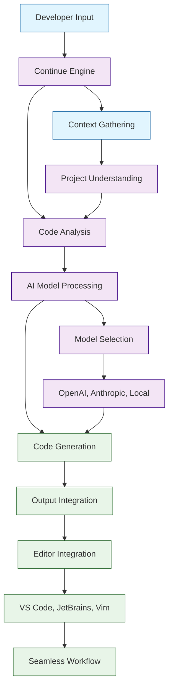

# Continue Tutorial: Open-Source AI Autopilot for Development

> This tutorial is AI-generated! To learn more, check out [Awesome Code Docs](https://github.com/johnxie/awesome-code-docs)

Continue[View Repo](https://github.com/continuedev/continue) is an open-source autopilot for software development that provides AI-powered coding assistance. It offers a customizable, self-hosted alternative to commercial AI coding tools, with support for multiple AI models, extensive customization options, and seamless integration with popular development environments.

Continue transforms how developers work by providing intelligent code completion, refactoring suggestions, documentation generation, and debugging assistance through a flexible, extensible architecture.

## Tutorial Chapters

Welcome to your journey through AI-powered software development! This tutorial explores how to harness Continue for intelligent coding assistance.

1. **[Chapter 1: Getting Started with Continue](01-getting-started.md)** - Installation, setup, and first AI-assisted coding session
2. **[Chapter 2: Code Completion & Generation](02-code-completion.md)** - Advanced code completion and intelligent suggestions
3. **[Chapter 3: Refactoring & Optimization](03-refactoring-optimization.md)** - AI-powered code refactoring and performance optimization
4. **[Chapter 4: Documentation & Comments](04-documentation-comments.md)** - Automatic documentation generation and code explanation
5. **[Chapter 5: Debugging & Testing](05-debugging-testing.md)** - AI-assisted debugging and test generation
6. **[Chapter 6: Custom Models & Configuration](06-custom-models.md)** - Setting up custom AI models and configurations
7. **[Chapter 7: Extensions & Plugins](07-extensions-plugins.md)** - Building and using Continue extensions
8. **[Chapter 8: Enterprise Deployment](08-enterprise-deployment.md)** - Scaling Continue for teams and organizations

## What You'll Learn

By the end of this tutorial, you'll be able to:

- **Set up Continue** for AI-powered development assistance
- **Master code completion** with context-aware suggestions
- **Perform intelligent refactoring** with AI guidance
- **Generate comprehensive documentation** automatically
- **Debug code efficiently** with AI assistance
- **Configure custom AI models** for specialized tasks
- **Build custom extensions** to extend functionality
- **Deploy Continue at scale** for enterprise environments

## Prerequisites

- Basic programming knowledge in any language
- Familiarity with your preferred code editor (VS Code, JetBrains, Vim, etc.)
- Understanding of AI/ML concepts (helpful but not required)

## Learning Path

### 🟢 Beginner Track
Perfect for developers new to AI-assisted coding:
1. Chapters 1-2: Setup and basic code completion
2. Focus on getting started with AI coding assistance

### 🟡 Intermediate Track
For developers enhancing their coding workflow:
1. Chapters 3-5: Refactoring, documentation, and debugging
2. Learn advanced AI-powered development techniques

### 🔴 Advanced Track
For customizing and deploying Continue at scale:
1. Chapters 6-8: Custom models, extensions, and enterprise deployment
2. Master advanced Continue customization and deployment

---

**Ready to supercharge your development workflow with AI? Let's begin with [Chapter 1: Getting Started](01-getting-started.md)!**

*Generated by [AI Codebase Knowledge Builder](https://github.com/johnxie/awesome-code-docs)*
