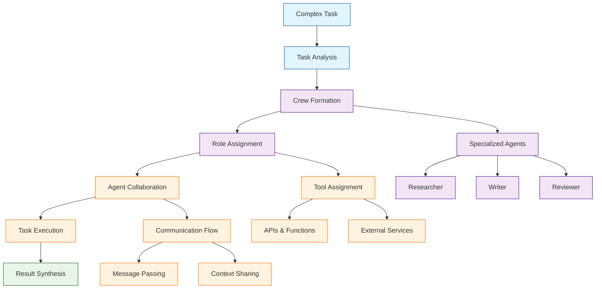

# CrewAI Tutorial: Building Collaborative AI Agent Teams

> This tutorial is AI-generated! To learn more, check out [Awesome Code Docs](https://github.com/johnxie/awesome-code-docs)

CrewAI[View Repo](https://github.com/crewAIInc/crewAI) is a framework for orchestrating role-based AI agent teams that collaborate to accomplish complex tasks. It provides a structured approach to creating AI crews with specialized agents, tools, and processes, enabling sophisticated multi-agent workflows and collaborative problem-solving.

CrewAI focuses on creating purposeful AI teams where each agent has a specific role, expertise, and set of tools, working together toward shared objectives with clear communication and coordination.

## Tutorial Chapters

Welcome to your journey through collaborative AI agent teams! This tutorial explores how to build and orchestrate AI crews that work together to solve complex problems.

1. **[Chapter 1: Getting Started with CrewAI](01-getting-started.md)** - Installation, setup, and your first AI crew
2. **[Chapter 2: Agent Roles & Specializations](02-agent-roles.md)** - Creating specialized agents with distinct capabilities
3. **[Chapter 3: Task Definition & Planning](03-task-planning.md)** - Breaking down complex objectives into executable tasks
4. **[Chapter 4: Tool Integration](04-tool-integration.md)** - Equipping agents with external tools and APIs
5. **[Chapter 5: Crew Communication](05-crew-communication.md)** - Managing agent interactions and information flow
6. **[Chapter 6: Process Management](06-process-management.md)** - Different execution patterns and workflows
7. **[Chapter 7: Advanced Crew Patterns](07-advanced-patterns.md)** - Complex multi-crew systems and hierarchies
8. **[Chapter 8: Production Deployment](08-production-deployment.md)** - Scaling AI crews for real-world applications

## What You'll Learn

By the end of this tutorial, you'll be able to:

- **Design collaborative AI teams** with specialized roles and responsibilities
- **Create complex task workflows** that leverage multiple agent capabilities
- **Implement effective communication patterns** between AI agents
- **Integrate external tools and APIs** into agent workflows
- **Manage different execution processes** for various types of tasks
- **Build hierarchical crew structures** for complex problem-solving
- **Deploy AI crews** at scale with proper monitoring and optimization
- **Handle real-world scenarios** with error recovery and adaptation

## Prerequisites

- Python 3.8+
- Basic understanding of AI/LLM concepts
- Familiarity with async programming (helpful but not required)
- Knowledge of API integration patterns

## Learning Path

### 🟢 Beginner Track
Perfect for developers new to AI agent teams:
1. Chapters 1-2: Setup and basic agent creation
2. Focus on understanding crew composition and roles

### 🟡 Intermediate Track
For developers building agent applications:
1. Chapters 3-5: Task planning, tool integration, and communication
2. Learn to build sophisticated collaborative workflows

### 🔴 Advanced Track
For production multi-agent system development:
1. Chapters 6-8: Process management, advanced patterns, and deployment
2. Master enterprise-grade AI crew orchestration

---

**Ready to build collaborative AI teams with CrewAI? Let's begin with [Chapter 1: Getting Started](01-getting-started.md)!**

*Generated by [AI Codebase Knowledge Builder](https://github.com/The-Pocket/Tutorial-Codebase-Knowledge)*
