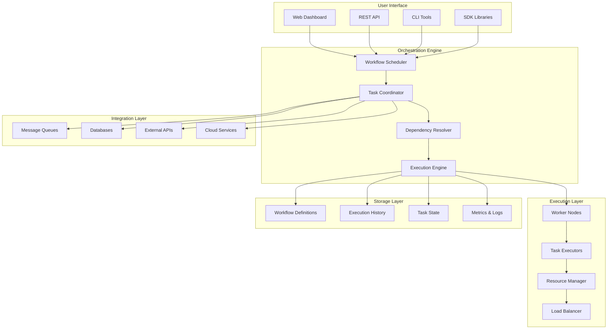

# Deer Flow Tutorial: Distributed Workflow Orchestration Platform

> Orchestrate complex distributed workflows with Deer Flow's powerful task coordination and execution platform.

<div align="center">
  
</div>

---

## 🎯 What is Deer Flow?

**Deer Flow** is a distributed workflow orchestration platform designed for coordinating complex tasks across multiple systems and services. It provides a robust framework for building, executing, and monitoring distributed workflows with support for parallelism, fault tolerance, and dynamic scaling.

### Key Features
- 🔀 **Workflow Orchestration** - Complex task coordination and execution
- 📊 **Distributed Processing** - Scale across multiple nodes and clusters
- 🛡️ **Fault Tolerance** - Automatic retry and recovery mechanisms
- 📈 **Dynamic Scaling** - Auto-scale based on workload demands
- 🎯 **Task Dependencies** - Define complex dependency relationships
- 📊 **Monitoring & Observability** - Comprehensive workflow monitoring
- 🔌 **Extensible Architecture** - Custom task types and integrations
- ⏱️ **Scheduling** - Time-based and event-driven execution

## 🏗️ Architecture Overview



## 📋 Tutorial Chapters

| Chapter | Topic | Time | Difficulty |
|:--------|:------|:-----|:-----------|
| **[01-getting-started](01-getting-started.md)** | Installation & Setup | 20 min | 🟢 Beginner |
| **[02-workflow-basics](02-workflow-basics.md)** | Basic Workflow Creation | 30 min | 🟢 Beginner |
| **[03-task-management](03-task-management.md)** | Task Types & Execution | 35 min | 🟡 Intermediate |
| **[04-dependencies](04-dependencies.md)** | Complex Dependencies | 40 min | 🟡 Intermediate |
| **[05-error-handling](05-error-handling.md)** | Fault Tolerance & Recovery | 35 min | 🟡 Intermediate |
| **[06-scaling](06-scaling.md)** | Distributed Execution | 45 min | 🔴 Expert |
| **[07-monitoring](07-monitoring.md)** | Monitoring & Observability | 30 min | 🔴 Expert |
| **[08-advanced-patterns](08-advanced-patterns.md)** | Advanced Orchestration Patterns | 50 min | 🔴 Expert |

## 🎯 Learning Outcomes

By the end of this tutorial, you'll be able to:

- ✅ Install and configure Deer Flow platform
- ✅ Design and implement complex workflows
- ✅ Manage task dependencies and execution order
- ✅ Implement fault-tolerant workflow patterns
- ✅ Scale workflows across distributed systems
- ✅ Monitor workflow performance and health
- ✅ Integrate with external systems and APIs
- ✅ Optimize workflow performance and reliability
- ✅ Debug and troubleshoot workflow issues

## 🛠️ Prerequisites

### System Requirements
- **CPU**: 2+ cores recommended
- **RAM**: 4GB+ recommended
- **Storage**: 10GB+ for workflow data
- **OS**: Linux, macOS, Windows

### Software Prerequisites
- Docker & Docker Compose
- Python 3.8+
- Node.js 16+ (for web interface)
- Redis or compatible message queue

### Knowledge Prerequisites
- Basic programming concepts
- Understanding of distributed systems
- Familiarity with workflow concepts

## 🚀 Quick Start

### Docker Deployment

```bash
# Clone repository
git clone https://github.com/bytedance/deer-flow.git
cd deer-flow

# Start with Docker Compose
docker-compose up -d

# Access web interface
open http://localhost:8080

# Submit first workflow
curl -X POST http://localhost:8080/api/workflows \
  -H "Content-Type: application/json" \
  -d @examples/simple_workflow.json
```

### Basic Usage

```bash
# Create a simple workflow
cat > my_workflow.json << EOF
{
  "name": "hello_world",
  "tasks": [
    {
      "id": "task1",
      "type": "shell",
      "command": "echo 'Hello, Deer Flow!'"
    }
  ]
}
EOF

# Submit workflow
curl -X POST http://localhost:8080/api/workflows \
  -H "Content-Type: application/json" \
  -d @my_workflow.json
```

## 🎨 What Makes This Tutorial Special?

### 🏆 **Production-Ready Focus**
- Enterprise-grade workflow orchestration
- Fault tolerance and reliability patterns
- Scalability and performance optimization

### 🔧 **Practical Implementation**
- Real-world workflow examples
- Integration patterns and best practices
- Troubleshooting and debugging techniques

### 📊 **Distributed Systems**
- Multi-node deployment strategies
- Load balancing and resource management
- High availability configurations

### 🌟 **Extensible Design**
- Custom task types and integrations
- Plugin architecture for extensions
- API-driven workflow management

## 💡 Use Cases

### Data Processing Pipelines
- ETL (Extract, Transform, Load) workflows
- Data validation and quality checks
- Batch processing and analytics
- Real-time data streaming

### Business Process Automation
- Order processing and fulfillment
- Customer onboarding workflows
- Approval and review processes
- Notification and communication flows

### DevOps & CI/CD
- Deployment pipelines
- Infrastructure provisioning
- Automated testing and validation
- Rollback and recovery procedures

### AI/ML Workflows
- Model training pipelines
- Data preprocessing workflows
- Model deployment and serving
- A/B testing and experimentation

## 🤝 Contributing

Found an issue or want to improve this tutorial? Contributions are welcome!

1. Fork this repository
2. Create a feature branch
3. Make your changes
4. Submit a pull request

## 📚 Additional Resources

- [Official Documentation](https://docs.deer-flow.io/)
- [GitHub Repository](https://github.com/bytedance/deer-flow)
- [API Reference](https://docs.deer-flow.io/api)
- [Community Forum](https://forum.deer-flow.io/)
- [Workflow Examples](https://github.com/bytedance/deer-flow/tree/main/examples)

## 🙏 Acknowledgments

Special thanks to the ByteDance team for creating this powerful distributed workflow orchestration platform!

---

**Ready to orchestrate distributed workflows?** Let's dive into [Chapter 1: Getting Started](01-getting-started.md)! 🚀

*Generated by [AI Codebase Knowledge Builder](https://github.com/johnxie/awesome-code-docs)*
