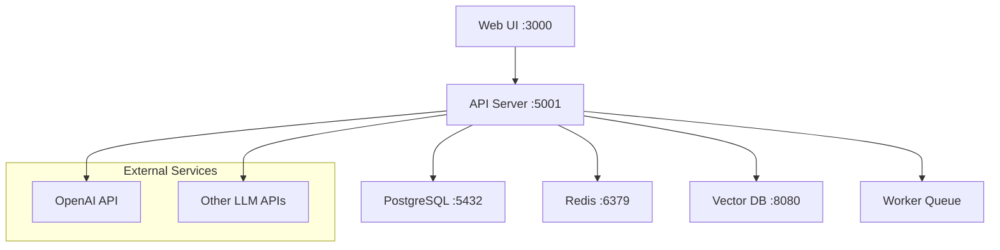

# Setup & Development Environment

## Prerequisites

### Required Software
- **Python 3.10+** with pip and virtual environment support
- **Docker & Docker Compose** for containerized development
- **Git** for cloning repositories
- **Node.js 16+** for frontend development (optional)

### Recommended Tools
- **VS Code** with Python extension
- **Postman** or similar for API testing
- **pgAdmin** or database client for debugging

## Development Setup Options

### Option 1: Docker Development (Recommended)

**Pros**: Consistent environment, easy setup, includes all services
**Cons**: Slightly slower for rapid iteration

```bash
# Clone the Dify repository
git clone https://github.com/langgenius/dify.git
cd dify

# Start all services with Docker Compose
docker-compose up -d

# Verify services are running
docker-compose ps

# Access the application
# - Web UI: http://localhost:3000
# - API: http://localhost:5001
# - Admin: http://localhost:3000/admin
```

### Option 2: Local Development

**Pros**: Faster development iteration, easier debugging
**Cons**: More complex setup, requires manual service management

```bash
# Clone and setup API backend
git clone https://github.com/langgenius/dify.git
cd dify/api

# Create virtual environment
python -m venv venv
source venv/bin/activate  # On Windows: venv\Scripts\activate

# Install dependencies
pip install -r requirements.txt

# Setup database (PostgreSQL required)
# Edit .env file with your database credentials
cp .env.example .env

# Run database migrations
flask db upgrade

# Start the API server
python app.py
```

## Environment Configuration

### Docker Environment Variables

Key environment variables in `docker-compose.yml`:

```yaml
environment:
  # Database
  DB_USERNAME: postgres
  DB_PASSWORD: difyai123456
  DB_HOST: db
  DB_PORT: 5432
  DB_DATABASE: dify
  
  # Redis
  REDIS_HOST: redis
  REDIS_PORT: 6379
  
  # OpenAI API (add your key)
  OPENAI_API_KEY: sk-your-key-here
  
  # Security
  SECRET_KEY: your-secret-key
  
  # Application
  APP_ENV: development
  DEBUG: true
```

### Local Development .env

For local development, create `.env` file:

```env
# Application
APP_ENV=development
DEBUG=true
SECRET_KEY=your-secret-key-here

# Database
DB_USERNAME=postgres
DB_PASSWORD=your-password
DB_HOST=localhost
DB_PORT=5432
DB_DATABASE=dify

# Redis
REDIS_HOST=localhost
REDIS_PORT=6379

# LLM Providers
OPENAI_API_KEY=sk-your-openai-key
ANTHROPIC_API_KEY=your-anthropic-key

# Vector Database (optional)
WEAVIATE_ENDPOINT=http://localhost:8080
WEAVIATE_API_KEY=your-key
```

## Service Architecture Overview

When you run Dify, these services start:



## Verification Steps

### 1. Check Service Health

```bash
# Check all containers are running
docker-compose ps

# Should show:
# - dify-web (port 3000)
# - dify-api (port 5001) 
# - dify-worker
# - postgres (port 5432)
# - redis (port 6379)
# - weaviate (port 8080)
```

### 2. Test API Endpoints

```bash
# Health check
curl http://localhost:5001/health

# Should return: {"status": "healthy"}

# API version
curl http://localhost:5001/v1/

# Should return API version info
```

### 3. Web Interface Test

1. Open http://localhost:3000
2. Create admin account
3. Login and explore the interface
4. Try creating a simple chatbot application

## Development Workflow

### Making Changes

**Frontend Changes:**
```bash
# For UI modifications
cd web
npm install
npm run dev

# Changes auto-reload at http://localhost:3001
```

**Backend Changes:**
```bash
# For API modifications
cd api

# If using Docker, rebuild:
docker-compose build api
docker-compose up -d

# If running locally:
source venv/bin/activate
python app.py
```

### Debugging Setup

**VS Code Launch Configuration:**

`.vscode/launch.json`:
```json
{
    "version": "0.2.0",
    "configurations": [
        {
            "name": "Python: Dify API",
            "type": "python",
            "request": "launch",
            "program": "${workspaceFolder}/api/app.py",
            "console": "integratedTerminal",
            "cwd": "${workspaceFolder}/api",
            "env": {
                "FLASK_ENV": "development"
            }
        }
    ]
}
```

## Common Issues & Solutions

### Port Conflicts
```bash
# If ports are already in use, modify docker-compose.yml:
ports:
  - "3001:3000"  # Web UI
  - "5002:5001"  # API
```

### Database Connection Issues
```bash
# Reset database:
docker-compose down
docker volume rm dify_postgres_data
docker-compose up -d
```

### Permission Issues (Linux/Mac)
```bash
# Fix Docker permissions:
sudo chown -R $USER:$USER .
```

## Next Steps

Once your environment is running:

1. **Explore the Web Interface** - Create your first application
2. **Review the API Documentation** - Test endpoints with Postman
3. **Check the Database Schema** - Understand the data model
4. **Read the Architecture Guide** - [Core Architecture](02-architecture.md)

## Getting Help

- **Setup Issues**: [Open an issue](https://github.com/johnxie/awesome-code-docs/issues) with `[setup]` tag
- **Dify Community**: [Official Dify Discord](https://discord.gg/dify)
- **Docker Problems**: Check [Docker documentation](https://docs.docker.com/)

---

**✅ Environment ready? Continue to [System Overview](01-overview.md)**
