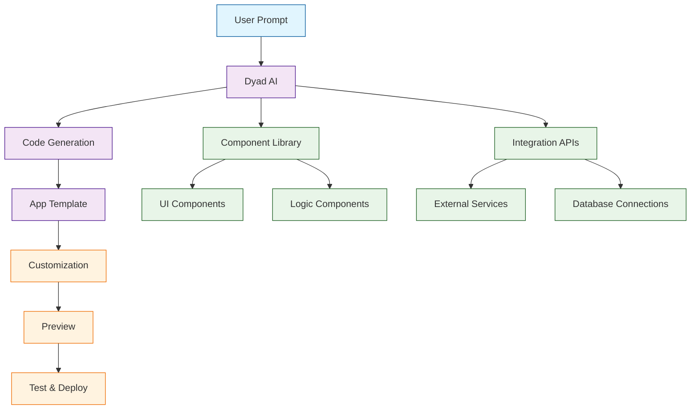

# Dyad Tutorial: Local AI-Powered App Builder

> This tutorial is AI-generated! To learn more, check out [Awesome Code Docs](https://github.com/johnxie/awesome-code-docs)

Dyad[View Repo](https://github.com/dyad-sh/dyad) is a free, local, open-source AI app builder that enables developers to create applications using natural language prompts. It provides an intuitive interface for building AI-powered applications without extensive coding knowledge.

Dyad allows users to describe their app requirements in plain English and generates the corresponding code, making app development accessible to non-technical users while maintaining the power and flexibility needed by developers.

## Tutorial Chapters

Welcome to your journey through AI-powered app development! This tutorial explores building applications with natural language using Dyad.

1. **[Chapter 1: Getting Started with Dyad](01-getting-started.md)** - Installation, setup, and your first AI-generated app
2. **[Chapter 2: Natural Language App Building](02-natural-language-building.md)** - Using prompts to create applications
3. **[Chapter 3: Component Integration](03-component-integration.md)** - Adding UI components and functionality
4. **[Chapter 4: Data Management](04-data-management.md)** - Connecting databases and managing data
5. **[Chapter 5: API Integration](05-api-integration.md)** - Integrating external services and APIs
6. **[Chapter 6: Customization and Styling](06-customization-styling.md)** - Customizing appearance and behavior
7. **[Chapter 7: Testing and Validation](07-testing-validation.md)** - Testing and validating AI-generated apps
8. **[Chapter 8: Deployment and Sharing](08-deployment-sharing.md)** - Deploying and sharing your applications

## What You'll Learn

By the end of this tutorial, you'll be able to:

- **Build Apps with AI** - Create applications using natural language descriptions
- **Customize Generated Code** - Modify and extend AI-generated applications
- **Integrate Components** - Add UI elements and functionality to your apps
- **Connect Data Sources** - Integrate databases and external APIs
- **Style and Theme** - Customize the appearance of your applications
- **Test Applications** - Validate and test AI-generated code
- **Deploy Locally** - Run applications on your local machine
- **Share Projects** - Distribute your AI-built applications

## Prerequisites

- Node.js 16+
- Basic understanding of web development concepts
- Familiarity with natural language prompts (helpful but not required)

## Learning Path

### 🟢 Beginner Track
Perfect for users new to AI app building:
1. Chapters 1-2: Setup and basic AI app creation
2. Focus on understanding Dyad's natural language interface

### 🟡 Intermediate Track
For users building practical applications:
1. Chapters 3-5: Components, data, and API integration
2. Learn to extend and customize AI-generated apps

### 🔴 Advanced Track
For power users and developers:
1. Chapters 6-8: Advanced customization, testing, and deployment
2. Master professional AI-assisted development workflows

---

**Ready to build apps with AI? Let's begin with [Chapter 1: Getting Started](01-getting-started.md)!**

*Generated by [AI Codebase Knowledge Builder](https://github.com/The-Pocket/Tutorial-Codebase-Knowledge)*
