# Fabric Tutorial: Open-Source Framework for Augmenting Humans with AI

> Enhance human capabilities with Fabric's modular framework for AI-powered cognitive assistance and task automation.

<div align="center">
  
</div>

---

## 🎯 What is Fabric?

**Fabric** is an open-source framework designed to augment human capabilities using AI. It provides a modular system of "Patterns" (prompt engineering templates) and "Stitches" (composable AI workflows) that help users accomplish complex cognitive tasks more effectively.

### Key Features
- 🧩 **Modular Patterns** - Reusable prompt engineering templates
- 🔗 **Composability** - Chain patterns together for complex workflows
- 🤖 **Multi-Model Support** - Works with various AI providers
- 📚 **Extensible Library** - Community-contributed patterns
- 🎯 **Task-Specific** - Specialized patterns for different domains
- 🔧 **CLI-First Design** - Command-line interface for efficiency
- 📝 **Markdown Integration** - Seamless document processing
- 🌐 **API Access** - REST API for integrations

## 🏗️ Architecture Overview



```mermaid
graph TB
    subgraph "User Interface"
        A[Command Line Interface]
        B[REST API]
        C[Web Interface - Planned]
    end

    subgraph "Core Engine"
        D[Pattern Processor]
        E[Stitch Composer]
        F[Context Manager]
        G[Output Formatter]
    end

    subgraph "Pattern Library"
        H[Core Patterns]
        I[Community Patterns]
        J[Custom Patterns]
        K[Domain-Specific]
    end

    subgraph "AI Integration"
        L[OpenAI API]
        M[Anthropic Claude]
        N[Local Models]
        O[Ollama]
        P[Custom Endpoints]
    end

    subgraph "Data Processing"
        Q[Text Input]
        R[File Processing]
        S[URL Processing]
        T[Stream Processing]
    end

    subgraph "Output System"
        U[Markdown Output]
        V[JSON Output]
        W[Custom Formats]
        X[Integration Hooks]
    end

    A --> D
    B --> D
    D --> H
    D --> I
    D --> J
    D --> K
    D --> L
    D --> M
    D --> N
    D --> O
    D --> P
    D --> Q
    D --> R
    D --> S
    D --> T
    D --> U
    D --> V
    D --> W
    D --> X
```

## 📋 Tutorial Chapters

| Chapter | Topic | Time | Difficulty |
|:--------|:------|:-----|:-----------|
| **[01-getting-started](01-getting-started.md)** | Installation & Setup | 15 min | 🟢 Beginner |
| **[02-pattern-system](02-pattern-system.md)** | Understanding Patterns | 25 min | 🟢 Beginner |
| **[03-basic-usage](03-basic-usage.md)** | Core Commands & Workflows | 30 min | 🟡 Intermediate |
| **[04-advanced-patterns](04-advanced-patterns.md)** | Advanced Pattern Usage | 35 min | 🟡 Intermediate |
| **[05-stitch-composition](05-stitch-composition.md)** | Composing Complex Workflows | 40 min | 🔴 Expert |
| **[06-custom-patterns](06-custom-patterns.md)** | Creating Custom Patterns | 35 min | 🔴 Expert |
| **[07-integration-api](07-integration-api.md)** | API Integration & Automation | 30 min | 🔴 Expert |
| **[08-enterprise-deployment](08-enterprise-deployment.md)** | Enterprise Setup & Scaling | 45 min | 🔴 Expert |

## 🎯 Learning Outcomes

By the end of this tutorial, you'll be able to:

- ✅ Install and configure Fabric for your workflow
- ✅ Use pre-built patterns for common cognitive tasks
- ✅ Create complex workflows by composing patterns
- ✅ Process various types of content (text, files, URLs)
- ✅ Develop custom patterns for specific use cases
- ✅ Integrate Fabric into existing tools and workflows
- ✅ Set up Fabric for team collaboration
- ✅ Optimize patterns for performance and accuracy
- ✅ Contribute to the pattern library ecosystem

## 🛠️ Prerequisites

### System Requirements
- **CPU**: 1+ cores
- **RAM**: 2GB+ recommended
- **Storage**: 1GB+ for patterns and data
- **OS**: Linux, macOS, Windows (WSL)

### Software Prerequisites
- Python 3.8+
- pip package manager
- Git (for cloning and contributing)
- Command-line interface experience

### Knowledge Prerequisites
- Basic command-line usage
- Understanding of AI/LLM concepts
- Text processing familiarity

## 🚀 Quick Start

### Installation

```bash
# Clone the repository
git clone https://github.com/danielmiessler/Fabric.git
cd Fabric

# Install dependencies
pip install -r requirements.txt

# Or install via pip
pip install fabric-ai

# Verify installation
fabric --help
```

### First Usage

```bash
# Set up your AI provider
export OPENAI_API_KEY="your_openai_key"

# Use a basic pattern
echo "Summarize the key points from this article about AI..." | fabric -p summarize

# Process a file
fabric -p extract_wisdom -o article.txt

# Get help
fabric --help
```

## 🎨 What Makes This Tutorial Special?

### 🏆 **Cognitive Augmentation Focus**
- Specialized for enhancing human cognitive capabilities
- Pattern-based approach to complex problem-solving
- Modular system for composable AI workflows

### 🔧 **Practical Task Orientation**
- Real-world use cases and examples
- Command-line efficiency for power users
- Integration with existing workflows

### 📚 **Pattern Ecosystem**
- Extensive library of community patterns
- Standardized approach to prompt engineering
- Best practices for AI-assisted tasks

### 🌟 **Developer Friendly**
- Open-source and extensible
- API for custom integrations
- Community-driven development

## 💡 Use Cases

### Content Processing
- Document summarization and analysis
- Information extraction and structuring
- Content rewriting and optimization
- Research synthesis and insights

### Creative Tasks
- Writing assistance and ideation
- Code review and improvement
- Design thinking and brainstorming
- Content creation workflows

### Professional Tasks
- Meeting notes and action items
- Email drafting and optimization
- Report generation and analysis
- Decision-making support

### Learning & Education
- Study material processing
- Concept explanation and clarification
- Knowledge organization
- Research assistance

## 🤝 Contributing

Found an issue or want to improve this tutorial? Contributions are welcome!

1. Fork this repository
2. Create a feature branch
3. Make your changes
4. Submit a pull request

## 📚 Additional Resources

- [Official Documentation](https://docs.fabric.io/)
- [GitHub Repository](https://github.com/danielmiessler/Fabric)
- [Pattern Library](https://github.com/danielmiessler/Fabric/tree/main/patterns)
- [Community Patterns](https://github.com/danielmiessler/Fabric#community-patterns)
- [API Reference](https://docs.fabric.io/api)

## 🙏 Acknowledgments

Special thanks to Daniel Miessler and the Fabric community for creating this powerful framework for AI-augmented human capabilities!

---

**Ready to augment your cognitive capabilities?** Let's dive into [Chapter 1: Getting Started](01-getting-started.md)! 🚀

*Generated by [AI Codebase Knowledge Builder](https://github.com/johnxie/awesome-code-docs)*
