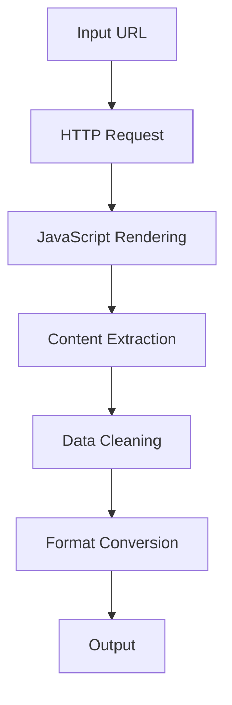

# Chapter 1: Getting Started with Firecrawl

Welcome to Firecrawl! If you've ever wanted to extract clean, structured data from websites for your AI applications, you're in the right place. Firecrawl is specifically designed for Large Language Models, providing reliable web scraping that handles JavaScript rendering, anti-bot measures, and content cleaning automatically.

## What Makes Firecrawl Special?

Firecrawl revolutionizes web scraping for AI with:
- **LLM-Optimized Output** - Clean, structured data perfect for AI consumption
- **JavaScript Rendering** - Handles modern SPAs and dynamic content
- **Anti-Bot Handling** - Built-in measures to avoid blocking
- **Content Cleaning** - Removes ads, navigation, and irrelevant content
- **Multiple Formats** - JSON, Markdown, HTML output options
- **Simple API** - Easy integration with any programming language

## Installing Firecrawl

### Python Installation

```bash
# Install Firecrawl via pip
pip install firecrawl-py

# Or install from source
git clone https://github.com/firecrawl/firecrawl.git
cd firecrawl
pip install -e .
```

### Node.js Installation

```bash
# Install Firecrawl via npm
npm install @firecrawl/firecrawl-js

# Or via yarn
yarn add @firecrawl/firecrawl-js
```

### Docker Setup

```bash
# Run Firecrawl with Docker
docker run -p 3000:3000 firecrawl/firecrawl

# Or use Docker Compose for full setup
docker-compose up -d
```

## Your First Web Scrape

Let's scrape your first website with Firecrawl:

### Step 1: Basic Setup

```python
from firecrawl import FirecrawlApp

# Initialize Firecrawl
app = FirecrawlApp(api_key='your-firecrawl-api-key')

print("🔥 Firecrawl initialized successfully!")
```

### Step 2: Scrape a Single Page

```python
# Scrape a single URL
url = 'https://example.com'
result = app.scrape_url(url)

# Print the extracted content
print("Title:", result['title'])
print("Content Preview:", result['content'][:200] + "...")
print("Metadata:", result['metadata'])
```

### Step 3: Advanced Scraping Options

```python
# Scrape with custom options
result = app.scrape_url(
    url='https://example.com/blog',
    params={
        'formats': ['markdown', 'html'],  # Output formats
        'onlyMainContent': True,          # Remove headers, footers, ads
        'includeTags': ['h1', 'h2', 'p'], # Specific HTML tags to extract
        'excludeTags': ['script', 'style'], # Tags to exclude
        'waitFor': 2000,                  # Wait for JavaScript (ms)
    }
)

print("Markdown Content:")
print(result['markdown'][:500] + "...")
```

## Understanding Firecrawl's Architecture

### Core Components

```
Firecrawl System
├── Scraping Engine (Handles HTTP requests and rendering)
├── Content Parser (Extracts and structures content)
├── Data Cleaner (Removes noise and irrelevant content)
├── Format Converter (JSON, Markdown, HTML output)
└── Caching Layer (Improves performance and reduces requests)
```

### Scraping Pipeline



## Advanced Scraping Patterns

### Scraping Multiple Pages

```python
# Scrape multiple URLs
urls = [
    'https://example.com/page1',
    'https://example.com/page2',
    'https://example.com/page3'
]

# Scrape all URLs
results = app.batch_scrape(urls)

for i, result in enumerate(results):
    print(f"Page {i+1}: {result['title']}")
    print(f"Content length: {len(result['content'])}")
    print("---")
```

### Crawling an Entire Website

```python
# Crawl an entire website
crawl_result = app.crawl_url(
    url='https://example.com',
    params={
        'limit': 10,                    # Maximum pages to crawl
        'maxDepth': 2,                  # Maximum crawl depth
        'includePaths': ['/blog/*'],    # Only crawl blog pages
        'excludePaths': ['/admin/*'],   # Exclude admin pages
        'allowExternalLinks': False,    # Stay within domain
    }
)

print(f"Crawled {len(crawl_result)} pages")
for page in crawl_result:
    print(f"- {page['url']}: {page['title']}")
```

### Extracting Structured Data

```python
# Extract specific data patterns
result = app.scrape_url(
    url='https://example.com/products',
    params={
        'extractRules': {
            'products': {
                'selector': '.product-card',
                'fields': {
                    'name': '.product-name',
                    'price': '.product-price',
                    'description': '.product-description'
                }
            }
        }
    }
)

# Access extracted data
for product in result['extractedData']['products']:
    print(f"Product: {product['name']}")
    print(f"Price: {product['price']}")
    print("---")
```

## Real-World Scraping Examples

### Building a Content Aggregator

```python
class ContentAggregator:
    def __init__(self, firecrawl_app):
        self.app = firecrawl_app

    def aggregate_blog_posts(self, blog_urls):
        """Aggregate blog posts from multiple sources"""
        all_posts = []

        for url in blog_urls:
            try:
                result = self.app.crawl_url(
                    url=url,
                    params={
                        'limit': 5,
                        'includePaths': ['/blog/*', '/posts/*'],
                        'extractRules': {
                            'posts': {
                                'selector': 'article, .post, .blog-post',
                                'fields': {
                                    'title': 'h1, h2, .title',
                                    'date': '.date, time',
                                    'author': '.author, .byline',
                                    'content': '.content, .post-content'
                                }
                            }
                        }
                    }
                )

                for page in result:
                    if 'extractedData' in page and 'posts' in page['extractedData']:
                        all_posts.extend(page['extractedData']['posts'])

            except Exception as e:
                print(f"Error scraping {url}: {e}")

        return all_posts

    def generate_summary_report(self, posts):
        """Generate a summary report of collected content"""
        report = {
            'total_posts': len(posts),
            'sources': len(set(post['source'] for post in posts if 'source' in post)),
            'date_range': self._get_date_range(posts),
            'top_authors': self._get_top_authors(posts),
            'content_sample': posts[:3]  # First 3 posts as samples
        }

        return report
```

### Research Data Collection

```python
class ResearchDataCollector:
    def __init__(self, firecrawl_app):
        self.app = firecrawl_app

    def collect_research_papers(self, search_terms, max_pages=10):
        """Collect research papers from academic sources"""
        papers = []

        for term in search_terms:
            # Search for papers on Google Scholar or similar
            search_results = self.app.scrape_url(
                url=f'https://scholar.google.com/scholar?q={term}',
                params={
                    'limit': max_pages,
                    'extractRules': {
                        'papers': {
                            'selector': '.gs_ri',
                            'fields': {
                                'title': '.gs_rt a',
                                'authors': '.gs_a',
                                'abstract': '.gs_rs',
                                'year': '.gs_a',
                                'citations': '.gs_fl a'
                            }
                        }
                    }
                }
            )

            if 'extractedData' in search_results:
                papers.extend(search_results['extractedData']['papers'])

        return papers

    def extract_paper_content(self, paper_urls):
        """Extract full content from paper URLs"""
        full_papers = []

        for url in paper_urls:
            try:
                result = self.app.scrape_url(
                    url=url,
                    params={
                        'onlyMainContent': True,
                        'formats': ['markdown'],
                        'includeTags': ['h1', 'h2', 'h3', 'p', 'li']
                    }
                )

                full_papers.append({
                    'url': url,
                    'content': result['markdown'],
                    'metadata': result['metadata']
                })

            except Exception as e:
                print(f"Error extracting {url}: {e}")

        return full_papers
```

## Configuration and Optimization

### Basic Configuration

```python
from firecrawl import FirecrawlApp

# Initialize with custom configuration
app = FirecrawlApp(
    api_key='your-api-key',
    timeout=30,                    # Request timeout in seconds
    max_retries=3,                 # Maximum retry attempts
    retry_delay=1,                 # Delay between retries
    user_agent='Custom Bot 1.0'   # Custom user agent
)
```

### Advanced Configuration

```python
# Advanced scraping configuration
scrape_config = {
    'url': 'https://example.com',
    'params': {
        # Content filtering
        'onlyMainContent': True,
        'removeAds': True,
        'removeNavigation': True,

        # JavaScript handling
        'waitFor': 3000,              # Wait for JS execution
        'waitForSelector': '.content-loaded',  # Wait for specific element

        # Rate limiting
        'delay': 1000,                # Delay between requests (ms)

        # Output customization
        'formats': ['markdown', 'json'],
        'includeMetadata': True,
        'includeLinks': True,

        # Error handling
        'ignoreHTTPError': False,
        'skipFailedPages': True,

        # Proxy settings (if needed)
        'proxy': {
            'host': 'proxy.example.com',
            'port': 8080,
            'auth': {'username': 'user', 'password': 'pass'}
        }
    }
}

result = app.scrape_url(**scrape_config)
```

### Environment Configuration

```bash
# .env file
FIRECRAWL_API_KEY=your-firecrawl-api-key
FIRECRAWL_TIMEOUT=30
FIRECRAWL_MAX_RETRIES=3
FIRECRAWL_USER_AGENT=Research Bot 1.0

# Optional: Proxy settings
FIRECRAWL_PROXY_HOST=proxy.example.com
FIRECRAWL_PROXY_PORT=8080
FIRECRAWL_PROXY_USER=user
FIRECRAWL_PROXY_PASS=password
```

## Performance Optimization

### Batch Processing

```python
# Process multiple URLs in batches
def batch_scrape_optimized(urls, batch_size=5):
    """Scrape URLs in optimized batches"""
    results = []

    for i in range(0, len(urls), batch_size):
        batch = urls[i:i + batch_size]

        # Scrape batch with delay to avoid rate limits
        batch_results = app.batch_scrape(batch)

        results.extend(batch_results)

        # Add delay between batches
        if i + batch_size < len(urls):
            time.sleep(2)

    return results
```

### Caching and Deduplication

```python
class CachedScraper:
    def __init__(self, firecrawl_app, cache_ttl=3600):
        self.app = firecrawl_app
        self.cache = {}
        self.cache_ttl = cache_ttl

    def scrape_with_cache(self, url, **params):
        """Scrape with caching to avoid duplicate requests"""
        cache_key = f"{url}_{hash(str(params))}"

        # Check cache
        if cache_key in self.cache:
            cached_result, timestamp = self.cache[cache_key]
            if time.time() - timestamp < self.cache_ttl:
                return cached_result

        # Scrape and cache
        result = self.app.scrape_url(url, params=params)
        self.cache[cache_key] = (result, time.time())

        return result

    def clear_cache(self):
        """Clear expired cache entries"""
        current_time = time.time()
        expired_keys = [
            key for key, (_, timestamp) in self.cache.items()
            if current_time - timestamp >= self.cache_ttl
        ]

        for key in expired_keys:
            del self.cache[key]
```

## Error Handling and Reliability

```python
def scrape_with_retry(url, max_retries=3, backoff_factor=2):
    """Scrape with intelligent retry logic"""
    last_error = None

    for attempt in range(max_retries):
        try:
            result = app.scrape_url(url)
            return result

        except Exception as e:
            last_error = e
            wait_time = backoff_factor ** attempt

            print(f"Attempt {attempt + 1} failed: {e}")
            print(f"Waiting {wait_time} seconds...")

            time.sleep(wait_time)

    raise last_error
```

## What We've Accomplished

Congratulations! 🎉 You've successfully:

1. **Installed Firecrawl** and set up your development environment
2. **Scraped your first website** with clean, structured output
3. **Understood the core architecture** of LLM-optimized web scraping
4. **Implemented advanced scraping patterns** for multiple pages and websites
5. **Built real-world applications** like content aggregators and research tools
6. **Optimized performance** with caching, batching, and error handling
7. **Configured Firecrawl** for different use cases and requirements

## Next Steps

Now that you can scrape websites effectively, let's explore more advanced extraction techniques. In [Chapter 2: Basic Web Scraping](02-basic-scraping.md), we'll dive into different scraping strategies and how to handle various website structures.

---

**Practice what you've learned:**
1. Create a content aggregator for your favorite blogs or news sites
2. Build a research paper collector for academic topics
3. Implement a product price monitor for e-commerce sites
4. Experiment with different output formats and extraction rules

*What kind of web content would you most like to extract for AI applications?* 🌐
