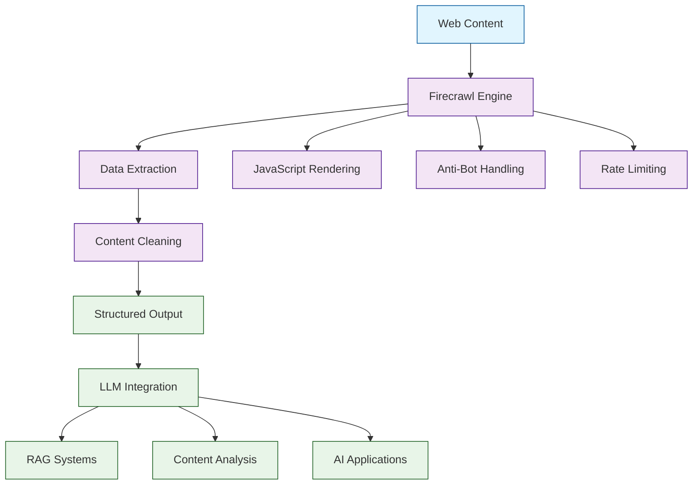

# Firecrawl Tutorial: Building LLM-Ready Web Scraping and Data Extraction Systems

> This tutorial is AI-generated! To learn more, check out [Awesome Code Docs](https://github.com/johnxie/awesome-code-docs)

Firecrawl[View Repo](https://github.com/firecrawl/firecrawl) is a powerful web scraping and data extraction platform specifically designed for Large Language Models. It provides clean, structured data extraction from websites, making it easy to build RAG systems, content analysis tools, and AI-powered applications that need access to web content.

Firecrawl handles the complexity of web scraping - dealing with JavaScript rendering, anti-bot measures, and data cleaning - so you can focus on building amazing AI applications.

## Tutorial Chapters

Welcome to your journey through web scraping and data extraction for AI applications! This tutorial explores how to build powerful systems that can extract, clean, and structure web content for LLM consumption.

1. **[Chapter 1: Getting Started with Firecrawl](01-getting-started.md)** - Installation, setup, and your first web scrape
2. **[Chapter 2: Basic Web Scraping](02-basic-scraping.md)** - Extracting content from single pages and websites
3. **[Chapter 3: Advanced Data Extraction](03-advanced-extraction.md)** - Complex scraping patterns and data structuring
4. **[Chapter 4: JavaScript & Dynamic Content](04-javascript-handling.md)** - Dealing with SPAs and dynamic websites
5. **[Chapter 5: Content Cleaning & Processing](05-content-cleaning.md)** - Preparing scraped data for LLM consumption
6. **[Chapter 6: Building RAG Systems](06-rag-integration.md)** - Integrating Firecrawl with vector databases and LLMs
7. **[Chapter 7: Scaling & Performance](07-scaling-performance.md)** - Handling large-scale scraping operations
8. **[Chapter 8: Production Deployment](08-production-deployment.md)** - Deploying scraping systems at scale

## What You'll Learn

By the end of this tutorial, you'll be able to:

- **Build robust web scraping systems** optimized for AI applications
- **Extract structured data** from complex websites and web applications
- **Handle JavaScript rendering** and dynamic content loading
- **Clean and preprocess web content** for optimal LLM consumption
- **Integrate scraping with RAG systems** for enhanced AI capabilities
- **Scale scraping operations** for enterprise-level data collection
- **Deploy production-ready scraping systems** with monitoring and reliability
- **Navigate legal and ethical considerations** in web scraping

## Prerequisites

- Python 3.8+ or Node.js 16+
- Basic understanding of web technologies (HTML, CSS, JavaScript)
- Familiarity with HTTP requests and APIs
- Knowledge of data processing and cleaning concepts

## Learning Path

### 🟢 Beginner Track
Perfect for developers new to web scraping:
1. Chapters 1-2: Setup and basic scraping concepts
2. Focus on understanding web scraping fundamentals

### 🟡 Intermediate Track
For developers building AI-integrated applications:
1. Chapters 3-5: Advanced extraction and content processing
2. Learn to prepare data for LLM consumption

### 🔴 Advanced Track
For production web scraping systems:
1. Chapters 6-8: RAG integration, scaling, and deployment
2. Master enterprise-grade scraping solutions

---

**Ready to build AI-ready web scraping systems? Let's begin with [Chapter 1: Getting Started](01-getting-started.md)!**

*Generated by [AI Codebase Knowledge Builder](https://github.com/The-Pocket/Tutorial-Codebase-Knowledge)*
