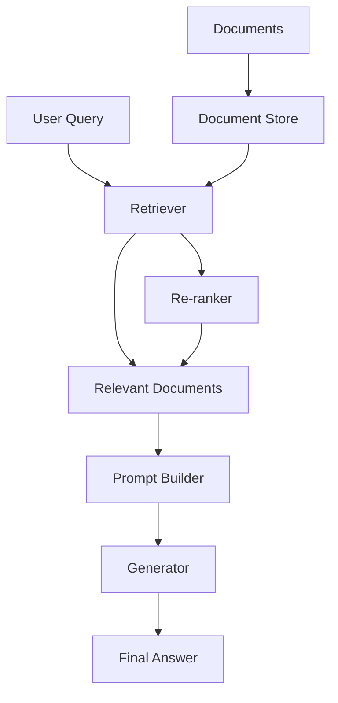

# Chapter 1: Getting Started with Haystack

Welcome to Haystack! If you've ever wanted to build intelligent search systems that can understand and answer questions about your documents, you're in the right place. Haystack makes it easy to create powerful search applications with advanced NLP capabilities.

## What Makes Haystack Special?

Haystack revolutionizes search by:
- **Intelligent Document Understanding** - Goes beyond keyword matching to semantic search
- **Question Answering** - Generates human-like answers from your documents
- **Modular Architecture** - Mix and match components for custom workflows
- **Production Ready** - Scalable for enterprise applications
- **Multi-Modal Support** - Works with text, images, and structured data

## Installation Options

### Basic Installation

```bash
# Install Haystack via pip
pip install haystack-ai

# Or install from source
git clone https://github.com/deepset-ai/haystack.git
cd haystack
pip install -e .
```

### Development Setup

```bash
# Clone the repository
git clone https://github.com/deepset-ai/haystack.git
cd haystack

# Install in development mode with all dependencies
pip install -e ".[dev,docstores,embedders,generators]"

# Run tests to verify installation
pytest test/
```

### Docker Setup

```bash
# Run Haystack with Docker
docker run --rm -p 8000:8000 deepset/haystack:latest

# Or build from source
docker build -t haystack .
docker run --rm -p 8000:8000 haystack
```

## Your First Haystack Application

Let's create your first intelligent search application:

### Step 1: Basic Setup

```python
import os
from haystack import Document
from haystack.components.builders import PromptBuilder
from haystack.components.generators import OpenAIGenerator
from haystack.components.retrievers import InMemoryBM25Retriever
from haystack.core.pipeline import Pipeline

# Set your OpenAI API key
os.environ["OPENAI_API_KEY"] = "your-openai-api-key"

print("🤖 Haystack initialized successfully!")
```

### Step 2: Create Documents

```python
# Create some sample documents
documents = [
    Document(content="Haystack is an open-source framework for building search systems."),
    Document(content="It supports question answering and document retrieval."),
    Document(content="Haystack can work with various document stores and retrievers."),
    Document(content="The framework is built with modularity in mind."),
    Document(content="Haystack supports both retrieval-augmented generation and traditional search.")
]

print(f"📄 Created {len(documents)} documents")
```

### Step 3: Build Your First Pipeline

```python
# Create a simple RAG pipeline
pipeline = Pipeline()

# Add components
pipeline.add_component("retriever", InMemoryBM25Retriever(documents=documents))
pipeline.add_component("prompt_builder", PromptBuilder(
    template="Context: {{documents}}\nQuestion: {{query}}\nAnswer:"
))
pipeline.add_component("generator", OpenAIGenerator())

# Connect components
pipeline.connect("retriever", "prompt_builder")
pipeline.connect("prompt_builder", "generator")

print("🔗 Pipeline created successfully!")
```

### Step 4: Run Your First Query

```python
# Ask a question
result = pipeline.run({
    "retriever": {"query": "What is Haystack?"},
    "prompt_builder": {"query": "What is Haystack?"}
})

print("🤖 Answer:", result["generator"]["replies"][0])
```

## Understanding Haystack Architecture

### Core Components

```
Haystack System
├── Document Stores - Where your data lives
├── Retrievers - How you find relevant documents
├── Generators - How you generate answers
├── Embedders - How you create vector representations
├── Rankers - How you order search results
└── Pipelines - How everything connects together
```

### Data Flow in Haystack



### Component Types

```python
# Document Stores
from haystack.document_stores import InMemoryDocumentStore, PineconeDocumentStore

# Retrievers
from haystack.retrievers import BM25Retriever, EmbeddingRetriever

# Generators
from haystack.generators import OpenAIGenerator, CohereGenerator

# Embedders
from haystack.embedders import SentenceTransformersDocumentEmbedder

# Rankers
from haystack.rankers import TransformersSimilarityRanker
```

## Working with Different Document Types

### Text Documents

```python
from haystack import Document

# Simple text document
doc1 = Document(
    content="Haystack is a powerful search framework.",
    meta={"source": "website", "category": "introduction"}
)

# Document with metadata
doc2 = Document(
    content="The framework supports multiple languages and document types.",
    meta={
        "source": "documentation",
        "category": "features",
        "author": "Haystack Team",
        "created_at": "2024-01-01"
    }
)
```

### Loading from Files

```python
from haystack.components.writers import DocumentWriter
from haystack.components.preprocessors import TextPreprocessor
from haystack.document_stores import InMemoryDocumentStore

# Create document store
document_store = InMemoryDocumentStore()

# Load from text files
with open("documents.txt", "r") as f:
    content = f.read()

documents = [Document(content=content)]
document_store.write_documents(documents)

print(f"📥 Loaded {len(documents)} documents")
```

### Loading from Web

```python
import requests
from haystack import Document

# Load web content
url = "https://docs.haystack.deepset.ai/docs"
response = requests.get(url)
content = response.text

# Create document
web_doc = Document(
    content=content,
    meta={"source": "web", "url": url, "title": "Haystack Documentation"}
)
```

## Basic Search Operations

### Keyword Search

```python
from haystack.retrievers import InMemoryBM25Retriever

# Create retriever
retriever = InMemoryBM25Retriever(document_store=document_store)

# Search for documents
results = retriever.run(query="Haystack framework")
print(f"🔍 Found {len(results['documents'])} relevant documents")

for doc in results["documents"]:
    print(f"• {doc.content[:100]}...")
```

### Semantic Search

```python
from haystack.embedders import SentenceTransformersDocumentEmbedder
from haystack.retrievers import InMemoryEmbeddingRetriever

# Create embeddings
embedder = SentenceTransformersDocumentEmbedder()
embedder.warm_up()

# Embed documents
documents_with_embeddings = embedder.run(documents=documents)

# Create embedding retriever
embedding_retriever = InMemoryEmbeddingRetriever(document_store=document_store)

# Semantic search
results = embedding_retriever.run(query="What is Haystack?", top_k=3)
print(f"🎯 Found {len(results['documents'])} semantically similar documents")
```

## Building Simple Pipelines

### Basic Retrieval Pipeline

```python
from haystack import Pipeline

# Create pipeline
pipeline = Pipeline()

# Add retriever
pipeline.add_component("retriever", InMemoryBM25Retriever(document_store=document_store))

# Run pipeline
result = pipeline.run({"retriever": {"query": "search query"}})
print(f"📊 Retrieved {len(result['retriever']['documents'])} documents")
```

### Retrieval-Augmented Generation (RAG) Pipeline

```python
from haystack import Pipeline
from haystack.components.builders import PromptBuilder

# Create RAG pipeline
rag_pipeline = Pipeline()

# Add components
rag_pipeline.add_component("retriever", InMemoryBM25Retriever(document_store=document_store))
rag_pipeline.add_component("prompt_builder", PromptBuilder(
    template="""Context: {{documents}}
Question: {{query}}
Please provide a comprehensive answer based on the context above."""
))
rag_pipeline.add_component("generator", OpenAIGenerator())

# Connect components
rag_pipeline.connect("retriever", "prompt_builder")
rag_pipeline.connect("prompt_builder", "generator")

# Run RAG pipeline
result = rag_pipeline.run({
    "retriever": {"query": "What are the main features of Haystack?"},
    "prompt_builder": {"query": "What are the main features of Haystack?"}
})

print("🤖 RAG Answer:", result["generator"]["replies"][0])
```

## Configuration and Setup

### Basic Configuration

```python
import os

# Set API keys
os.environ["OPENAI_API_KEY"] = "your-openai-api-key"
os.environ["COHERE_API_KEY"] = "your-cohere-api-key"

# Configure Haystack
from haystack import defaults

defaults.configure(
    log_level="INFO",
    local_files_cache_dir="./cache",
    similarity_function="cosine"
)
```

### Environment Variables

```bash
# .env file
OPENAI_API_KEY=your-openai-api-key
COHERE_API_KEY=your-cohere-api-key
PINECONE_API_KEY=your-pinecone-api-key
HUGGINGFACE_API_KEY=your-huggingface-api-key

# Haystack specific
HAYSTACK_CACHE_DIR=./cache
HAYSTACK_LOG_LEVEL=INFO
```

### Logging Configuration

```python
import logging

# Configure Haystack logging
logging.basicConfig(
    level=logging.INFO,
    format='%(asctime)s - %(name)s - %(levelname)s - %(message)s'
)

# Set specific component logging
logging.getLogger("haystack").setLevel(logging.DEBUG)
logging.getLogger("haystack.components.retrievers").setLevel(logging.INFO)
```

## What We've Accomplished

Congratulations! 🎉 You've successfully:

1. **Installed Haystack** and set up your development environment
2. **Created your first intelligent search application** with document retrieval and question answering
3. **Understood the core architecture** of Haystack's modular system
4. **Worked with different document types** and sources
5. **Implemented basic and semantic search** operations
6. **Built simple pipelines** for retrieval and RAG
7. **Configured the environment** for optimal performance

## Next Steps

Now that you have a working Haystack setup, let's dive deeper into document stores and how to manage large collections of documents. In [Chapter 2: Document Stores](02-document-stores.md), we'll explore different ways to store and manage your documents for optimal search performance.

---

**Practice what you've learned:**
1. Experiment with different types of documents and queries
2. Try building a simple search interface for your documents
3. Compare keyword vs semantic search results
4. Add more documents and test retrieval accuracy

*What's the most interesting search application you could build with Haystack?* 🔍
