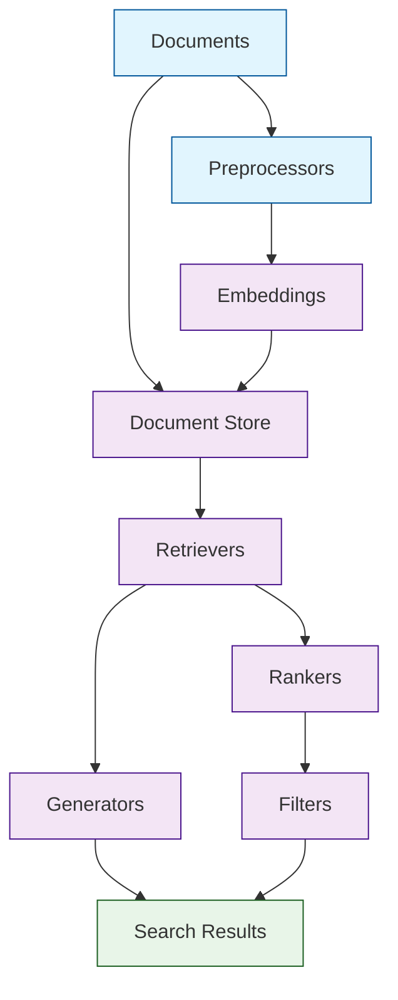

# Haystack Tutorial: Building Intelligent Search Systems

> This tutorial is AI-generated! To learn more, check out [Awesome Code Docs](https://github.com/johnxie/awesome-code-docs)

Haystack[View Repo](https://github.com/deepset-ai/haystack) is an open-source framework for building search systems that work intelligently over large document collections. It enables developers to create production-ready applications with advanced NLP capabilities, including question answering, document search, and information retrieval.

Haystack provides a modular architecture that combines the best of retrieval-augmented generation (RAG) with powerful search capabilities, making it easy to build sophisticated AI-powered search applications.

## Tutorial Chapters

Welcome to your journey through intelligent search systems! This tutorial explores how to build powerful search applications with Haystack.

1. **[Chapter 1: Getting Started with Haystack](01-getting-started.md)** - Installation, setup, and your first search pipeline
2. **[Chapter 2: Document Stores](02-document-stores.md)** - Managing and storing your document collections
3. **[Chapter 3: Retrievers & Search](03-retrievers-search.md)** - Finding relevant documents efficiently
4. **[Chapter 4: Generators & LLMs](04-generators-llms.md)** - Integrating language models for answer generation
5. **[Chapter 5: Pipelines & Workflows](05-pipelines-workflows.md)** - Building complex search workflows
6. **[Chapter 6: Evaluation & Optimization](06-evaluation-optimization.md)** - Measuring and improving search quality
7. **[Chapter 7: Custom Components](07-custom-components.md)** - Extending Haystack with custom functionality
8. **[Chapter 8: Production Deployment](08-production-deployment.md)** - Scaling Haystack applications for production

## What You'll Learn

By the end of this tutorial, you'll be able to:

- **Build intelligent search systems** with document retrieval and question answering
- **Implement RAG pipelines** combining retrieval with generation
- **Work with various document stores** including vector databases and search engines
- **Integrate multiple LLMs** for different search and generation tasks
- **Create custom components** to extend Haystack's functionality
- **Evaluate and optimize** search system performance
- **Deploy search applications** at scale with proper monitoring
- **Handle complex search scenarios** with filtering and ranking

## Prerequisites

- Python 3.8+
- Basic understanding of NLP concepts
- Familiarity with vector databases (helpful but not required)
- Knowledge of REST APIs and web services

## Learning Path

### 🟢 Beginner Track
Perfect for developers new to search systems:
1. Chapters 1-2: Setup and basic document management
2. Focus on understanding Haystack fundamentals

### 🟡 Intermediate Track
For developers building search applications:
1. Chapters 3-5: Retrieval, generation, and pipeline construction
2. Learn to build sophisticated search workflows

### 🔴 Advanced Track
For production search system development:
1. Chapters 6-8: Evaluation, customization, and deployment
2. Master enterprise-grade search applications

---

**Ready to build intelligent search systems with Haystack? Let's begin with [Chapter 1: Getting Started](01-getting-started.md)!**

*Generated by [AI Codebase Knowledge Builder](https://github.com/johnxie/awesome-code-docs)*
