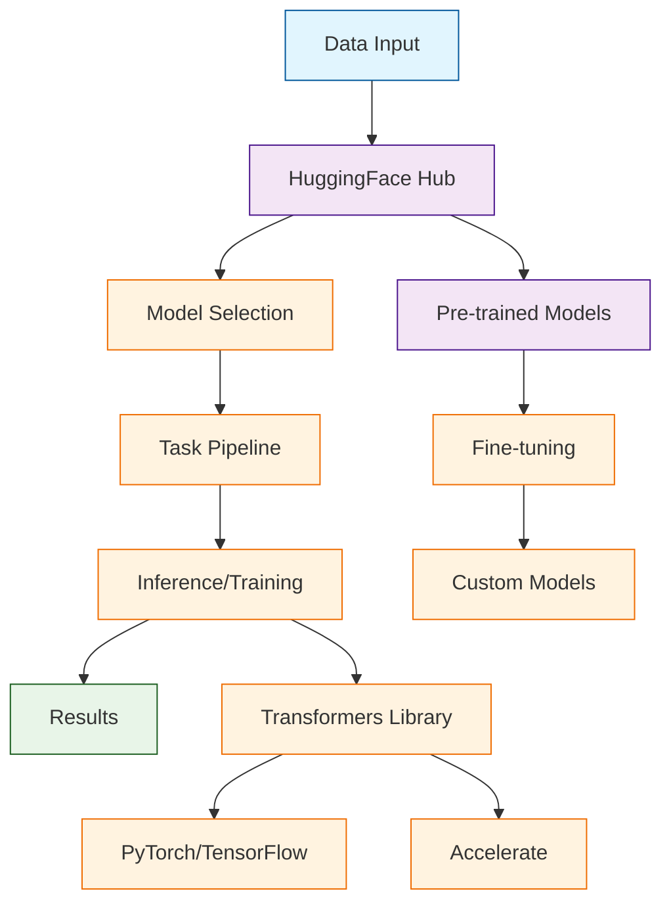

# HuggingFace Transformers Tutorial: Building State-of-the-Art AI Models

> This tutorial is AI-generated! To learn more, check out [Awesome Code Docs](https://github.com/johnxie/awesome-code-docs)

HuggingFace Transformers[View Repo](https://github.com/huggingface/transformers) is the leading open-source library for natural language processing and multimodal AI. It provides thousands of pre-trained models for tasks like text classification, question answering, text generation, translation, and more, making state-of-the-art AI accessible to everyone.

Transformers has become the foundation of modern AI development, with over 100,000 models and 10,000+ datasets available through the HuggingFace Hub.

## Tutorial Chapters

Welcome to your journey through the HuggingFace Transformers ecosystem! This tutorial explores how to leverage state-of-the-art AI models for your applications.

1. **[Chapter 1: Getting Started with Transformers](01-getting-started.md)** - Installation, setup, and your first AI model
2. **[Chapter 2: Text Classification & Analysis](02-text-classification.md)** - Sentiment analysis, topic classification, and text understanding
3. **[Chapter 3: Text Generation](03-text-generation.md)** - Creative writing, code generation, and conversational AI
4. **[Chapter 4: Question Answering](04-question-answering.md)** - Building Q&A systems and knowledge retrieval
5. **[Chapter 5: Named Entity Recognition](05-named-entity-recognition.md)** - Extracting structured information from text
6. **[Chapter 6: Translation & Multilingual Models](06-translation-multilingual.md)** - Cross-language AI applications
7. **[Chapter 7: Fine-tuning Models](07-fine-tuning.md)** - Customizing models for specific tasks
8. **[Chapter 8: Production Deployment](08-production-deployment.md)** - Scaling Transformers applications

## What You'll Learn

By the end of this tutorial, you'll be able to:

- **Leverage pre-trained models** for immediate AI capabilities
- **Build applications** with text classification, generation, and analysis
- **Implement question answering systems** with custom knowledge bases
- **Fine-tune models** for domain-specific tasks and datasets
- **Deploy AI models** at scale with proper optimization
- **Work with multimodal models** combining text, vision, and audio
- **Integrate Transformers** with modern web frameworks and APIs
- **Contribute to the ecosystem** by sharing models and datasets

## Prerequisites

- Python 3.8+
- Basic understanding of machine learning concepts
- Familiarity with NumPy and PyTorch (helpful but not required)
- Knowledge of natural language processing basics

## Learning Path

### 🟢 Beginner Track
Perfect for developers new to AI:
1. Chapters 1-2: Setup and basic text processing
2. Focus on using pre-trained models effectively

### 🟡 Intermediate Track
For developers building AI applications:
1. Chapters 3-5: Advanced NLP tasks and model customization
2. Learn to build sophisticated AI-powered applications

### 🔴 Advanced Track
For production AI system development:
1. Chapters 6-8: Fine-tuning, optimization, and deployment
2. Master enterprise-grade AI model deployment

---

**Ready to harness the power of state-of-the-art AI models? Let's begin with [Chapter 1: Getting Started](01-getting-started.md)!**

*Generated by [AI Codebase Knowledge Builder](https://github.com/The-Pocket/Tutorial-Codebase-Knowledge)*
