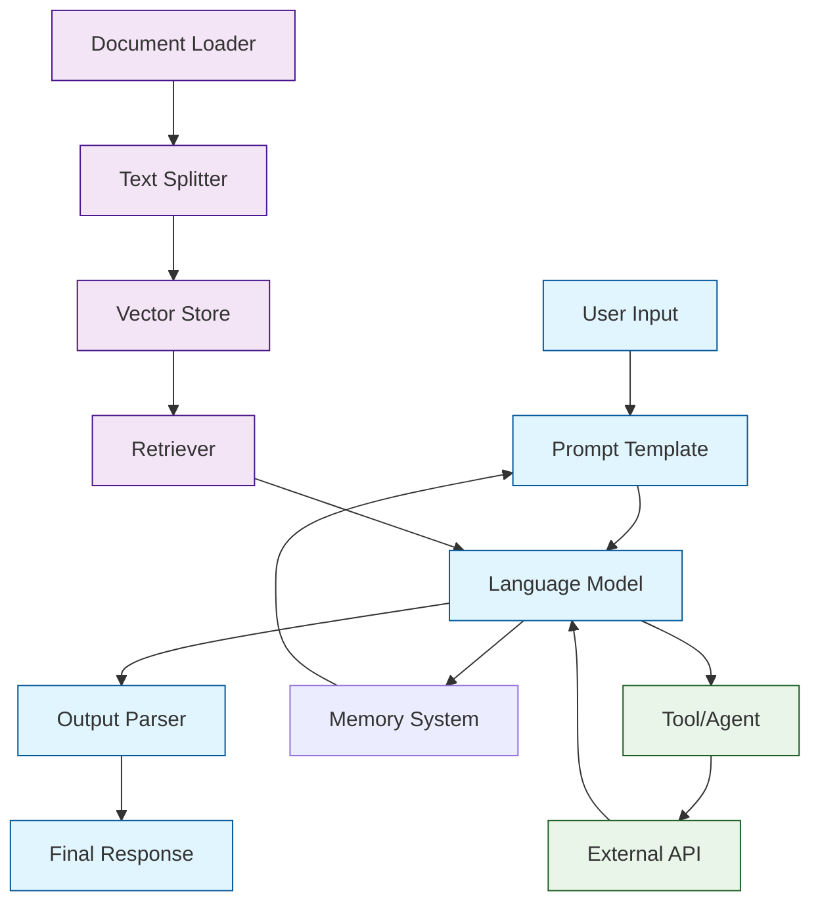

# LangChain Tutorial: Building AI Applications with Large Language Models

> This tutorial is AI-generated! To learn more, check out [Awesome Code Docs](https://github.com/johnxie/awesome-code-docs)

LangChain[View Repo](https://github.com/langchain-ai/langchain) is a powerful framework for building applications powered by large language models. Whether you're creating chatbots, question-answering systems, or complex AI workflows, LangChain provides the building blocks to chain together different components seamlessly.

Imagine you're building a smart assistant that can not only answer questions but also remember previous conversations, search through documents, and even take actions on your behalf. LangChain makes this possible by providing a standardized way to connect language models with other sources of data and functionality.

## Tutorial Chapters

Welcome to your journey through LangChain! This tutorial is structured to take you from basic concepts to advanced implementations:

1. **[Chapter 1: Getting Started with LangChain](01-getting-started.md)** - Installation, basic setup, and your first LLM interaction
2. **[Chapter 2: Prompt Templates & Chains](02-prompt-templates.md)** - Creating reusable prompts and basic chaining
3. **[Chapter 3: Memory Systems](03-memory-systems.md)** - Adding conversation memory to your applications
4. **[Chapter 4: Document Loading & Processing](04-document-processing.md)** - Working with PDFs, websites, and other data sources
5. **[Chapter 5: Vector Stores & Retrieval](05-vector-stores.md)** - Implementing semantic search and RAG
6. **[Chapter 6: Agents & Tools](06-agents-tools.md)** - Building autonomous agents that can take actions
7. **[Chapter 7: Advanced Chains](07-advanced-chains.md)** - Complex workflows and custom chain implementations
8. **[Chapter 8: Production Deployment](08-production-deployment.md)** - Scaling, monitoring, and best practices

## What You'll Learn

By the end of this tutorial, you'll be able to:

- **Build conversational AI applications** with memory and context
- **Implement Retrieval-Augmented Generation (RAG)** systems
- **Create autonomous agents** that can use tools and APIs
- **Process and analyze documents** at scale
- **Deploy LangChain applications** to production environments
- **Customize and extend** LangChain components for your specific needs

## Prerequisites

- Basic Python programming knowledge
- Understanding of APIs and web services
- Familiarity with command-line tools
- (Optional) Experience with machine learning concepts

## Learning Path

### 🟢 Beginner Track
Perfect for developers new to AI and LangChain:
1. Chapters 1-3: Core concepts and basic applications
2. Focus on understanding LangChain's philosophy and basic patterns

### 🟡 Intermediate Track
For developers ready to build more complex applications:
1. Chapters 4-6: Data processing, retrieval, and agents
2. Learn to integrate external data sources and APIs

### 🔴 Advanced Track
For experienced developers building production systems:
1. Chapters 7-8: Custom chains, deployment, and scaling
2. Master advanced patterns and production best practices

---

**Ready to start building with LangChain? Let's begin with [Chapter 1: Getting Started](01-getting-started.md)!**

*Generated by [AI Codebase Knowledge Builder](https://github.com/The-Pocket/Tutorial-Codebase-Knowledge)*
