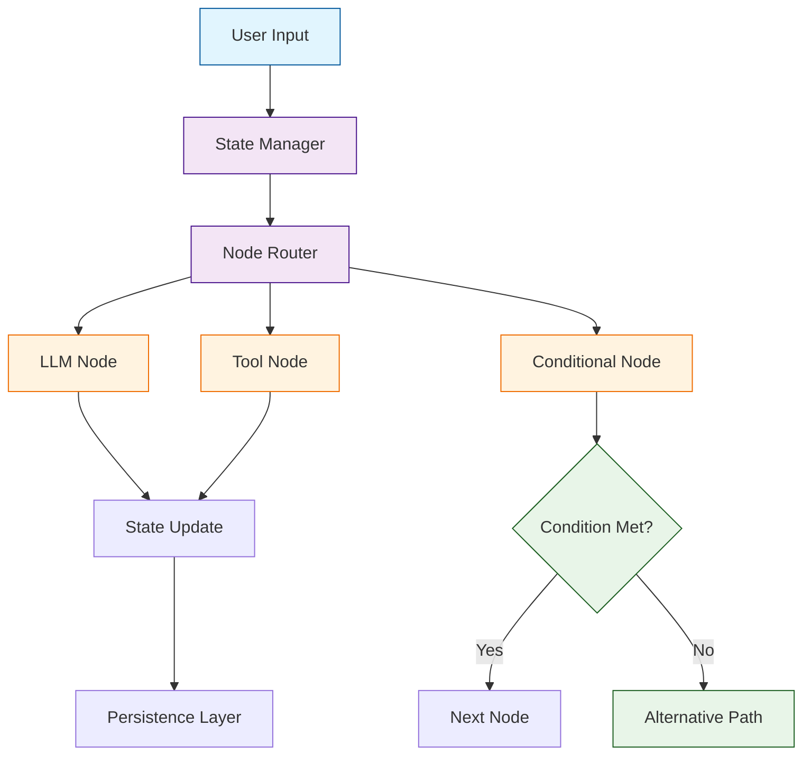

# LangGraph Tutorial: Building Stateful Multi-Actor Applications

> This tutorial is AI-generated! To learn more, check out [Awesome Code Docs](https://github.com/johnxie/awesome-code-docs)

LangGraph[View Repo](https://github.com/langchain-ai/langgraph) is a library for building stateful, multi-actor applications with large language models (LLMs). It extends LangChain to provide fine-grained control over both the flow and state of your applications, making it ideal for building complex AI workflows and agent systems.

LangGraph enables developers to create sophisticated applications with multiple interacting components, persistent state management, and complex control flows that go beyond simple sequential chains.

## Tutorial Chapters

Welcome to your journey through stateful multi-actor applications! This tutorial explores how to build complex AI systems with LangGraph.

1. **[Chapter 1: Getting Started with LangGraph](01-getting-started.md)** - Installation, basic concepts, and your first graph
2. **[Chapter 2: State Management](02-state-management.md)** - Managing application state and persistence
3. **[Chapter 3: Nodes and Edges](03-nodes-edges.md)** - Building graph components and connections
4. **[Chapter 4: Conditional Logic](04-conditional-logic.md)** - Implementing decision points and branching
5. **[Chapter 5: Multi-Agent Systems](05-multi-agent-systems.md)** - Coordinating multiple agents
6. **[Chapter 6: Tool Integration](06-tool-integration.md)** - Connecting external tools and APIs
7. **[Chapter 7: Persistence and Checkpoints](07-persistence-checkpoints.md)** - State persistence and recovery
8. **[Chapter 8: Production Deployment](08-production-deployment.md)** - Scaling and deploying LangGraph applications

## What You'll Learn

By the end of this tutorial, you'll be able to:

- **Build Complex AI Workflows** - Create multi-step processes with conditional logic
- **Manage Application State** - Handle persistent state across graph executions
- **Coordinate Multiple Agents** - Build systems with interacting AI components
- **Integrate External Tools** - Connect APIs, databases, and services
- **Implement Error Handling** - Build resilient applications with recovery mechanisms
- **Scale Production Systems** - Deploy and monitor LangGraph applications
- **Debug Complex Graphs** - Troubleshoot and optimize graph execution
- **Customize Graph Behavior** - Extend LangGraph with custom components

## Prerequisites

- Python 3.8+
- Basic understanding of async/await patterns
- Familiarity with LangChain concepts (helpful but not required)
- Knowledge of graph theory basics (helpful but not required)

## Learning Path

### 🟢 Beginner Track
Perfect for developers new to graph-based AI systems:
1. Chapters 1-2: Setup and basic state management
2. Focus on understanding LangGraph fundamentals

### 🟡 Intermediate Track
For developers building AI applications:
1. Chapters 3-5: Nodes, edges, and multi-agent coordination
2. Learn to build sophisticated AI workflows

### 🔴 Advanced Track
For production AI system development:
1. Chapters 6-8: Tool integration, persistence, and deployment
2. Master enterprise-grade AI graph applications

---

**Ready to build stateful AI applications? Let's begin with [Chapter 1: Getting Started](01-getting-started.md)!**

*Generated by [AI Codebase Knowledge Builder](https://github.com/The-Pocket/Tutorial-Codebase-Knowledge)*
