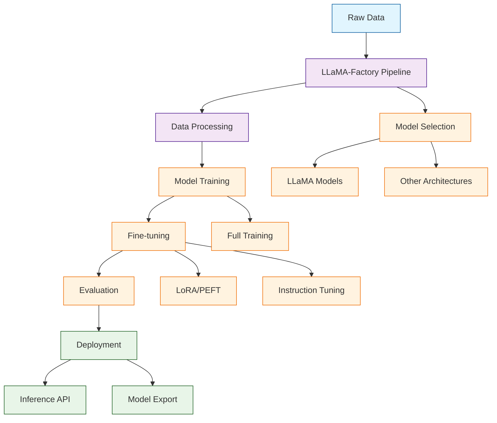

# LLaMA-Factory Tutorial: Unified Framework for LLM Training and Fine-tuning

> This tutorial is AI-generated! To learn more, check out [Awesome Code Docs](https://github.com/johnxie/awesome-code-docs)

LLaMA-Factory[View Repo](https://github.com/hiyouga/LLaMA-Factory) is a unified framework designed to streamline the entire lifecycle of large language model (LLM) development. It provides an easy-to-use interface for training, fine-tuning, evaluation, and deployment of LLMs, supporting multiple model architectures and training methodologies.

LLaMA-Factory democratizes access to advanced LLM capabilities by providing a unified, user-friendly interface that works across different model architectures and training scenarios.

## Tutorial Chapters

Welcome to your journey through unified LLM training! This tutorial explores how to master LLaMA-Factory for building and fine-tuning large language models.

1. **[Chapter 1: Getting Started with LLaMA-Factory](01-getting-started.md)** - Installation, setup, and basic model training
2. **[Chapter 2: Data Preparation & Processing](02-data-preparation.md)** - Dataset formatting and preprocessing
3. **[Chapter 3: Model Fine-tuning](03-model-finetuning.md)** - LoRA and full fine-tuning techniques
4. **[Chapter 4: Instruction Tuning](04-instruction-tuning.md)** - Training chat models and assistants
5. **[Chapter 5: Advanced Training Techniques](05-advanced-techniques.md)** - Multi-GPU training and optimization
6. **[Chapter 6: Model Evaluation & Testing](06-model-evaluation.md)** - Performance assessment and benchmarking
7. **[Chapter 7: Deployment & Inference](07-deployment-inference.md)** - Model deployment and serving
8. **[Chapter 8: Production Workflows](08-production-workflows.md)** - Scaling and automation

## What You'll Learn

By the end of this tutorial, you'll be able to:

- **Set up LLaMA-Factory** for LLM training and fine-tuning
- **Prepare datasets** for various training scenarios
- **Fine-tune models** using LoRA and other efficient methods
- **Train instruction-tuned models** for conversational AI
- **Optimize training performance** with advanced techniques
- **Evaluate model performance** and iterate on improvements
- **Deploy trained models** for production use
- **Scale training workflows** for enterprise applications

## Prerequisites

- Python 3.8+
- PyTorch and CUDA (for GPU training)
- Basic understanding of machine learning concepts
- Familiarity with command-line interfaces

## Learning Path

### 🟢 Beginner Track
Perfect for developers new to LLM training:
1. Chapters 1-2: Setup and basic data preparation
2. Focus on understanding the LLaMA-Factory workflow

### 🟡 Intermediate Track
For developers fine-tuning models:
1. Chapters 3-5: Fine-tuning, instruction tuning, and optimization
2. Learn advanced training techniques

### 🔴 Advanced Track
For production LLM development:
1. Chapters 6-8: Evaluation, deployment, and scaling
2. Master enterprise-grade LLM workflows

---

**Ready to master LLM training with LLaMA-Factory? Let's begin with [Chapter 1: Getting Started](01-getting-started.md)!**

*Generated by [AI Codebase Knowledge Builder](https://github.com/The-Pocket/Tutorial-Codebase-Knowledge)*
