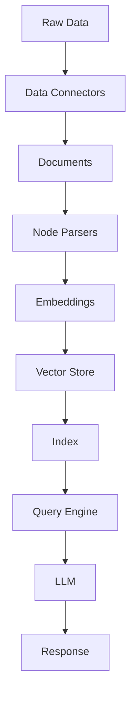

# Chapter 1: Getting Started with LlamaIndex

Welcome to LlamaIndex! If you've ever wanted to build AI applications that can access and reason over your own data, you're in the right place. LlamaIndex (formerly GPT Index) is the leading framework for connecting Large Language Models with external data sources, enabling powerful Retrieval-Augmented Generation (RAG) systems.

## What Makes LlamaIndex Special?

LlamaIndex revolutionizes AI development with:
- **Comprehensive Data Framework** - Connect LLMs to any data source
- **Enterprise-Grade Performance** - Production-ready with advanced optimization
- **Flexible Architecture** - Modular components for any use case
- **Multi-Modal Support** - Text, images, structured data, and more
- **Advanced Retrieval** - Hybrid search, re-ranking, and context enrichment
- **Production Features** - Caching, monitoring, and scalability

## Installing LlamaIndex

### Basic Installation

```bash
# Install core LlamaIndex
pip install llama-index

# Or install with common dependencies
pip install llama-index[all]

# For specific integrations
pip install llama-index-vector-stores-chroma
pip install llama-index-llms-openai
pip install llama-index-embeddings-openai
```

### Development Setup

```bash
# Clone LlamaIndex for development
git clone https://github.com/run-llama/llama_index.git
cd llama_index

# Install in development mode
pip install -e .

# Install development dependencies
pip install -e ".[dev]"

# Run tests to verify installation
pytest tests/
```

## Your First RAG Application

Let's build your first Retrieval-Augmented Generation application:

### Step 1: Basic Setup

```python
import os
from llama_index.core import VectorStoreIndex, SimpleDirectoryReader
from llama_index.llms.openai import OpenAI
from llama_index.embeddings.openai import OpenAIEmbedding

# Set your OpenAI API key
os.environ["OPENAI_API_KEY"] = "your-openai-api-key"

# Initialize LLM and embedding model
llm = OpenAI(model="gpt-3.5-turbo", temperature=0.1)
embed_model = OpenAIEmbedding()

print("🚀 LlamaIndex initialized successfully!")
```

### Step 2: Load and Index Documents

```python
# Load documents from a directory
documents = SimpleDirectoryReader("data/").load_data()

print(f"📄 Loaded {len(documents)} documents")

# Create an index from the documents
index = VectorStoreIndex.from_documents(
    documents,
    embed_model=embed_model
)

print("📚 Index created successfully!")
```

### Step 3: Query Your Documents

```python
# Create a query engine
query_engine = index.as_query_engine(llm=llm)

# Ask questions about your documents
response = query_engine.query("What are the main topics covered in these documents?")

print("🤖 AI Response:")
print(response)

# Get detailed response information
print("\n📊 Response Details:")
print(f"Response time: {response.metadata.get('response_time', 'N/A')}")
print(f"Source documents used: {len(response.source_nodes)}")
```

## Understanding LlamaIndex Architecture

### Core Components

```
LlamaIndex Application
├── Data Connectors (Loaders)
├── Documents (Data representation)
├── Node Parsers (Text splitting)
├── Embeddings (Vector representations)
├── Vector Stores (Storage and retrieval)
├── Retrievers (Query processing)
├── Query Engines (Response generation)
└── Response Synthesizers (Answer formatting)
```

### Data Flow Pipeline



## Advanced First Application

Let's build a more sophisticated RAG application:

```python
from llama_index.core import (
    VectorStoreIndex,
    SimpleDirectoryReader,
    StorageContext,
    load_index_from_storage
)
from llama_index.vector_stores.chroma import ChromaVectorStore
from llama_index.llms.openai import OpenAI
from llama_index.embeddings.openai import OpenAIEmbedding
import chromadb
import os

class AdvancedRAGApplication:
    def __init__(self, data_dir="data/", persist_dir="storage/"):
        self.data_dir = data_dir
        self.persist_dir = persist_dir
        self.setup_components()

    def setup_components(self):
        """Initialize all LlamaIndex components"""
        # Initialize Chroma client
        chroma_client = chromadb.PersistentClient(path=self.persist_dir)

        # Create or get collection
        chroma_collection = chroma_client.get_or_create_collection("my_docs")

        # Initialize vector store
        self.vector_store = ChromaVectorStore(chroma_collection=chroma_collection)

        # Initialize LLM and embeddings
        self.llm = OpenAI(model="gpt-4", temperature=0.1)
        self.embed_model = OpenAIEmbedding()

        # Create storage context
        self.storage_context = StorageContext.from_defaults(
            vector_store=self.vector_store
        )

    def load_and_index_documents(self):
        """Load documents and create searchable index"""
        if os.path.exists(self.persist_dir) and os.listdir(self.persist_dir):
            # Load existing index
            self.index = load_index_from_storage(
                StorageContext.from_defaults(
                    vector_store=self.vector_store,
                    persist_dir=self.persist_dir
                )
            )
            print("📚 Loaded existing index")
        else:
            # Create new index
            documents = SimpleDirectoryReader(self.data_dir).load_data()
            print(f"📄 Loaded {len(documents)} documents")

            self.index = VectorStoreIndex.from_documents(
                documents,
                storage_context=self.storage_context,
                embed_model=self.embed_model
            )

            # Persist the index
            self.index.storage_context.persist(persist_dir=self.persist_dir)
            print("💾 Index created and persisted")

    def query_documents(self, query, similarity_top_k=3):
        """Query the indexed documents"""
        query_engine = self.index.as_query_engine(
            llm=self.llm,
            similarity_top_k=similarity_top_k,
            response_mode="tree_summarize"  # Better for comprehensive answers
        )

        response = query_engine.query(query)

        return {
            'answer': response.response,
            'sources': [
                {
                    'content': node.node.text,
                    'score': node.score,
                    'metadata': node.node.metadata
                }
                for node in response.source_nodes
            ],
            'metadata': response.metadata
        }

    def get_index_stats(self):
        """Get statistics about the index"""
        stats = {
            'total_documents': len(self.vector_store.client.list_collections()[0].count())
            if self.vector_store.client.list_collections() else 0,
            'vector_dimensions': 1536,  # OpenAI embedding dimensions
            'storage_location': self.persist_dir
        }
        return stats

# Usage
if __name__ == "__main__":
    # Initialize the application
    rag_app = AdvancedRAGApplication()

    # Load and index documents
    rag_app.load_and_index_documents()

    # Query examples
    queries = [
        "What are the main concepts discussed?",
        "Summarize the key findings",
        "What recommendations are provided?"
    ]

    for query in queries:
        print(f"\n🔍 Query: {query}")
        result = rag_app.query_documents(query)

        print(f"🤖 Answer: {result['answer'][:200]}...")
        print(f"📚 Sources used: {len(result['sources'])}")
        print("-" * 50)

    # Show index statistics
    stats = rag_app.get_index_stats()
    print(f"\n📊 Index Stats: {stats}")
```

## Real-World Application Patterns

### Document Q&A System

```python
from llama_index.core import VectorStoreIndex, SimpleDirectoryReader
from llama_index.llms.openai import OpenAI
from llama_index.core.memory import ChatMemoryBuffer

class DocumentQASystem:
    def __init__(self, document_dir):
        self.document_dir = document_dir
        self.llm = OpenAI(model="gpt-4")
        self.memory = ChatMemoryBuffer.from_defaults(token_limit=2000)
        self.index = None

    def initialize_knowledge_base(self):
        """Load and index documents"""
        documents = SimpleDirectoryReader(self.document_dir).load_data()

        self.index = VectorStoreIndex.from_documents(
            documents,
            memory=self.memory
        )

        return f"Knowledge base initialized with {len(documents)} documents"

    def ask_question(self, question, chat_history=None):
        """Ask a question with conversation context"""
        if not self.index:
            return "Please initialize the knowledge base first"

        query_engine = self.index.as_query_engine(
            llm=self.llm,
            memory=self.memory,
            streaming=True
        )

        # Include chat history for context
        if chat_history:
            context = "\n".join([
                f"{'User' if msg['role'] == 'user' else 'Assistant'}: {msg['content']}"
                for msg in chat_history[-5:]  # Last 5 messages
            ])
            question = f"Context:\n{context}\n\nQuestion: {question}"

        response = query_engine.query(question)
        return response.response

    def get_relevant_sources(self, question, top_k=3):
        """Get the most relevant source documents"""
        if not self.index:
            return []

        retriever = self.index.as_retriever(similarity_top_k=top_k)
        nodes = retriever.retrieve(question)

        return [
            {
                'content': node.node.text,
                'score': node.score,
                'metadata': node.node.metadata
            }
            for node in nodes
        ]
```

### Multi-Source Data Integration

```python
from llama_index.core import VectorStoreIndex
from llama_index.core.schema import Document
from llama_index.readers.web import SimpleWebPageReader
from llama_index.readers.database import DatabaseReader

class MultiSourceRAG:
    def __init__(self):
        self.sources = {}
        self.index = None

    def add_file_documents(self, file_paths):
        """Add documents from files"""
        documents = SimpleDirectoryReader(
            input_files=file_paths
        ).load_data()

        self.sources['files'] = documents
        return f"Added {len(documents)} file documents"

    def add_web_documents(self, urls):
        """Add documents from web pages"""
        documents = SimpleWebPageReader().load_data(urls)
        self.sources['web'] = documents
        return f"Added {len(documents)} web documents"

    def add_database_documents(self, connection_string, query):
        """Add documents from database"""
        reader = DatabaseReader(
            connection_string=connection_string
        )
        documents = reader.load_data(query=query)
        self.sources['database'] = documents
        return f"Added {len(documents)} database documents"

    def build_unified_index(self):
        """Build a unified index from all sources"""
        all_documents = []
        for source_docs in self.sources.values():
            all_documents.extend(source_docs)

        # Add source metadata
        for i, doc in enumerate(all_documents):
            if 'source' not in doc.metadata:
                doc.metadata['source'] = f"document_{i}"

        self.index = VectorStoreIndex.from_documents(all_documents)
        return f"Unified index built with {len(all_documents)} documents"

    def query_across_sources(self, query):
        """Query across all data sources"""
        if not self.index:
            return "Please build the index first"

        query_engine = self.index.as_query_engine()
        response = query_engine.query(query)

        # Group sources by type
        source_breakdown = {}
        for node in response.source_nodes:
            source_type = node.node.metadata.get('source_type', 'unknown')
            if source_type not in source_breakdown:
                source_breakdown[source_type] = []
            source_breakdown[source_type].append(node)

        return {
            'answer': response.response,
            'sources_by_type': source_breakdown,
            'total_sources': len(response.source_nodes)
        }
```

## Configuration and Optimization

### Basic Configuration

```python
from llama_index.core import Settings

# Global settings for LlamaIndex
Settings.llm = OpenAI(model="gpt-4", temperature=0.1)
Settings.embed_model = OpenAIEmbedding()
Settings.chunk_size = 512
Settings.chunk_overlap = 50
Settings.context_window = 4096

print("⚙️ LlamaIndex configured successfully!")
```

### Advanced Configuration

```python
from llama_index.core import Settings
from llama_index.core.node_parser import SimpleNodeParser
from llama_index.core.callbacks import CallbackManager

# Advanced settings
Settings.chunk_size = 1024
Settings.chunk_overlap = 200
Settings.num_output = 512
Settings.context_window = 4096

# Custom node parser
Settings.node_parser = SimpleNodeParser.from_defaults(
    chunk_size=1024,
    chunk_overlap=200,
    include_metadata=True
)

# Callback manager for monitoring
Settings.callback_manager = CallbackManager()

# Custom transformations
Settings.transformations = [
    # Your custom transformations here
]

print("🔧 Advanced configuration applied!")
```

### Environment Configuration

```bash
# .env file
OPENAI_API_KEY=your-openai-api-key
LLAMA_INDEX_CHUNK_SIZE=1024
LLAMA_INDEX_CHUNK_OVERLAP=200
LLAMA_INDEX_EMBEDDING_MODEL=text-embedding-3-small
LLAMA_INDEX_LLM_MODEL=gpt-4
LLAMA_INDEX_TEMPERATURE=0.1

# Optional: Vector store settings
CHROMA_PERSIST_DIR=./chroma_db
PINECONE_API_KEY=your-pinecone-key
PINECONE_ENVIRONMENT=your-environment
```

## Performance Optimization

### Caching Strategies

```python
from llama_index.core import VectorStoreIndex
from llama_index.core.cache import RedisCache

# Enable caching for better performance
Settings.cache = RedisCache(
    redis_url="redis://localhost:6379",
    ttl=3600  # Cache for 1 hour
)

# Create index with caching
index = VectorStoreIndex.from_documents(
    documents,
    cache=Settings.cache
)
```

### Parallel Processing

```python
import asyncio
from llama_index.core import VectorStoreIndex

async def build_index_parallel(documents):
    """Build index with parallel processing"""
    # Split documents into chunks
    chunk_size = 100
    document_chunks = [
        documents[i:i + chunk_size]
        for i in range(0, len(documents), chunk_size)
    ]

    # Process chunks in parallel
    tasks = [
        asyncio.to_thread(VectorStoreIndex.from_documents, chunk)
        for chunk in document_chunks
    ]

    indexes = await asyncio.gather(*tasks)

    # Merge indexes if needed
    if len(indexes) > 1:
        merged_index = indexes[0]
        for idx in indexes[1:]:
            merged_index.insert_nodes(idx.docstore.docs.values())
        return merged_index
    else:
        return indexes[0]
```

## What We've Accomplished

Congratulations! 🎉 You've successfully:

1. **Installed LlamaIndex** and set up your development environment
2. **Built your first RAG application** with document indexing and querying
3. **Understood the core architecture** of LlamaIndex's data framework
4. **Created advanced RAG patterns** with multiple data sources and persistence
5. **Implemented real-world applications** like document Q&A and multi-source integration
6. **Optimized performance** with caching, configuration, and parallel processing
7. **Configured LlamaIndex** for different use cases and requirements

## Next Steps

Now that you have a solid foundation in LlamaIndex, let's explore how to load data from various sources. In [Chapter 2: Data Ingestion & Loading](02-data-ingestion.md), we'll dive into the different ways to bring your data into LlamaIndex.

---

**Practice what you've learned:**
1. Create a RAG system for your personal documents or notes
2. Build a Q&A system for a specific domain (like legal documents or technical manuals)
3. Implement a multi-source knowledge base combining web content and local files
4. Experiment with different chunk sizes and embedding models

*What kind of data would you most like to make searchable with AI?* 📚
