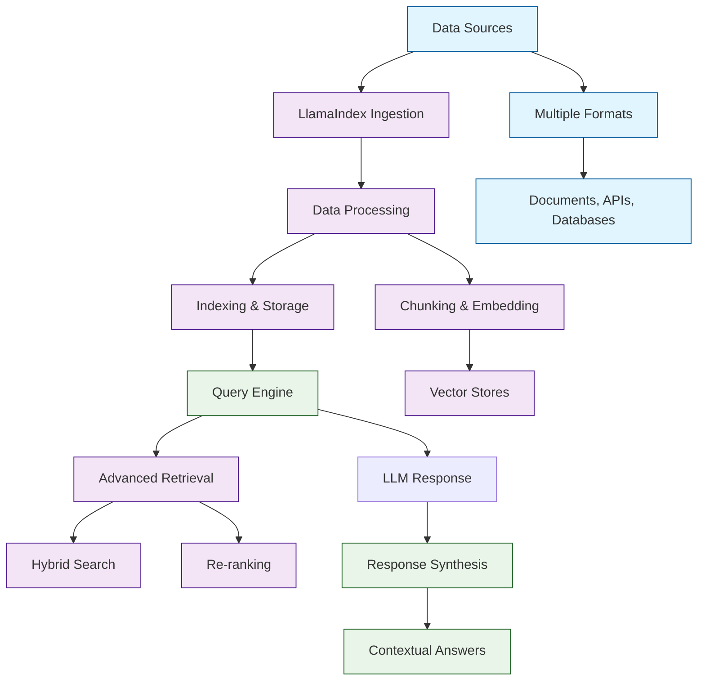

# LlamaIndex Tutorial: Building Advanced RAG Systems and Data Frameworks

> This tutorial is AI-generated! To learn more, check out [Awesome Code Docs](https://github.com/johnxie/awesome-code-docs)

LlamaIndex[View Repo](https://github.com/run-llama/llama_index) (formerly GPT Index) is a comprehensive data framework for connecting Large Language Models (LLMs) with external data sources. It provides powerful tools for ingestion, indexing, querying, and deployment of RAG (Retrieval-Augmented Generation) systems with enterprise-grade performance and reliability.

LlamaIndex enables you to build sophisticated AI applications that can reason over private data, maintain context across conversations, and provide accurate, up-to-date responses based on your specific knowledge base.

## Tutorial Chapters

Welcome to your journey through advanced RAG systems and data frameworks! This tutorial explores how to build powerful AI applications with LlamaIndex's comprehensive toolkit.

1. **[Chapter 1: Getting Started with LlamaIndex](01-getting-started.md)** - Installation, setup, and your first RAG application
2. **[Chapter 2: Data Ingestion & Loading](02-data-ingestion.md)** - Loading data from various sources and formats
3. **[Chapter 3: Indexing & Storage](03-indexing-storage.md)** - Creating efficient indexes for fast retrieval
4. **[Chapter 4: Query Engines & Retrieval](04-query-engines.md)** - Building sophisticated query and retrieval systems
5. **[Chapter 5: Advanced RAG Patterns](05-advanced-rag.md)** - Multi-modal, agent-based, and hybrid approaches
6. **[Chapter 6: Custom Components](06-custom-components.md)** - Building custom loaders, indexes, and query engines
7. **[Chapter 7: Production Deployment](07-production-deployment.md)** - Scaling LlamaIndex applications for production
8. **[Chapter 8: Monitoring & Optimization](08-monitoring-optimization.md)** - Performance tuning and observability

## What You'll Learn

By the end of this tutorial, you'll be able to:

- **Build comprehensive RAG systems** that combine LLMs with external knowledge
- **Ingest data from diverse sources** including documents, APIs, and databases
- **Create efficient indexes** for fast, accurate information retrieval
- **Implement advanced query patterns** including hybrid search and re-ranking
- **Develop custom components** for specialized use cases and data types
- **Deploy production-ready applications** with proper scaling and monitoring
- **Optimize performance** through caching, indexing, and architectural choices
- **Integrate multiple data modalities** including text, images, and structured data

## Prerequisites

- Python 3.8+
- Basic understanding of LLMs and embeddings
- Familiarity with data processing and APIs
- Knowledge of vector databases (helpful but not required)

## Learning Path

### 🟢 Beginner Track
Perfect for developers new to RAG systems:
1. Chapters 1-2: Setup and basic data ingestion
2. Focus on understanding LlamaIndex fundamentals

### 🟡 Intermediate Track
For developers building complex AI applications:
1. Chapters 3-5: Indexing, querying, and advanced patterns
2. Learn to build sophisticated RAG architectures

### 🔴 Advanced Track
For production AI system development:
1. Chapters 6-8: Custom components, deployment, and optimization
2. Master enterprise-grade RAG solutions

---

**Ready to build advanced RAG systems with LlamaIndex? Let's begin with [Chapter 1: Getting Started](01-getting-started.md)!**

*Generated by [AI Codebase Knowledge Builder](https://github.com/The-Pocket/Tutorial-Codebase-Knowledge)*
