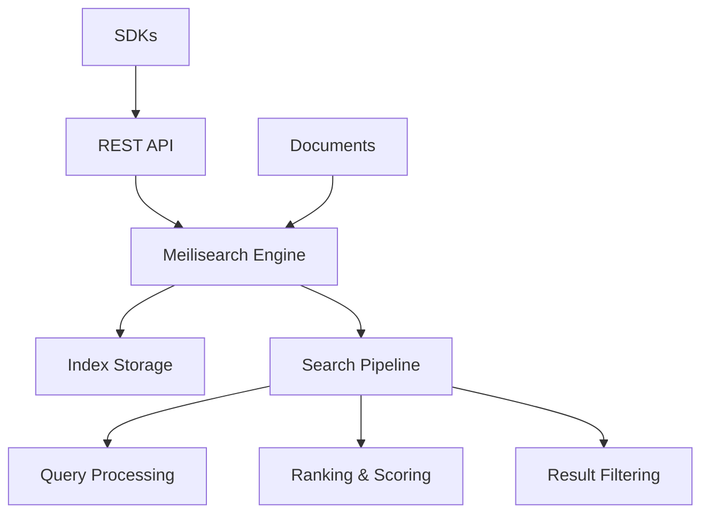

# Meilisearch Tutorial: Lightning Fast Search Engine

<p align="center">
  
</p>

<p align="center">
  <strong>⚡ Lightning-fast search engine with typo-tolerance and faceted search</strong>
</p>

---

## 🎯 What You'll Learn

This comprehensive tutorial will guide you through Meilisearch, a powerful search engine written in Rust that provides:

- **Instant Search Results**: Sub-millisecond response times
- **Typo-Tolerant Search**: Handles spelling mistakes automatically
- **Faceted Search**: Filter and categorize results
- **RESTful API**: Easy integration with any application
- **Real-time Indexing**: Documents are searchable immediately
- **Multi-language Support**: 80+ languages supported
- **Customizable Ranking**: Fine-tune search relevance

## 📚 Tutorial Chapters

1. **[Getting Started with Meilisearch](01-getting-started.md)** - Installation, setup, and first search
2. **[Document Management](02-document-management.md)** - Adding, updating, and deleting documents
3. **[Search Fundamentals](03-search-fundamentals.md)** - Basic and advanced search queries
4. **[Typo Tolerance & Relevance](04-typo-tolerance-relevance.md)** - Understanding search ranking and typo handling
5. **[Filtering & Facets](05-filtering-facets.md)** - Advanced filtering and faceted search
6. **[Multi-Language Support](06-multi-language-support.md)** - Internationalization and localization
7. **[API Integration](07-api-integration.md)** - REST API usage and SDK integration
8. **[Production Deployment](08-production-deployment.md)** - Scaling, monitoring, and optimization

## 🚀 Quick Start

```bash
# Install Meilisearch
curl -L https://install.meilisearch.com | sh

# Start Meilisearch
./meilisearch --master-key="your_master_key"

# Add documents via API
curl -X POST 'http://localhost:7700/indexes/movies/documents' \
  -H 'Content-Type: application/json' \
  --data-binary @movies.json

# Search
curl 'http://localhost:7700/indexes/movies/search?q=avengers'
```

## 🏗️ Architecture Overview



## 🎯 Use Cases

- **E-commerce**: Product search with filters
- **Documentation**: Technical documentation search
- **Content Management**: Blog/article search
- **Database Search**: SQL database augmentation
- **Mobile Apps**: Offline-capable search

## 📋 Prerequisites

- Basic knowledge of REST APIs
- Understanding of JSON
- Familiarity with command line tools
- Basic programming concepts

## 🕐 Time Investment

- **Complete Tutorial**: 3-4 hours
- **Basic Setup**: 30 minutes
- **Advanced Features**: 2-3 hours

## 🎯 Learning Outcomes

By the end of this tutorial, you'll be able to:

- Set up and configure Meilisearch instances
- Index and manage documents effectively
- Implement advanced search features
- Integrate Meilisearch into applications
- Optimize search performance and relevance
- Deploy Meilisearch in production environments

## 🔗 Resources

- **Official Documentation**: [docs.meilisearch.com](https://docs.meilisearch.com)
- **GitHub Repository**: [github.com/meilisearch/meilisearch](https://github.com/meilisearch/meilisearch)
- **REST API Reference**: [docs.meilisearch.com/reference/api](https://docs.meilisearch.com/reference/api/)
- **SDKs**: JavaScript, Go, PHP, Python, Ruby, Swift, Java

---

*Generated by [AI Codebase Knowledge Builder](https://github.com/johnxie/awesome-code-docs)*
