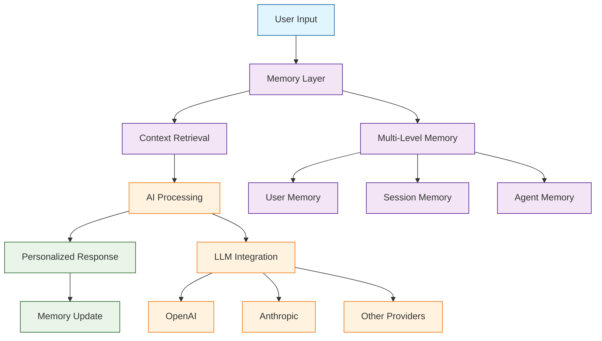

# Mem0 Tutorial: Building Production-Ready AI Agents with Scalable Long-Term Memory

> This tutorial is AI-generated! To learn more, check out [Awesome Code Docs](https://github.com/johnxie/awesome-code-docs)

Mem0[View Repo](https://github.com/mem0ai/mem0) is a universal memory layer for AI agents that enables personalized AI interactions with intelligent memory management. It provides an intelligent memory layer that remembers user preferences, adapts to individual needs, and continuously learns over time - ideal for customer support chatbots, AI assistants, and autonomous systems.

Mem0 enhances AI assistants and agents with a production-ready memory system that delivers +26% accuracy improvements, 91% faster responses, and 90% lower token usage compared to traditional memory approaches.

## Tutorial Chapters

Welcome to your journey through scalable AI memory systems! This tutorial explores how to build production-ready AI agents with intelligent long-term memory.

1. **[Chapter 1: Getting Started with Mem0](01-getting-started.md)** - Installation, basic setup, and your first memory-enabled AI agent
2. **[Chapter 2: Memory Architecture & Types](02-memory-architecture.md)** - Understanding multi-level memory systems and storage patterns
3. **[Chapter 3: Core Memory Operations](03-memory-operations.md)** - Adding, retrieving, and managing memories effectively
4. **[Chapter 4: Advanced Memory Features](04-advanced-features.md)** - Semantic search, memory consolidation, and optimization
5. **[Chapter 5: Integrating with LLMs](05-llm-integration.md)** - Connecting Mem0 with various language models and providers
6. **[Chapter 6: Building Memory-Enabled Applications](06-memory-applications.md)** - Real-world use cases and implementation patterns
7. **[Chapter 7: Performance Optimization](07-performance-optimization.md)** - Scaling memory systems for production workloads
8. **[Chapter 8: Deployment & Monitoring](08-production-deployment.md)** - Deploying memory-enabled AI systems at scale

## What You'll Learn

By the end of this tutorial, you'll be able to:

- **Implement intelligent memory systems** that adapt to user behavior and preferences
- **Build production-ready AI agents** with scalable long-term memory
- **Optimize memory performance** for 91% faster responses and 90% lower token usage
- **Integrate multiple LLM providers** seamlessly with memory management
- **Deploy memory-enabled applications** with monitoring and analytics
- **Handle complex memory scenarios** including user preferences, session context, and agent state
- **Scale memory systems** for enterprise-grade AI applications
- **Monitor and optimize memory performance** in production environments

## Prerequisites

- Python 3.8+ or Node.js 16+
- Basic understanding of AI/LLM concepts
- Familiarity with API integration patterns
- Knowledge of database concepts (helpful but not required)

## Learning Path

### 🟢 Beginner Track
Perfect for developers new to memory systems:
1. Chapters 1-2: Setup and basic memory concepts
2. Focus on understanding memory architecture and operations

### 🟡 Intermediate Track
For developers building AI applications:
1. Chapters 3-5: Advanced memory features and LLM integration
2. Learn to build memory-enabled AI applications

### 🔴 Advanced Track
For production AI system development:
1. Chapters 6-8: Performance optimization and production deployment
2. Master enterprise-grade memory-enabled AI systems

---

**Ready to build AI agents with intelligent memory? Let's begin with [Chapter 1: Getting Started](01-getting-started.md)!**

*Generated by [AI Codebase Knowledge Builder](https://github.com/The-Pocket/Tutorial-Codebase-Knowledge)*
