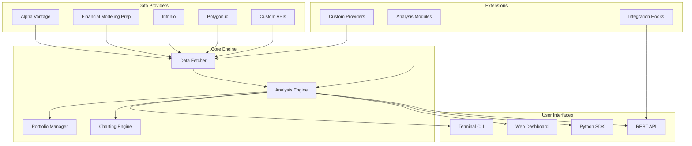

# Chapter 1: Getting Started with OpenBB

Welcome to your journey with OpenBB! This chapter will guide you through installing and setting up the OpenBB Platform, understanding its core components, and creating your first investment research analysis.

## 🎯 What You'll Learn

- OpenBB Platform architecture and components
- Installation methods (pip, Docker, source)
- Basic configuration and setup
- First investment analysis walkthrough
- Core concepts and terminology

## 🏗️ OpenBB Architecture

OpenBB consists of several key components working together to provide comprehensive investment research capabilities:



### Core Components

1. **Data Providers**: Integration with 100+ financial data sources
2. **Core Engine**: Data processing, analysis, and portfolio management
3. **User Interfaces**: Terminal, web, SDK, and API access
4. **Extensions**: Custom providers and analysis modules

## 🚀 Installation Methods

### Method 1: pip Installation (Recommended)

```bash
# Install OpenBB Platform
pip install openbb

# Verify installation
openbb --version

# Update to latest version
pip install --upgrade openbb

# Install optional dependencies
pip install openbb[all]  # Install all optional dependencies
```

### Method 2: Docker Installation

```bash
# Pull OpenBB Docker image
docker pull ghcr.io/openbb-finance/openbb:latest

# Run OpenBB container
docker run -it --rm ghcr.io/openbb-finance/openbb:latest

# Run with web interface
docker run -p 8501:8501 ghcr.io/openbb-finance/openbb:latest --web
```

### Method 3: Source Installation

```bash
# Clone the repository
git clone https://github.com/OpenBB-finance/OpenBB.git
cd OpenBB

# Create virtual environment
python -m venv openbb_env
source openbb_env/bin/activate  # On Windows: openbb_env\Scripts\activate

# Install in development mode
pip install -e .

# Install optional dependencies
pip install -e .[all]
```

### Method 4: Conda Installation

```bash
# Create conda environment
conda create -n openbb python=3.10
conda activate openbb

# Install OpenBB
pip install openbb

# Or install from conda-forge
conda install -c conda-forge openbb
```

## ⚙️ Configuration

### API Keys Setup

```bash
# Set API keys as environment variables
export OPENBB_API_KEY_ALPHA_VANTAGE="your_alpha_vantage_key"
export OPENBB_API_KEY_FMP="your_fmp_key"
export OPENBB_API_KEY_INTRINIO="your_intrinio_key"
export OPENBB_API_KEY_POLYGON="your_polygon_key"

# Or create a .env file
cat > .env << EOF
OPENBB_API_KEY_ALPHA_VANTAGE=your_alpha_vantage_key
OPENBB_API_KEY_FMP=your_fmp_key
OPENBB_API_KEY_INTRINIO=your_intrinio_key
OPENBB_API_KEY_POLYGON=your_polygon_key
EOF
```

### Configuration File

```python
# ~/.openbb/config.json
{
  "data": {
    "sources": {
      "alpha_vantage": {
        "api_key": "your_key_here"
      },
      "financial_modeling_prep": {
        "api_key": "your_key_here"
      }
    }
  },
  "interface": {
    "theme": "dark",
    "language": "en"
  },
  "export": {
    "default_format": "csv",
    "output_directory": "~/openbb_exports"
  }
}
```

### Jupyter Notebook Setup

```python
# Install Jupyter support
pip install jupyter

# Launch OpenBB in Jupyter
import openbb
openbb.launch()

# Or use the OpenBB extension
%load_ext openbb
```

## 🌐 Launching OpenBB

### Terminal Interface

```bash
# Launch OpenBB terminal
openbb

# You'll see the OpenBB prompt:
# >>> 

# Get help
help

# List available commands
/

# Exit OpenBB
exit
```

### Web Interface

```bash
# Launch web interface
openbb --web

# Or specify port
openbb --web --port 8502

# Access at http://localhost:8501
```

### Python SDK Usage

```python
# Import OpenBB
from openbb import obb

# Initialize with API keys
obb.account.login(
    alpha_vantage="your_key",
    fmp="your_key"
)

# Use OpenBB functions
data = obb.stocks.quote("AAPL")
print(data)
```

## 🏃‍♂️ Your First Analysis

### Stock Quote Analysis

```bash
# Launch OpenBB
openbb

# Get stock quote
/equity/quote AAPL

# Get historical data
/equity/historical AAPL --start 2023-01-01 --end 2023-12-31

# View company information
/equity/profile AAPL

# Get financial statements
/equity/financials AAPL
```

### Technical Analysis

```bash
# Load stock data
/equity/load AAPL

# Calculate technical indicators
/ta/sma --length 20
/ta/rsi --length 14
/ta/macd

# Plot charts
/chart
```

### Fundamental Analysis

```bash
# Get key metrics
/equity/metrics AAPL

# View valuation ratios
/equity/ratios AAPL

# Get analyst recommendations
/equity/analyst AAPL

# View earnings calendar
/equity/calendar
```

## 🔧 Troubleshooting

### Common Issues

#### Import Errors
```bash
# Clear pip cache and reinstall
pip cache purge
pip uninstall openbb
pip install openbb

# Check Python version compatibility
python --version
```

#### API Key Issues
```bash
# Verify API keys
openbb
/account

# Test data provider connection
/equity/quote AAPL --source alpha_vantage
```

#### Memory Issues
```bash
# Check system resources
free -h  # Linux
vm_stat  # macOS

# Increase Python memory limit
export PYTHONOPTIMIZE=1
```

### Docker Issues
```bash
# Check Docker status
docker --version
docker ps

# Clean up Docker
docker system prune -a

# Run with increased memory
docker run --memory=4g ghcr.io/openbb-finance/openbb:latest
```

## 📊 Basic Commands Reference

### Data Commands
```bash
# Stock data
/equity/quote SYMBOL          # Get current quote
/equity/historical SYMBOL     # Get historical data
/equity/profile SYMBOL        # Get company profile

# Market data
/market/overview              # Market overview
/market/indices               # Major indices
/market/sector                # Sector performance

# Economic data
/economy/gdp                  # GDP data
/economy/inflation           # Inflation data
/economy/interest            # Interest rates
```

### Analysis Commands
```bash
# Technical analysis
/ta/sma                       # Simple moving average
/ta/rsi                       # Relative strength index
/ta/macd                      # MACD indicator

# Fundamental analysis
/equity/financials SYMBOL     # Financial statements
/equity/ratios SYMBOL         # Valuation ratios
/equity/metrics SYMBOL        # Key metrics
```

### Portfolio Commands
```bash
# Portfolio management
/portfolio/load FILE          # Load portfolio
/portfolio/show               # Show portfolio
/portfolio/holdings           # View holdings
/portfolio/performance        # Performance analysis
```

## 🎯 Key Concepts

### Data Sources
- **Primary Sources**: Real-time market data providers
- **Secondary Sources**: Financial statements and fundamentals
- **Alternative Sources**: News, social media, satellite data

### Analysis Types
- **Technical Analysis**: Price and volume patterns
- **Fundamental Analysis**: Financial health and valuation
- **Quantitative Analysis**: Statistical modeling
- **Sentiment Analysis**: Market psychology

### Asset Classes
- **Equities**: Stocks and ETFs
- **Fixed Income**: Bonds and treasuries
- **Commodities**: Gold, oil, agriculture
- **Cryptocurrencies**: Digital assets
- **Derivatives**: Options and futures

## 📊 Performance Monitoring

### System Health Check

```python
import psutil
import openbb

def check_system_health():
    """Check OpenBB system health"""
    
    # Check memory usage
    memory = psutil.virtual_memory()
    print(f"Memory Usage: {memory.percent}%")
    
    # Check disk space
    disk = psutil.disk_usage('/')
    print(f"Disk Usage: {disk.percent}%")
    
    # Test OpenBB connection
    try:
        data = openbb.stocks.quote("AAPL")
        print("OpenBB Connection: OK")
    except Exception as e:
        print(f"OpenBB Connection: ERROR - {e}")

def monitor_performance():
    """Monitor OpenBB performance"""
    
    import time
    
    # Test response time
    start_time = time.time()
    data = openbb.stocks.quote("AAPL")
    end_time = time.time()
    
    response_time = end_time - start_time
    print(f"Response Time: {response_time:.2f} seconds")

if __name__ == "__main__":
    check_system_health()
    monitor_performance()
```

## 🏆 Achievement Unlocked!

Congratulations! 🎉 You've successfully:

- ✅ Installed OpenBB Platform
- ✅ Configured API keys and settings
- ✅ Launched both terminal and web interfaces
- ✅ Performed your first stock analysis
- ✅ Explored basic commands and features

## 🚀 What's Next?

Ready to explore financial data sources? Let's dive into [Chapter 2: Data Access](02-data-access.md) to learn about connecting to various financial data providers.

---

**Practice what you've learned:**
1. Experiment with different installation methods
2. Configure multiple data source API keys
3. Try various stock analysis commands
4. Set up both terminal and web interfaces
5. Create a basic system monitoring script

*What's the first stock or asset you analyzed with OpenBB?* 📈
