# Chapter 2: Financial Data Access

This chapter explores OpenBB's comprehensive data access capabilities. You'll learn how to connect to various financial data providers, manage API keys, and access different types of financial data for your investment research.

## 🎯 What You'll Learn

- Data provider setup and configuration
- API key management and authentication
- Accessing different types of financial data
- Data quality assessment and validation
- Handling rate limits and errors

## 📊 Data Provider Ecosystem

OpenBB connects to 100+ financial data sources:

```mermaid
graph TB
    subgraph "Market Data"
        A[Real-time Quotes]
        B[Historical Prices]
        C[Options Data]
        D[Futures Data]
    end

    subgraph "Fundamental Data"
        E[Financial Statements]
        F[Company Profiles]
        G[Analyst Estimates]
        H[Corporate Actions]
    end

    subgraph "Economic Data"
        I[GDP & Growth]
        J[Inflation Rates]
        K[Interest Rates]
        L[Employment Data]
    end

    subgraph "Alternative Data"
        M[News & Sentiment]
        N[Social Media]
        O[Satellite Imagery]
        P[Supply Chain]
    end

    subgraph "Data Providers"
        Q[Alpha Vantage]
        R[Financial Modeling Prep]
        S[Intrinio]
        T[Polygon.io]
        U[IEX Cloud]
        V[Yahoo Finance]
    end

    Q --> A
    Q --> B
    R --> E
    R --> F
    S --> G
    S --> H
    T --> I
    T --> J
    U --> K
    U --> L
    V --> M
    V --> N
```



## 🔑 API Key Management

### Setting Up API Keys

```python
import os
from pathlib import Path
import json
from typing import Dict, Optional

class APIKeyManager:
    """Manage API keys for different data providers"""

    def __init__(self, config_file: str = "~/.openbb/api_keys.json"):
        self.config_file = Path(config_file).expanduser()
        self.keys = self._load_keys()

    def _load_keys(self) -> Dict[str, str]:
        """Load API keys from config file"""
        if self.config_file.exists():
            with open(self.config_file, 'r') as f:
                return json.load(f)
        return {}

    def _save_keys(self):
        """Save API keys to config file"""
        self.config_file.parent.mkdir(parents=True, exist_ok=True)
        with open(self.config_file, 'w') as f:
            json.dump(self.keys, f, indent=2)

    def set_key(self, provider: str, key: str):
        """Set API key for a provider"""
        self.keys[provider] = key
        self._save_keys()

    def get_key(self, provider: str) -> Optional[str]:
        """Get API key for a provider"""
        return self.keys.get(provider)

    def list_providers(self) -> list:
        """List configured providers"""
        return list(self.keys.keys())

    def validate_key(self, provider: str) -> bool:
        """Validate API key format"""
        key = self.get_key(provider)
        if not key:
            return False

        # Provider-specific validation
        validations = {
            'alpha_vantage': lambda k: len(k) == 16 and k.isalnum(),
            'polygon': lambda k: len(k) > 20,
            'intrinio': lambda k: len(k) > 10,
            'fmp': lambda k: len(k) > 10
        }

        validator = validations.get(provider)
        return validator(key) if validator else True

# Usage
key_manager = APIKeyManager()

# Set API keys
key_manager.set_key('alpha_vantage', 'your_alpha_vantage_key')
key_manager.set_key('polygon', 'your_polygon_key')
key_manager.set_key('intrinio', 'your_intrinio_key')

# Validate keys
for provider in key_manager.list_providers():
    is_valid = key_manager.validate_key(provider)
    print(f"{provider}: {'✓' if is_valid else '✗'}")
```

### Environment Variable Configuration

```bash
# Set environment variables
export OPENBB_API_KEY_ALPHA_VANTAGE="your_key_here"
export OPENBB_API_KEY_POLYGON="your_key_here"
export OPENBB_API_KEY_INTRINIO="your_key_here"
export OPENBB_API_KEY_FMP="your_key_here"
export OPENBB_API_KEY_IEX="your_key_here"

# Or create a .env file
cat > .env << EOF
OPENBB_API_KEY_ALPHA_VANTAGE=your_key_here
OPENBB_API_KEY_POLYGON=your_key_here
OPENBB_API_KEY_INTRINIO=your_key_here
OPENBB_API_KEY_FMP=your_key_here
OPENBB_API_KEY_IEX=your_key_here
EOF
```

### OpenBB Configuration

```python
# ~/.openbb/config.json
{
  "data": {
    "api_keys": {
      "alpha_vantage": "your_key_here",
      "polygon": "your_key_here",
      "intrinio": "your_key_here",
      "financial_modeling_prep": "your_key_here",
      "iex": "your_key_here"
    },
    "defaults": {
      "source": "polygon",
      "interval": "1day",
      "range": "1year"
    }
  },
  "features": {
    "cache": {
      "enabled": true,
      "ttl": 3600
    },
    "rate_limiting": {
      "enabled": true,
      "max_requests_per_minute": 60
    }
  }
}
```

## 📈 Accessing Market Data

### Stock Quotes and Prices

```python
from openbb import obb
import pandas as pd

# Initialize OpenBB
obb.account.login(
    alpha_vantage="your_key",
    polygon="your_key"
)

# Get real-time quote
quote = obb.equity.quote("AAPL")
print(quote)

# Get quotes for multiple symbols
symbols = ["AAPL", "MSFT", "GOOGL", "AMZN"]
quotes = obb.equity.quote(symbols)
print(quotes)

# Get historical prices
historical = obb.equity.historical(
    "AAPL",
    start_date="2023-01-01",
    end_date="2023-12-31",
    interval="1day"
)
print(historical.head())
```

### Options Data

```python
# Get options chain
options = obb.equity.options.chain("AAPL")
print(options.head())

# Get specific option data
call_option = obb.equity.options.chain(
    "AAPL",
    expiration="2024-01",
    option_type="call",
    strike=150.0
)
print(call_option)

# Get options greeks
greeks = obb.equity.options.greeks("AAPL240119C00150000")
print(greeks)
```

### Futures and Commodities

```python
# Get futures prices
futures = obb.futures.historical(
    "ES",  # E-mini S&P 500
    start_date="2023-01-01",
    end_date="2023-12-31"
)
print(futures.head())

# Get commodities data
gold = obb.commodities.historical(
    "GC",  # Gold futures
    start_date="2023-01-01",
    end_date="2023-12-31"
)
print(gold.head())
```

## 📊 Fundamental Data Access

### Financial Statements

```python
# Get income statement
income_stmt = obb.equity.fundamental.income_statement("AAPL", period="annual")
print(income_stmt)

# Get balance sheet
balance_sheet = obb.equity.fundamental.balance_sheet("AAPL", period="quarterly")
print(balance_sheet)

# Get cash flow statement
cash_flow = obb.equity.fundamental.cash_flow_statement("AAPL", period="annual")
print(cash_flow)
```

### Company Profiles and Metrics

```python
# Get company profile
profile = obb.equity.profile("AAPL")
print(profile)

# Get key metrics
metrics = obb.equity.metrics("AAPL")
print(metrics)

# Get valuation ratios
ratios = obb.equity.valuation.ratios("AAPL")
print(ratios)
```

### Analyst Estimates

```python
# Get analyst recommendations
recommendations = obb.equity.estimates.recommendations("AAPL")
print(recommendations)

# Get earnings estimates
earnings_estimates = obb.equity.estimates.earnings("AAPL")
print(earnings_estimates)

# Get revenue estimates
revenue_estimates = obb.equity.estimates.revenue("AAPL")
print(revenue_estimates)
```

## 📈 Economic and Market Data

### Economic Indicators

```python
# Get GDP data
gdp = obb.economy.gdp()
print(gdp)

# Get inflation data
inflation = obb.economy.inflation()
print(inflation)

# Get interest rates
interest_rates = obb.economy.interest_rates()
print(interest_rates)

# Get employment data
employment = obb.economy.employment()
print(employment)
```

### Market Indices

```python
# Get major indices
indices = obb.market.indices()
print(indices)

# Get index historical data
sp500 = obb.market.historical(
    "^GSPC",  # S&P 500
    start_date="2023-01-01",
    end_date="2023-12-31"
)
print(sp500.head())

# Get sector performance
sectors = obb.market.sectors()
print(sectors)
```

## 📰 News and Alternative Data

### Financial News

```python
# Get news for a specific stock
news = obb.news.company("AAPL", limit=10)
print(news)

# Get market news
market_news = obb.news.market(limit=20)
print(market_news)

# Search news by topic
search_results = obb.news.search("artificial intelligence", limit=15)
print(search_results)
```

### Sentiment Analysis

```python
# Get sentiment data
sentiment = obb.sentiment.stocktwits("AAPL")
print(sentiment)

# Get social media sentiment
twitter_sentiment = obb.sentiment.twitter("AAPL")
print(twitter_sentiment)
```

## 🔄 Data Processing and Validation

### Data Quality Checks

```python
import pandas as pd
import numpy as np
from typing import Dict, List

class DataValidator:
    """Validate financial data quality"""

    def __init__(self):
        self.quality_checks = []

    def validate_price_data(self, df: pd.DataFrame) -> Dict[str, bool]:
        """Validate stock price data"""
        checks = {}

        # Check for required columns
        required_cols = ['open', 'high', 'low', 'close', 'volume']
        checks['has_required_columns'] = all(col in df.columns for col in required_cols)

        # Check for missing values
        checks['no_missing_values'] = not df[required_cols].isnull().any().any()

        # Check price logic (high >= low, close between high and low)
        if checks['has_required_columns']:
            checks['valid_price_logic'] = (
                (df['high'] >= df['low']).all() and
                (df['close'] >= df['low']).all() and
                (df['close'] <= df['high']).all()
            )

        # Check for outliers (extreme price changes)
        if len(df) > 1:
            returns = df['close'].pct_change()
            checks['no_extreme_returns'] = (returns.abs() < 0.5).all()  # 50% daily change threshold

        return checks

    def validate_financial_statements(self, df: pd.DataFrame) -> Dict[str, bool]:
        """Validate financial statement data"""
        checks = {}

        # Check for negative revenues (generally not expected)
        if 'revenue' in df.columns:
            checks['positive_revenue'] = (df['revenue'] >= 0).all()

        # Check balance sheet logic
        balance_cols = ['assets', 'liabilities', 'equity']
        if all(col in df.columns for col in balance_cols):
            checks['balance_sheet_balances'] = (
                abs(df['assets'] - (df['liabilities'] + df['equity'])) < 1e-6
            ).all()

        return checks

    def clean_data(self, df: pd.DataFrame) -> pd.DataFrame:
        """Clean and preprocess data"""
        # Remove duplicates
        df = df.drop_duplicates()

        # Forward fill missing values for price data
        if 'close' in df.columns:
            df = df.fillna(method='ffill')

        # Remove outliers using IQR method
        if 'close' in df.columns:
            Q1 = df['close'].quantile(0.25)
            Q3 = df['close'].quantile(0.75)
            IQR = Q3 - Q1
            lower_bound = Q1 - 1.5 * IQR
            upper_bound = Q3 + 1.5 * IQR
            df = df[(df['close'] >= lower_bound) & (df['close'] <= upper_bound)]

        return df

# Usage
validator = DataValidator()

# Validate stock data
price_data = obb.equity.historical("AAPL", start_date="2023-01-01")
quality_checks = validator.validate_price_data(price_data.to_dataframe())
print("Data Quality Checks:", quality_checks)

# Clean data
cleaned_data = validator.clean_data(price_data.to_dataframe())
print("Cleaned data shape:", cleaned_data.shape)
```

### Rate Limiting and Error Handling

```python
import time
import requests
from typing import Optional, Dict, Any
import backoff

class RateLimiter:
    """Handle API rate limiting"""

    def __init__(self, requests_per_minute: int = 60):
        self.requests_per_minute = requests_per_minute
        self.requests = []
        self.min_interval = 60 / requests_per_minute

    def wait_if_needed(self):
        """Wait if necessary to respect rate limits"""
        current_time = time.time()

        # Remove old requests
        self.requests = [t for t in self.requests if current_time - t < 60]

        if len(self.requests) >= self.requests_per_minute:
            # Wait until we can make another request
            wait_time = 60 - (current_time - self.requests[0])
            if wait_time > 0:
                time.sleep(wait_time)

        self.requests.append(current_time)

class DataFetcher:
    """Robust data fetching with error handling"""

    def __init__(self, api_key: str):
        self.api_key = api_key
        self.rate_limiter = RateLimiter()
        self.session = requests.Session()

    @backoff.on_exception(
        backoff.expo,
        (requests.exceptions.RequestException, requests.exceptions.Timeout),
        max_tries=3
    )
    def fetch_with_retry(self, url: str, params: Optional[Dict] = None) -> Dict[str, Any]:
        """Fetch data with retry logic"""
        self.rate_limiter.wait_if_needed()

        try:
            response = self.session.get(
                url,
                params=params,
                headers={'Authorization': f'Bearer {self.api_key}'},
                timeout=30
            )
            response.raise_for_status()

            return response.json()

        except requests.exceptions.HTTPError as e:
            if e.response.status_code == 429:  # Rate limit exceeded
                print("Rate limit exceeded, waiting...")
                time.sleep(60)
                raise  # Will retry
            elif e.response.status_code == 403:
                raise Exception("API key invalid or expired")
            else:
                raise Exception(f"HTTP error: {e.response.status_code}")

        except requests.exceptions.Timeout:
            print("Request timed out, retrying...")
            raise

        except requests.exceptions.ConnectionError:
            print("Connection error, retrying...")
            raise

    def fetch_stock_data(self, symbol: str) -> Optional[Dict[str, Any]]:
        """Fetch stock data with error handling"""
        url = f"https://api.example.com/stocks/{symbol}"

        try:
            data = self.fetch_with_retry(url)
            return data
        except Exception as e:
            print(f"Failed to fetch data for {symbol}: {e}")
            return None

# Usage
fetcher = DataFetcher("your_api_key")

# Fetch data with automatic retry and rate limiting
data = fetcher.fetch_stock_data("AAPL")
if data:
    print("Successfully fetched data:", data)
```

## 📊 Data Caching and Optimization

### Local Data Caching

```python
import pickle
import hashlib
from pathlib import Path
from typing import Any, Optional

class DataCache:
    """Cache financial data locally"""

    def __init__(self, cache_dir: str = "~/.openbb/cache"):
        self.cache_dir = Path(cache_dir).expanduser()
        self.cache_dir.mkdir(parents=True, exist_ok=True)

    def _get_cache_key(self, query: str) -> str:
        """Generate cache key from query"""
        return hashlib.md5(query.encode()).hexdigest()

    def get(self, query: str) -> Optional[Any]:
        """Get data from cache"""
        cache_key = self._get_cache_key(query)
        cache_file = self.cache_dir / f"{cache_key}.pkl"

        if cache_file.exists():
            try:
                with open(cache_file, 'rb') as f:
                    return pickle.load(f)
            except Exception:
                return None

        return None

    def set(self, query: str, data: Any, ttl: int = 3600):
        """Store data in cache with TTL"""
        cache_key = self._get_cache_key(query)
        cache_file = self.cache_dir / f"{cache_key}.pkl"

        cache_data = {
            'data': data,
            'timestamp': time.time(),
            'ttl': ttl
        }

        try:
            with open(cache_file, 'wb') as f:
                pickle.dump(cache_data, f)
        except Exception as e:
            print(f"Failed to cache data: {e}")

    def is_expired(self, cache_file: Path) -> bool:
        """Check if cache file is expired"""
        try:
            with open(cache_file, 'rb') as f:
                cache_data = pickle.load(f)

            current_time = time.time()
            cache_time = cache_data.get('timestamp', 0)
            ttl = cache_data.get('ttl', 3600)

            return current_time - cache_time > ttl
        except Exception:
            return True

    def clear_expired(self):
        """Clear expired cache files"""
        for cache_file in self.cache_dir.glob("*.pkl"):
            if self.is_expired(cache_file):
                cache_file.unlink()

# Usage
cache = DataCache()

def fetch_with_cache(query: str, fetch_func):
    """Fetch data with caching"""
    # Try to get from cache
    cached_data = cache.get(query)
    if cached_data is not None:
        print("Returning cached data")
        return cached_data

    # Fetch fresh data
    print("Fetching fresh data")
    data = fetch_func(query)

    # Cache the result
    cache.set(query, data, ttl=3600)  # Cache for 1 hour

    return data

# Example usage
def fetch_stock_quote(symbol):
    return obb.equity.quote(symbol)

quote = fetch_with_cache("AAPL_quote", fetch_stock_quote)
print(quote)
```

## 🎯 Best Practices

### Data Management Guidelines

1. **API Key Security**
   - Store keys in environment variables
   - Use different keys for different environments
   - Rotate keys regularly

2. **Rate Limit Management**
   - Implement exponential backoff
   - Cache frequently accessed data
   - Monitor API usage

3. **Data Quality Assurance**
   - Validate data before processing
   - Handle missing values appropriately
   - Check for data consistency

4. **Error Handling**
   - Implement comprehensive error handling
   - Log errors for debugging
   - Provide fallback data sources

## 🏆 Achievement Unlocked!

Congratulations! 🎉 You've mastered:

- ✅ API key management and configuration
- ✅ Accessing various types of financial data
- ✅ Implementing data validation and quality checks
- ✅ Handling rate limits and errors gracefully
- ✅ Setting up data caching for performance

## 🚀 What's Next?

Ready to dive into technical analysis? Let's explore [Chapter 3: Technical Analysis](03-technical-analysis.md) to learn about charts and technical indicators.

---

**Practice what you've learned:**
1. Set up multiple data provider API keys
2. Fetch data from different sources and compare
3. Implement data validation for your datasets
4. Set up caching for frequently accessed data
5. Handle API rate limits and errors

*What's the most valuable data source you've discovered?* 📊
