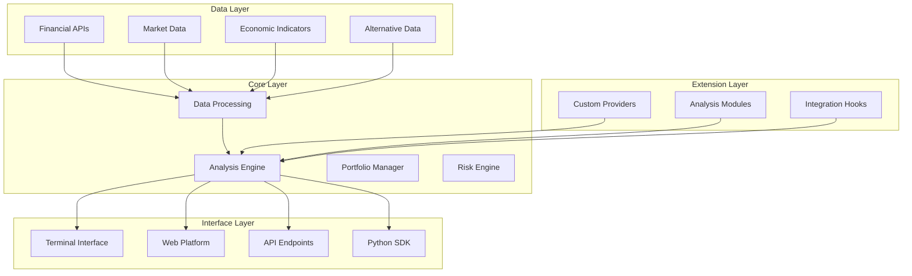

# OpenBB Tutorial: Complete Guide to Investment Research Platform

> Democratize investment research with OpenBB's comprehensive financial data and analysis platform.

<div align="center">
  
</div>

---

## 🎯 What is OpenBB?

**OpenBB** is an open-source investment research platform that provides access to financial data, analytics, and research tools. Originally forked from Gamma Technologies' Gamestonk Terminal, OpenBB has evolved into a comprehensive platform for investment research, data analysis, and portfolio management.

### Key Features
- 📊 **Financial Data Access** - 100+ data sources and APIs
- 📈 **Technical Analysis** - Advanced charting and indicators
- 🤖 **Quantitative Analysis** - Statistical modeling and backtesting
- 📰 **News & Research** - Real-time news and research aggregation
- 💼 **Portfolio Management** - Position tracking and risk analysis
- 🔧 **Extensible Architecture** - Custom extensions and integrations
- 🌐 **Web Interface** - User-friendly web-based platform

## 🏗️ Architecture Overview



## 📋 Tutorial Chapters

| Chapter | Topic | Time | Difficulty |
|:--------|:------|:-----|:-----------|
| **[01-getting-started](01-getting-started.md)** | Installation & Setup | 20 min | 🟢 Beginner |
| **[02-data-access](02-data-access.md)** | Financial Data Sources | 35 min | 🟢 Beginner |
| **[03-technical-analysis](03-technical-analysis.md)** | Charts & Technical Indicators | 45 min | 🟡 Intermediate |
| **[04-quantitative-analysis](04-quantitative-analysis.md)** | Statistical Analysis & Modeling | 50 min | 🟡 Intermediate |
| **[05-portfolio-management](05-portfolio-management.md)** | Portfolio Tracking & Optimization | 40 min | 🟡 Intermediate |
| **[06-research-automation](06-research-automation.md)** | Automated Research Workflows | 55 min | 🔴 Expert |
| **[07-custom-extensions](07-custom-extensions.md)** | Building Custom Extensions | 45 min | 🔴 Expert |
| **[08-enterprise-deployment](08-enterprise-deployment.md)** | Enterprise Setup & Scaling | 50 min | 🔴 Expert |

## 🎯 Learning Outcomes

By the end of this tutorial, you'll be able to:

- ✅ Install and configure OpenBB Platform
- ✅ Access financial data from multiple sources
- ✅ Perform technical analysis and charting
- ✅ Build quantitative models and backtests
- ✅ Manage investment portfolios
- ✅ Create automated research workflows
- ✅ Develop custom extensions and integrations
- ✅ Deploy OpenBB in enterprise environments

## 🛠️ Prerequisites

### System Requirements
- **CPU**: 2+ cores recommended
- **RAM**: 4GB+ recommended
- **Storage**: 10GB+ for data and models
- **OS**: Linux, macOS, or Windows

### Software Prerequisites
- Python 3.8+
- pip package manager
- Git
- Optional: Docker for containerized deployment

### Knowledge Prerequisites
- Basic Python programming
- Understanding of financial markets
- Familiarity with data analysis concepts

## 🚀 Quick Start

### pip Installation

```bash
# Install OpenBB Platform
pip install openbb

# Launch the platform
openbb

# Access web interface
openbb --web
```

### Docker Installation

```bash
# Pull and run OpenBB container
docker run -p 8501:8501 ghcr.io/openbb-finance/openbb:latest

# Or use Docker Compose
curl https://raw.githubusercontent.com/OpenBB-finance/OpenBB/main/docker-compose.yml -o docker-compose.yml
docker-compose up
```

## 🎨 What Makes This Tutorial Special?

### 🏆 **Comprehensive Coverage**
- From basic installation to enterprise deployment
- Real-world investment research workflows
- Production-ready configurations

### 📊 **Practical Focus**
- Hands-on financial data analysis
- Portfolio management techniques
- Custom extension development

### 🔧 **Enterprise Ready**
- Scalable deployment patterns
- Security and compliance considerations
- Integration with existing systems

### 📈 **Market Analysis**
- Technical analysis techniques
- Quantitative modeling approaches
- Risk management strategies

## 💡 Use Cases

### Investment Research
- Stock analysis and screening
- Market trend identification
- Economic indicator monitoring
- Competitor analysis

### Portfolio Management
- Position tracking and monitoring
- Risk assessment and management
- Performance attribution analysis
- Rebalancing optimization

### Quantitative Trading
- Strategy development and backtesting
- Risk modeling and stress testing
- Performance analytics
- Automated trading signals

### Financial Reporting
- Custom report generation
- Data visualization and dashboards
- Client presentation materials
- Regulatory compliance reporting

## 🤝 Contributing

Found an issue or want to improve this tutorial? Contributions are welcome!

1. Fork this repository
2. Create a feature branch
3. Make your changes
4. Submit a pull request

## 📚 Additional Resources

- [Official Documentation](https://docs.openbb.co/)
- [GitHub Repository](https://github.com/OpenBB-finance/OpenBB)
- [Community Discord](https://discord.gg/openbb)
- [API Reference](https://docs.openbb.co/platform/reference)
- [Extension Marketplace](https://extensions.openbb.co/)

## 🙏 Acknowledgments

Special thanks to the OpenBB development team and the open-source community for creating this powerful investment research platform!

---

**Ready to democratize investment research?** Let's dive into [Chapter 1: Getting Started](01-getting-started.md)! 🚀

*Generated by [AI Codebase Knowledge Builder](https://github.com/johnxie/awesome-code-docs)*
