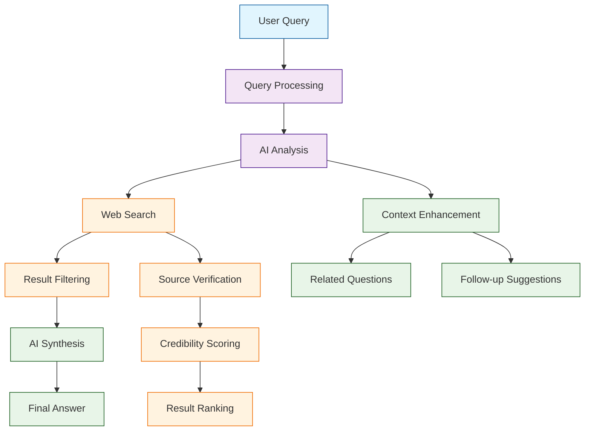

# Perplexica Tutorial: AI-Powered Search Engine

> This tutorial is AI-generated! To learn more, check out [Awesome Code Docs](https://github.com/johnxie/awesome-code-docs)

Perplexica[View Repo](https://github.com/ItzCrazyKns/Perplexica) is an AI-powered search engine and open-source alternative to Perplexity AI. It provides intelligent search capabilities with natural language processing, web scraping, and AI-driven result analysis.

Perplexica combines the power of large language models with web search capabilities to provide comprehensive, contextual answers to complex queries, making it an excellent tool for research and information discovery.

## Tutorial Chapters

Welcome to your journey through AI-powered search technology! This tutorial explores building intelligent search engines with Perplexica.

1. **[Chapter 1: Getting Started with Perplexica](01-getting-started.md)** - Installation, setup, and your first search queries
2. **[Chapter 2: Search Engine Architecture](02-search-architecture.md)** - Understanding the core search components
3. **[Chapter 3: AI Integration](03-ai-integration.md)** - Connecting LLMs and AI models
4. **[Chapter 4: Web Scraping and Data Collection](04-web-scraping.md)** - Gathering and processing web data
5. **[Chapter 5: Result Processing and Ranking](05-result-processing.md)** - Filtering and ranking search results
6. **[Chapter 6: User Interface Development](06-user-interface.md)** - Building the search interface
7. **[Chapter 7: Advanced Features](07-advanced-features.md)** - Conversation history, personalization, and analytics
8. **[Chapter 8: Production Deployment](08-production-deployment.md)** - Scaling and deploying your search engine

## What You'll Learn

By the end of this tutorial, you'll be able to:

- **Build AI Search Engines** - Create intelligent search systems with NLP capabilities
- **Integrate LLMs** - Connect and utilize large language models for query understanding
- **Implement Web Scraping** - Collect and process data from web sources
- **Process Search Results** - Filter, rank, and synthesize search results
- **Create User Interfaces** - Build intuitive search interfaces with modern UX
- **Handle Complex Queries** - Process multi-part questions and follow-up queries
- **Scale Search Systems** - Deploy and manage production search infrastructure
- **Ensure Quality** - Implement credibility scoring and result verification

## Prerequisites

- Python 3.8+
- Node.js 16+
- Basic understanding of web development
- Familiarity with AI/ML concepts (helpful but not required)

## Learning Path

### 🟢 Beginner Track
Perfect for developers new to search engine development:
1. Chapters 1-2: Setup and basic search architecture
2. Focus on understanding search engine fundamentals

### 🟡 Intermediate Track
For developers building AI-powered applications:
1. Chapters 3-5: AI integration, web scraping, and result processing
2. Learn to build sophisticated search systems

### 🔴 Advanced Track
For production search engine development:
1. Chapters 6-8: UI development, advanced features, and deployment
2. Master enterprise-grade search solutions

---

**Ready to build an AI search engine? Let's begin with [Chapter 1: Getting Started](01-getting-started.md)!**

*Generated by [AI Codebase Knowledge Builder](https://github.com/The-Pocket/Tutorial-Codebase-Knowledge)*
