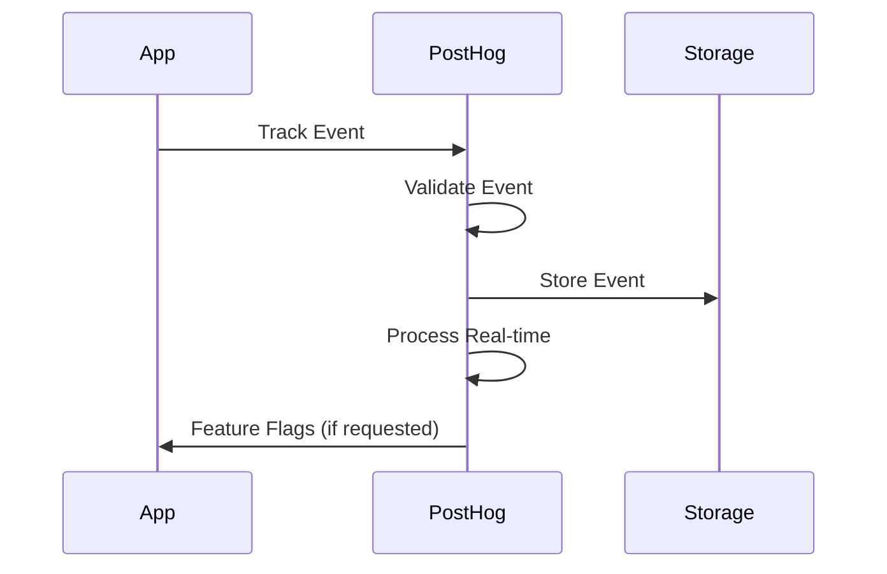

# Chapter 1: Getting Started with PostHog

Welcome to PostHog! If you've ever wanted to understand how users interact with your product, track conversions, and make data-driven decisions without compromising privacy, you're in the right place. PostHog provides a comprehensive analytics platform that puts you in control of your data.

## What Makes PostHog Special?

PostHog revolutionizes product analytics by:
- **Privacy-First Design** - No third-party tracking, full data ownership
- **Comprehensive Analytics** - Events, funnels, cohorts, sessions, and more
- **Real-Time Insights** - Live data processing and instant updates
- **Developer-Friendly** - Easy integration with modern web frameworks
- **Self-Hosted Option** - Full control over your data infrastructure
- **Open-Source** - Transparent, customizable, and community-driven

## Installation Options

### Option 1: PostHog Cloud (Recommended for Beginners)

1. **Sign Up**: Visit [posthog.com](https://posthog.com) and create an account
2. **Create Project**: Set up your first project
3. **Get API Key**: Copy your project API key from settings
4. **Choose Region**: Select the closest data center

### Option 2: Self-Hosted with Docker

```bash
# Clone and deploy PostHog
git clone https://github.com/PostHog/posthog
cd posthog
docker-compose up -d

# Access at http://localhost:8000
# Default credentials: admin/admin
```

### Option 3: Kubernetes Deployment

```bash
# Add PostHog Helm repository
helm repo add posthog https://posthog.github.io/charts/
helm repo update

# Install PostHog
helm install posthog posthog/posthog
```

## Your First Analytics Implementation

Let's add PostHog to your web application:

### Step 1: Install PostHog SDK

```bash
# For JavaScript/React applications
npm install posthog-js

# For Python backend
pip install posthog-python

# For other platforms
# Visit: https://posthog.com/docs/libraries
```

### Step 2: Initialize PostHog

```javascript
// In your main application file
import posthog from 'posthog-js'

// Initialize PostHog
posthog.init('your-project-api-key', {
    api_host: 'https://app.posthog.com', // or your self-hosted URL
    // Optional: Enable session recordings
    disable_session_recording: false,
    // Optional: Enable feature flags
    enable_recording_console_log: true
})
```

### Step 3: Track Your First Event

```javascript
// Track a simple event
posthog.capture('user_signed_up', {
    method: 'email',
    plan: 'free'
})

// Track page views
posthog.capture('$pageview', {
    $current_url: window.location.href
})

// Track button clicks
function handleButtonClick() {
    posthog.capture('button_clicked', {
        button_name: 'upgrade_plan',
        button_location: 'header'
    })
    // Your button logic here
}
```

### Step 4: Identify Users

```javascript
// Identify users
posthog.identify('user_123', {
    email: 'user@example.com',
    name: 'John Doe',
    plan: 'premium',
    signup_date: '2023-12-01'
})

// Set user properties
posthog.people.set({
    $set: {
        last_login: new Date().toISOString(),
        favorite_feature: 'analytics'
    }
})
```

### Step 5: Create Your First Dashboard

1. **Access PostHog Dashboard**: Go to your PostHog instance
2. **Navigate to Insights**: Click on "Insights" in the sidebar
3. **Create New Insight**:
   - Choose "Trends" for event analysis
   - Select your custom events
   - Set time range and filters
   - Save the insight

## Understanding PostHog Architecture

### Core Components

```
PostHog Platform
├── Event Ingestion
│   ├── HTTP API (port 8000)
│   ├── Real-time Processing
│   └── Data Validation
├── Analytics Engine
│   ├── Event Storage (ClickHouse)
│   ├── Query Processing
│   └── Real-time Aggregation
├── User Interface
│   ├── Dashboard
│   ├── Insights Builder
│   └── Session Recordings
├── Feature Management
│   ├── Feature Flags
│   ├── A/B Testing
│   └── Rollout Management
└── Integrations
    ├── Webhooks
    ├── API Access
    └── Third-party Tools
```

### Data Flow



### Event Structure

```javascript
// Standard PostHog event format
{
    "event": "user_action",
    "properties": {
        "distinct_id": "user_123",
        "timestamp": "2023-12-01T10:00:00Z",
        "$browser": "Chrome",
        "$os": "macOS",
        "custom_property": "value"
    }
}
```

## Key Concepts

### 1. Events

Events are the core of PostHog analytics:
- **Page Views**: `$pageview` events track user navigation
- **Custom Events**: Business-specific actions you define
- **Autocapture**: Automatic event tracking (optional)

### 2. Properties

Properties provide context for events:
- **Event Properties**: Data specific to the event
- **User Properties**: Information about the user
- **System Properties**: Browser, OS, device information

### 3. Distinct IDs

Unique identifiers for users:
- **Anonymous IDs**: Temporary IDs for unidentified users
- **Identified IDs**: Permanent IDs after user authentication
- **Alias**: Link anonymous and identified IDs

## Advanced Setup

### Environment Configuration

```javascript
// Development
posthog.init('dev-api-key', {
    api_host: 'http://localhost:8000',
    debug: true
})

// Production
posthog.init('prod-api-key', {
    api_host: 'https://app.posthog.com',
    persistence: 'localStorage+cookie',
    loaded: (posthog) => {
        // PostHog loaded callback
        console.log('PostHog loaded!')
    }
})
```

### Privacy & Compliance

```javascript
// GDPR compliance
posthog.init('your-api-key', {
    // Disable autocapture
    autocapture: false,
    // Respect Do Not Track
    respect_dnt: true,
    // Custom property filtering
    property_blacklist: ['sensitive_data'],
    // IP anonymization
    ip: false
})
```

### Error Handling

```javascript
// Handle initialization errors
try {
    posthog.init('your-api-key', {
        api_host: 'https://app.posthog.com'
    })
} catch (error) {
    console.error('PostHog initialization failed:', error)
    // Fallback: disable analytics
    window.posthog = { capture: () => {} }
}
```

## Testing Your Implementation

### Basic Event Testing

```javascript
// Test event tracking
posthog.capture('test_event', {
    test_property: 'test_value',
    timestamp: new Date().toISOString()
})

// Check in PostHog dashboard
// 1. Go to "Live Events"
// 2. Look for your test event
// 3. Verify properties are captured correctly
```

### User Identification Testing

```javascript
// Test user identification
posthog.identify('test_user_123', {
    email: 'test@example.com',
    test_account: true
})

// Check user properties
// 1. Go to "Persons" in dashboard
// 2. Find your test user
// 3. Verify properties are set
```

## Integration Examples

### React Application

```jsx
import { useEffect } from 'react'
import posthog from 'posthog-js'

function App() {
    useEffect(() => {
        // Track page view
        posthog.capture('$pageview')
    }, [])

    const handleSignup = () => {
        posthog.capture('user_signed_up', {
            method: 'google_oauth'
        })
    }

    return (
        <div>
            <button onClick={handleSignup}>
                Sign up with Google
            </button>
        </div>
    )
}
```

### Next.js Application

```jsx
// pages/_app.js
import { useRouter } from 'next/router'
import { useEffect } from 'react'
import posthog from 'posthog-js'

function MyApp({ Component, pageProps }) {
    const router = useRouter()

    useEffect(() => {
        // Initialize PostHog
        posthog.init(process.env.NEXT_PUBLIC_POSTHOG_KEY, {
            api_host: process.env.NEXT_PUBLIC_POSTHOG_HOST
        })

        // Track page views
        const handleRouteChange = () => posthog.capture('$pageview')
        router.events.on('routeChangeComplete', handleRouteChange)

        return () => {
            router.events.off('routeChangeComplete', handleRouteChange)
        }
    }, [])

    return <Component {...pageProps} />
}
```

## What We've Accomplished

Congratulations! 🎉 You've successfully:

1. **Set up PostHog** using cloud or self-hosted deployment
2. **Integrated PostHog SDK** into your web application
3. **Implemented event tracking** with custom properties
4. **Set up user identification** and property management
5. **Created your first analytics dashboard** and insights
6. **Understood PostHog's architecture** and data flow
7. **Configured privacy settings** and compliance features
8. **Tested your implementation** with real events and users

## Next Steps

Now that you have PostHog collecting data, let's explore event tracking patterns and best practices. In [Chapter 2: Event Tracking & Properties](02-event-tracking.md), we'll dive into implementing comprehensive event tracking strategies and property management.

---

**Practice what you've learned:**
1. Track different types of user interactions in your app
2. Set up user identification for authenticated users
3. Create custom events for your specific business metrics
4. Explore the PostHog dashboard and available insights

*What user behavior are you most curious about tracking in your application?* 📊
