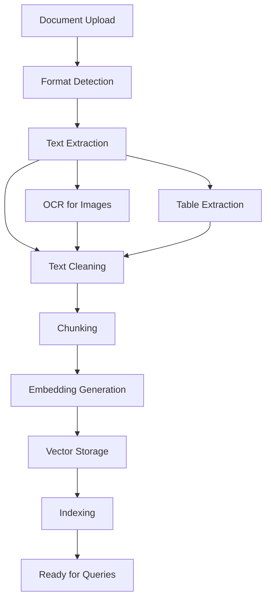

# Chapter 1: Getting Started with Quivr

Welcome to Quivr! If you've ever wanted to build AI systems that can intelligently answer questions about your documents, you're in the right place. Quivr makes it easy to upload documents, process them with advanced AI models, and create conversational interfaces that provide accurate, context-aware responses.

## What Makes Quivr Special?

Quivr revolutionizes document-based AI by:
- **Universal Document Support** - Works with PDFs, text files, images, and more
- **Intelligent Processing** - Advanced text extraction and preprocessing
- **Vector Search** - Semantic similarity search across documents
- **Contextual Responses** - Generates answers based on document content
- **User-Friendly Interface** - Clean web interface for easy document management
- **Extensible Architecture** - Customizable processing pipelines

## Installation Options

### Docker Installation (Recommended)

```bash
# Clone the repository
git clone https://github.com/QuivrHQ/quivr.git
cd quivr

# Start with Docker Compose
docker-compose up -d

# Access the web interface at http://localhost:3000
```

### Local Development Setup

```bash
# Clone the repository
git clone https://github.com/QuivrHQ/quivr.git
cd quivr

# Install Python dependencies
pip install -r requirements.txt

# Install Node.js dependencies for frontend
cd frontend
npm install
npm run build
cd ..

# Set up environment variables
cp .env.example .env
# Edit .env with your API keys and configuration

# Start the backend
python -m uvicorn main:app --host 0.0.0.0 --port 8000

# Start the frontend
cd frontend
npm run dev
```

### Quick Start with Pre-built Image

```bash
# Run the latest version
docker run -p 3000:3000 quivrhq/quivr:latest

# Or with custom configuration
docker run -p 3000:3000 \
  -e OPENAI_API_KEY=your-key \
  -e SUPABASE_URL=your-url \
  -e SUPABASE_ANON_KEY=your-key \
  quivrhq/quivr:latest
```

## Your First Document Upload

Let's upload your first document and see Quivr in action:

### Step 1: Access Quivr Interface

```bash
# After installation, access the web interface
open http://localhost:3000

# Or if using Docker
open http://localhost:3000
```

### Step 2: Create Your First Knowledge Base

```python
# Using Quivr's Python SDK
from quivr import QuivrClient

# Initialize client
client = QuivrClient(
    api_key="your-api-key",
    base_url="http://localhost:8000"
)

# Create a knowledge base
kb = client.create_knowledge_base(
    name="My First Knowledge Base",
    description="A collection of documents for testing"
)

print(f"✅ Knowledge base created: {kb.id}")
```

### Step 3: Upload Documents

```python
# Upload a text document
with open("sample-document.txt", "r") as f:
    content = f.read()

document = client.upload_document(
    knowledge_base_id=kb.id,
    content=content,
    filename="sample-document.txt",
    file_type="text/plain"
)

print(f"📄 Document uploaded: {document.id}")
```

### Step 4: Ask Your First Question

```python
# Ask a question about your document
response = client.ask_question(
    knowledge_base_id=kb.id,
    question="What is the main topic of this document?",
    stream=False  # Set to True for streaming responses
)

print("🤖 Answer:", response.answer)
print("📚 Sources:", [source.filename for source in response.sources])
```

## Understanding Quivr Architecture

### Core Components

```
Quivr System
├── Frontend (React/Next.js) - User interface and interactions
├── Backend (FastAPI/Python) - API endpoints and processing
├── Vector Database - Document embeddings and similarity search
├── LLM Integration - Language model processing and generation
├── Document Processor - Text extraction and preprocessing
└── Knowledge Base Manager - Document organization and management
```

### Document Processing Pipeline



### Supported Document Types

```python
# Quivr supports various document formats
supported_formats = {
    "text": [".txt", ".md", ".rst"],
    "documents": [".pdf", ".docx", ".pptx"],
    "spreadsheets": [".xlsx", ".csv"],
    "images": [".png", ".jpg", ".jpeg"],
    "code": [".py", ".js", ".ts", ".java", ".cpp"],
    "web": [".html", ".xml"],
    "archives": [".zip", ".tar.gz"]
}
```

## Working with Different Document Types

### Text Documents

```python
# Upload a text file
text_doc = client.upload_file(
    knowledge_base_id=kb.id,
    file_path="article.txt",
    metadata={
        "author": "John Doe",
        "category": "Technology",
        "tags": ["AI", "Machine Learning"]
    }
)
```

### PDF Documents

```python
# Upload a PDF with advanced options
pdf_doc = client.upload_file(
    knowledge_base_id=kb.id,
    file_path="research-paper.pdf",
    chunk_size=1000,  # Characters per chunk
    chunk_overlap=200,  # Overlap between chunks
    preprocessing={
        "extract_tables": True,
        "extract_images": False,
        "remove_headers": True
    }
)
```

### Web Content

```python
# Upload from URL
web_doc = client.upload_from_url(
    knowledge_base_id=kb.id,
    url="https://example.com/article",
    metadata={
        "source": "Web",
        "crawl_depth": 1
    }
)
```

## Basic Query Operations

### Simple Question Answering

```python
# Basic question
response = client.ask(
    knowledge_base_id=kb.id,
    question="What are the key benefits of this technology?"
)

print(f"Answer: {response.answer}")
print(f"Confidence: {response.confidence}")
```

### Advanced Queries

```python
# Query with filters
response = client.ask(
    knowledge_base_id=kb.id,
    question="Explain the algorithm",
    filters={
        "document_type": "research_paper",
        "author": "Smith",
        "date_range": ["2023-01-01", "2024-01-01"]
    },
    top_k=5  # Return top 5 most relevant results
)
```

### Conversational Queries

```python
# Start a conversation
conversation = client.create_conversation(kb.id)

# Ask follow-up questions
response1 = conversation.ask("What is the main topic?")
response2 = conversation.ask("Can you elaborate on the methodology?")
response3 = conversation.ask("What are the limitations?")

# Get conversation history
history = conversation.get_history()
```

## Configuration and Customization

### Basic Configuration

```python
# Configure Quivr client
client = QuivrClient(
    api_key="your-api-key",
    base_url="http://localhost:8000",
    timeout=30,
    retries=3
)
```

### Environment Configuration

```bash
# .env file
QUIVR_API_KEY=your-api-key
QUIVR_BASE_URL=http://localhost:8000
OPENAI_API_KEY=your-openai-key
SUPABASE_URL=your-supabase-url
SUPABASE_ANON_KEY=your-supabase-key

# Advanced settings
QUIVR_CHUNK_SIZE=1000
QUIVR_CHUNK_OVERLAP=200
QUIVR_EMBEDDING_MODEL=text-embedding-ada-002
QUIVR_LLM_MODEL=gpt-4
```

### Model Configuration

```python
# Configure different models
client.configure_models({
    "embedding": {
        "provider": "openai",
        "model": "text-embedding-3-small",
        "dimensions": 1536
    },
    "llm": {
        "provider": "openai",
        "model": "gpt-4-turbo-preview",
        "temperature": 0.3,
        "max_tokens": 1000
    }
})
```

## Monitoring and Analytics

### Basic Monitoring

```python
# Get knowledge base statistics
stats = client.get_knowledge_base_stats(kb.id)

print(f"Documents: {stats.document_count}")
print(f"Total chunks: {stats.total_chunks}")
print(f"Storage used: {stats.storage_mb} MB")
```

### Query Analytics

```python
# Get query history and performance
analytics = client.get_query_analytics(kb.id)

for query in analytics.recent_queries:
    print(f"Query: {query.question}")
    print(f"Response time: {query.response_time}s")
    print(f"Relevance score: {query.relevance_score}")
    print("---")
```

### Performance Monitoring

```python
# Monitor system health
health = client.get_system_health()

print(f"Status: {health.status}")
print(f"Response time: {health.avg_response_time}ms")
print(f"Error rate: {health.error_rate}%")
print(f"Active connections: {health.active_connections}")
```

## What We've Accomplished

Congratulations! 🎉 You've successfully:

1. **Installed Quivr** and set up your development environment
2. **Created your first knowledge base** and uploaded documents
3. **Experienced intelligent question answering** based on document content
4. **Understood Quivr's architecture** and processing pipeline
5. **Worked with different document types** and formats
6. **Configured the system** for optimal performance
7. **Set up monitoring** for system health and performance

## Next Steps

Now that you have Quivr running and have uploaded your first documents, let's explore the document processing capabilities in more detail. In [Chapter 2: Document Processing](02-document-processing.md), we'll dive into advanced text extraction, preprocessing, and optimization techniques.

---

**Practice what you've learned:**
1. Upload documents of different formats (PDF, text, images)
2. Try asking various types of questions about your documents
3. Experiment with different query filters and parameters
4. Monitor the performance and accuracy of responses

*What's the most interesting document-based question you could ask an AI system?* 📄
