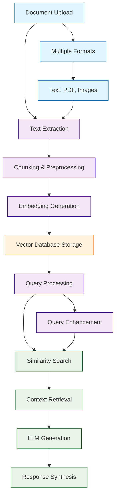

# Quivr Tutorial: Open-Source RAG Framework for Document Ingestion

> This tutorial is AI-generated! To learn more, check out [Awesome Code Docs](https://github.com/johnxie/awesome-code-docs)

Quivr[View Repo](https://github.com/QuivrHQ/quivr) is an open-source RAG (Retrieval-Augmented Generation) framework designed for seamless document ingestion and intelligent question answering. It provides a user-friendly interface for uploading documents, processing them with advanced AI models, and generating accurate responses based on the document content.

Quivr combines the power of vector databases, large language models, and modern web technologies to create a comprehensive platform for document-based AI interactions.

## Tutorial Chapters

Welcome to your journey through document-based AI interactions! This tutorial explores how to build intelligent RAG applications with Quivr.

1. **[Chapter 1: Getting Started with Quivr](01-getting-started.md)** - Installation, setup, and first document upload
2. **[Chapter 2: Document Processing](02-document-processing.md)** - Text extraction and preprocessing pipelines
3. **[Chapter 3: Vector Embeddings](03-vector-embeddings.md)** - Creating and managing embeddings for documents
4. **[Chapter 4: Query Processing](04-query-processing.md)** - Advanced query understanding and enhancement
5. **[Chapter 5: Knowledge Bases](05-knowledge-bases.md)** - Building and managing document collections
6. **[Chapter 6: Integration APIs](06-integration-apis.md)** - Connecting Quivr with external applications
7. **[Chapter 7: Customization](07-customization.md)** - Extending Quivr with custom components
8. **[Chapter 8: Production Deployment](08-production-deployment.md)** - Scaling Quivr for enterprise use

## What You'll Learn

By the end of this tutorial, you'll be able to:

- **Set up Quivr** for document processing and question answering
- **Process various document formats** including PDF, text, and images
- **Implement vector embeddings** for semantic document search
- **Build knowledge bases** with organized document collections
- **Create intelligent query systems** with context-aware responses
- **Integrate Quivr APIs** with existing applications
- **Customize processing pipelines** for specific use cases
- **Deploy Quivr at scale** with proper monitoring and optimization

## Prerequisites

- Python 3.8+
- Basic understanding of AI/ML concepts
- Familiarity with REST APIs (helpful but not required)
- Understanding of vector databases (helpful but not required)

## Learning Path

### 🟢 Beginner Track
Perfect for developers new to RAG and document AI:
1. Chapters 1-2: Setup and basic document processing
2. Focus on understanding Quivr fundamentals

### 🟡 Intermediate Track
For developers building document-based applications:
1. Chapters 3-5: Embeddings, queries, and knowledge bases
2. Learn to build sophisticated document AI systems

### 🔴 Advanced Track
For production document AI deployment:
1. Chapters 6-8: APIs, customization, and scaling
2. Master enterprise-grade document processing

---

**Ready to build intelligent document-based AI applications? Let's begin with [Chapter 1: Getting Started](01-getting-started.md)!**

*Generated by [AI Codebase Knowledge Builder](https://github.com/johnxie/awesome-code-docs)*
