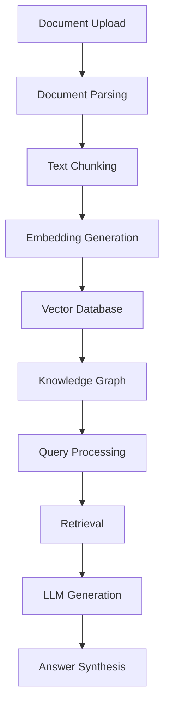

# RAGFlow Tutorial: Complete Guide to Open-Source RAG Engine

> Transform documents into intelligent Q&A systems with RAGFlow's comprehensive RAG (Retrieval-Augmented Generation) platform.

<div align="center">
  
</div>

---

## 🎯 What is RAGFlow?

**RAGFlow** is an open-source RAG (Retrieval-Augmented Generation) engine designed for document-based question answering systems. It combines advanced document parsing, vector search, and large language models to create intelligent conversational interfaces that can answer questions based on your documents.

### Key Features
- 🔍 **Advanced Document Parsing** - Supports 100+ file formats
- 🧠 **Intelligent Chunking** - Automatic text segmentation and optimization
- 🔗 **Graph-Based Retrieval** - Knowledge graph enhanced search
- 🤖 **Multi-Model Support** - Integration with various LLMs
- 📊 **Visual Knowledge Management** - Graph visualization of knowledge
- 🚀 **High Performance** - Optimized for production deployment
- 🌐 **Web Interface** - User-friendly management console

## 🏗️ Architecture Overview



## 📋 Tutorial Chapters

| Chapter | Topic | Time | Difficulty |
|:--------|:------|:-----|:-----------|
| **[01-getting-started](01-getting-started.md)** | Installation & Setup | 30 min | 🟢 Beginner |
| **[02-document-processing](02-document-processing.md)** | Document Upload & Parsing | 45 min | 🟢 Beginner |
| **[03-knowledge-base-setup](03-knowledge-base-setup.md)** | Knowledge Base Configuration | 40 min | 🟡 Intermediate |
| **[04-retrieval-system](04-retrieval-system.md)** | Advanced Retrieval Techniques | 50 min | 🟡 Intermediate |
| **[05-llm-integration](05-llm-integration.md)** | LLM Integration & Configuration | 35 min | 🟡 Intermediate |
| **[06-chatbot-development](06-chatbot-development.md)** | Building Conversational Interfaces | 60 min | 🔴 Expert |
| **[07-advanced-features](07-advanced-features.md)** | Advanced Features & Customization | 45 min | 🔴 Expert |
| **[08-production-deployment](08-production-deployment.md)** | Production Deployment & Scaling | 50 min | 🔴 Expert |

## 🎯 Learning Outcomes

By the end of this tutorial, you'll be able to:

- ✅ Deploy RAGFlow in various environments (Docker, Kubernetes, cloud)
- ✅ Process and index documents from multiple formats
- ✅ Configure knowledge bases with optimal chunking strategies
- ✅ Implement advanced retrieval techniques (hybrid search, reranking)
- ✅ Integrate with popular LLMs (OpenAI, Anthropic, local models)
- ✅ Build custom chatbots and conversational interfaces
- ✅ Optimize performance for production workloads
- ✅ Monitor and maintain RAG systems

## 🛠️ Prerequisites

### System Requirements
- **CPU**: 4+ cores recommended
- **RAM**: 8GB+ recommended
- **Storage**: 50GB+ for document storage
- **OS**: Linux, macOS, or Windows (WSL)

### Software Prerequisites
- Docker & Docker Compose
- Python 3.8+
- Node.js 16+ (for frontend development)
- Git

### Knowledge Prerequisites
- Basic understanding of RAG concepts
- Familiarity with vector databases
- Basic knowledge of LLMs and embeddings

## 🚀 Quick Start

### Docker Deployment (Recommended)

```bash
# Clone the repository
git clone https://github.com/infiniflow/ragflow.git
cd ragflow

# Start with Docker Compose
docker-compose -f docker-compose.yml up -d

# Access the web interface
open http://localhost:80
```

### Manual Installation

```bash
# Install dependencies
pip install -r requirements.txt

# Start the services
python api/ragflow_server.py &
python web/ragflow_web.py &

# Access at http://localhost:80
```

## 🎨 What Makes This Tutorial Special?

### 🏆 **Production-Ready Focus**
- Real-world deployment scenarios
- Performance optimization techniques
- Monitoring and maintenance strategies

### 🔧 **Hands-On Learning**
- Complete code examples
- Step-by-step implementations
- Troubleshooting guides

### 📈 **Advanced Techniques**
- Graph-based retrieval
- Multi-modal processing
- Custom embedding models
- Hybrid search strategies

### 🌟 **Enterprise Features**
- High availability setup
- Scalability patterns
- Security best practices
- Integration patterns

## 💡 Use Cases

### Document Q&A Systems
- Customer support knowledge bases
- Legal document analysis
- Research paper Q&A
- Technical documentation

### Enterprise Applications
- HR policy assistants
- Compliance documentation
- Product knowledge bases
- Internal wiki systems

### Educational Platforms
- Course material Q&A
- Study guide generation
- Exam preparation assistants

## 🤝 Contributing

Found an issue or want to improve this tutorial? Contributions are welcome!

1. Fork this repository
2. Create a feature branch
3. Make your changes
4. Submit a pull request

## 📚 Additional Resources

- [Official Documentation](https://ragflow.io/docs/)
- [GitHub Repository](https://github.com/infiniflow/ragflow)
- [Community Discord](https://discord.gg/ragflow)
- [API Reference](https://ragflow.io/api/)

## 🙏 Acknowledgments

Special thanks to the RAGFlow development team for creating this amazing open-source RAG platform!

---

**Ready to transform your documents into intelligent conversational systems?** Let's dive into [Chapter 1: Getting Started](01-getting-started.md)! 🚀

*Generated by [AI Codebase Knowledge Builder](https://github.com/johnxie/awesome-code-docs)*
