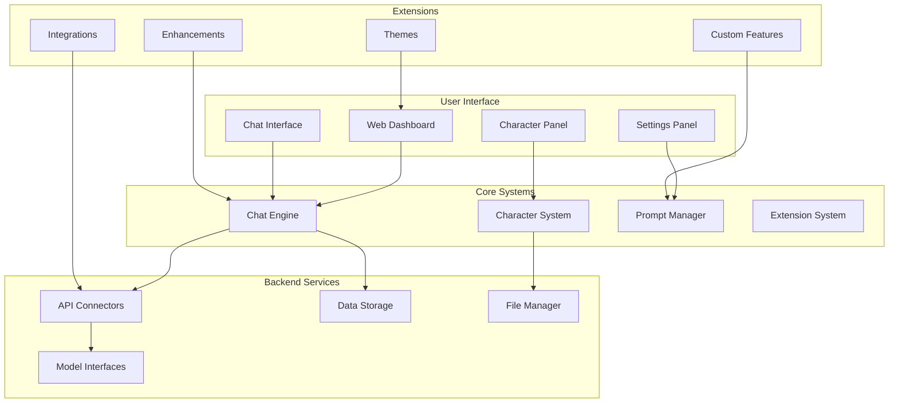

# Chapter 1: Getting Started with SillyTavern

Welcome to SillyTavern! This chapter will guide you through installing and setting up SillyTavern, understanding its interface, and creating your first AI conversation.

## 🎯 What You'll Learn

- SillyTavern installation methods and setup
- Interface overview and navigation
- Basic configuration and settings
- First conversation walkthrough
- Core concepts and terminology

## 🏗️ SillyTavern Architecture

SillyTavern consists of several key components working together to provide a powerful AI chat interface:



### Core Components

1. **Web Interface**: Main user interface accessible through browser
2. **Chat Engine**: Handles conversation flow and message processing
3. **Character System**: Manages character profiles and personalities
4. **Extension System**: Supports community-developed enhancements
5. **API Connectors**: Interfaces with various LLM providers

## 🚀 Installation Methods

### Method 1: Browser-Based Installation (Recommended)

```bash
# Clone the repository
git clone https://github.com/SillyTavern/SillyTavern.git
cd SillyTavern

# Install dependencies
npm install

# Start the server
npm run start

# Access at http://localhost:8000
```

**What this installs:**
- Node.js web server
- Local file storage
- Browser-based interface
- Extension support

### Method 2: Desktop Application

```bash
# Download from releases page
# https://github.com/SillyTavern/SillyTavern/releases

# For Windows: Download SillyTavern-*.exe
# For macOS: Download SillyTavern-*.dmg
# For Linux: Download SillyTavern-*.AppImage

# Run the installer
# Application will start automatically
```

**Desktop app features:**
- Standalone application
- No browser required
- System tray support
- Automatic updates

### Method 3: Docker Installation

```bash
# Pull the Docker image
docker pull ghcr.io/sillytavern/sillytavern:latest

# Run the container
docker run -d \
  --name sillytavern \
  -p 8000:8000 \
  -v $(pwd)/data:/app/data \
  ghcr.io/sillytavern/sillytavern:latest

# Access at http://localhost:8000
```

**Docker benefits:**
- Isolated environment
- Easy updates
- Cross-platform compatibility
- Volume persistence

## ⚙️ Initial Configuration

### First Time Setup

```javascript
// config.yaml - Basic configuration
{
  "port": 8000,
  "host": "localhost",
  "dataPath": "./data",
  "enableExtensions": true,
  "backupEnabled": true,
  "theme": "default",
  "language": "en"
}
```

### API Configuration

```javascript
// API settings for different providers
const apiConfigs = {
  openai: {
    apiKey: "your_openai_key",
    model: "gpt-4",
    temperature: 0.8,
    maxTokens: 2048
  },
  koboldai: {
    endpoint: "http://localhost:5000",
    model: "koboldai-model",
    settings: {
      temperature: 0.7,
      topP: 0.9,
      repetitionPenalty: 1.1
    }
  },
  claude: {
    apiKey: "your_anthropic_key",
    model: "claude-3-opus-20240229",
    maxTokens: 4096
  }
}
```

## 🌐 Interface Overview

### Main Dashboard

```
┌─────────────────────────────────────────┐
│ SillyTavern v1.x.x                     │
├─────────────────────────────────────────┤
│ ┌─────────────┐ ┌─────────────────────┐ │
│ │ Characters  │ │ Chat Interface      │ │
│ │             │ │                     │ │
│ │ • Character │ │ [Message Input]     │ │
│ │   Cards     │ │                     │ │
│ │ • Create    │ └─────────────────────┘ │
│ │ • Import    │                         │
│ └─────────────┘ ┌─────────────────────┐ │
│                 │ Settings & Config    │ │
│ ┌─────────────┐ │                     │ │
│ │ Extensions  │ │ • API Settings      │ │
│ │             │ │ • UI Preferences    │ │
│ │ • Themes    │ │ • Backup Options    │ │
│ │ • Integrations│ └─────────────────────┘ │
│ │ • Custom     │                         │
│ └─────────────┘                         │
└─────────────────────────────────────────┘
```

### Navigation Elements

1. **Character Panel**: Character selection and management
2. **Chat Area**: Main conversation interface
3. **Input Field**: Message composition and sending
4. **Settings**: Configuration and preferences
5. **Extensions**: Community features and integrations

## 🏃‍♂️ Your First Conversation

### Step 1: Connect to an AI Model

```bash
# Open SillyTavern in browser
open http://localhost:8000

# Navigate to Settings > API
# Configure your preferred AI provider:

# For OpenAI:
API Type: OpenAI
API Key: your_openai_api_key
Model: gpt-4

# For Local Models (KoboldAI):
API Type: KoboldAI
API Endpoint: http://localhost:5000
```

### Step 2: Create Your First Character

```javascript
// Character creation data
const firstCharacter = {
  name: "Assistant",
  description: "A helpful AI assistant",
  personality: "You are a helpful and friendly AI assistant. You provide clear, accurate, and concise responses.",
  scenario: "You are chatting with a user who wants help with various tasks.",
  firstMessage: "Hello! I'm here to help you with anything you need. What would you like to talk about?"
}
```

**Character Creation Steps:**
1. Click "Create Character" in the character panel
2. Fill in the name and description
3. Add personality and scenario details
4. Set the first message
5. Save the character

### Step 3: Start Chatting

```bash
# In the chat interface:
# 1. Select your character
# 2. Type your message in the input field
# 3. Press Enter or click Send
# 4. Wait for AI response
# 5. Continue the conversation

# Example conversation:
User: Hello! Can you help me learn about programming?
Assistant: Of course! I'd be happy to help you learn about programming. What specific programming language or concept are you interested in?

User: I'm interested in Python. Can you explain what it is?
Assistant: Python is a high-level, interpreted programming language known for its simplicity and readability. It's widely used for web development, data analysis, artificial intelligence, and more...
```

## 🔧 Basic Settings Configuration

### Interface Settings

```javascript
// UI preferences
const uiSettings = {
  theme: "dark", // light, dark, custom
  fontSize: "medium", // small, medium, large
  messageDisplay: "bubbles", // bubbles, text-only
  autoScroll: true,
  showTimestamps: false,
  enableSounds: false
}
```

### Chat Settings

```javascript
// Chat configuration
const chatSettings = {
  maxContextLength: 4096,
  autoSave: true,
  saveFrequency: 30, // seconds
  enableBackup: true,
  backupInterval: 3600, // seconds
  messageHistory: 100
}
```

### Model Settings

```javascript
// AI model parameters
const modelSettings = {
  temperature: 0.8, // 0.0 - 2.0
  topP: 0.9, // 0.0 - 1.0
  maxTokens: 2048,
  frequencyPenalty: 0.0,
  presencePenalty: 0.0,
  repetitionPenalty: 1.1
}
```

## 📊 Understanding the Interface

### Character Panel

```
Character Panel
├── Character Cards
│   ├── Avatar Image
│   ├── Name & Description
│   ├── Tags/Categories
│   └── Action Buttons
├── Character Management
│   ├── Create New
│   ├── Import/Export
│   ├── Duplicate
│   └── Delete
└── Character Settings
    ├── Edit Profile
    ├── Personality
    ├── Scenario
    └── Advanced Options
```

### Chat Interface

```
Chat Interface
├── Message History
│   ├── User Messages
│   ├── AI Responses
│   ├── System Messages
│   └── Timestamps
├── Message Input
│   ├── Text Input Field
│   ├── Send Button
│   ├── Attachment Options
│   └── Quick Commands
└── Chat Controls
    ├── Regenerate
    ├── Edit Message
    ├── Branch Chat
    └── Export Chat
```

## 🔧 Troubleshooting

### Common Issues

#### Connection Problems
```bash
# Check if server is running
curl http://localhost:8000

# Check port availability
netstat -an | grep 8000

# Restart the server
npm run start
```

#### API Key Issues
```javascript
// Verify API key format
const apiKeyPattern = /^sk-[a-zA-Z0-9]{48}$/; // OpenAI format
console.log(apiKeyPattern.test(yourApiKey));

// Test API connection
fetch('/api/test-connection', {
  method: 'POST',
  headers: { 'Content-Type': 'application/json' },
  body: JSON.stringify({ apiKey: yourApiKey })
});
```

#### Performance Issues
```javascript
// Check system resources
const systemInfo = {
  memory: navigator.deviceMemory || 'Unknown',
  cores: navigator.hardwareConcurrency || 'Unknown',
  userAgent: navigator.userAgent
};
console.log(systemInfo);

// Optimize settings
const optimizedSettings = {
  maxContextLength: 2048, // Reduce for better performance
  autoSave: false, // Disable for faster response
  theme: 'light', // Lighter themes may perform better
  disableExtensions: true // Temporarily disable extensions
};
```

### Extension Problems
```bash
# Check extension compatibility
const extensionCheck = {
  version: '1.x.x',
  compatible: true,
  dependencies: ['required-package']
};

// Reinstall extensions
npm install
npm run build
```

## 🎯 Key Concepts

### Characters
- **Profile**: Basic information and appearance
- **Personality**: Behavioral traits and tendencies
- **Scenario**: Context and setting for conversations
- **First Message**: Initial response to start conversations

### Chats
- **Context**: Conversation history maintained by the AI
- **Branches**: Alternative conversation paths
- **Bookmarks**: Important conversation points
- **Tags**: Organization and categorization

### Extensions
- **Themes**: Visual customization
- **Integrations**: External service connections
- **Enhancements**: Additional features
- **Custom Scripts**: User-developed functionality

## 📊 Performance Monitoring

### System Health Check

```javascript
// Monitor application performance
const performanceMonitor = {
  checkHealth: function() {
    return {
      memoryUsage: performance.memory,
      pageLoadTime: performance.timing.loadEventEnd - performance.timing.navigationStart,
      responseTime: this.measureResponseTime(),
      extensionCount: this.countExtensions()
    };
  },

  measureResponseTime: function() {
    const start = performance.now();
    // Simulate API call
    setTimeout(() => {
      const end = performance.now();
      return end - start;
    }, 100);
  },

  countExtensions: function() {
    // Count loaded extensions
    return document.querySelectorAll('[data-extension]').length;
  }
};

// Usage
console.log(performanceMonitor.checkHealth());
```

## 🏆 Achievement Unlocked!

Congratulations! 🎉 You've successfully:

- ✅ Installed SillyTavern using your preferred method
- ✅ Configured API connections to AI models
- ✅ Created your first character profile
- ✅ Started your first AI conversation
- ✅ Explored the main interface components

## 🚀 What's Next?

Ready to create compelling characters? Let's explore [Chapter 2: Character Creation](02-character-creation.md) to learn about building rich character profiles and personalities.

---

**Practice what you've learned:**
1. Experiment with different installation methods
2. Configure connections to various AI providers
3. Create multiple character profiles
4. Test different conversation scenarios
5. Customize the interface to your preferences

*What type of character are you most excited to create?* 🎭
