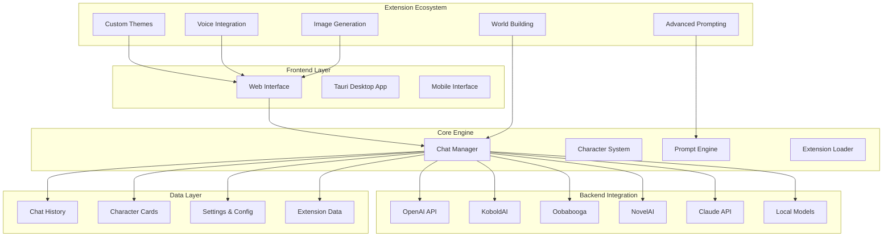

# SillyTavern Tutorial: Advanced LLM Frontend for Power Users

> Unlock the full potential of large language models with SillyTavern's comprehensive interface for role-playing, creative writing, and AI experimentation.

<div align="center">
  
</div>

---

## 🎯 What is SillyTavern?

**SillyTavern** is a user-friendly interface for chatting with AI Large Language Models (LLMs), with advanced features for power users. It supports extensive customization, multiple model backends, and a rich ecosystem of extensions for enhanced functionality.

### Key Features
- 🎭 **Character Creation** - Rich character profiles with personalities and backgrounds
- 🔧 **Advanced Prompting** - Complex prompt engineering and template system
- 🎨 **Visual Novel Interface** - Immersive chat experience with backgrounds and sprites
- 🔌 **Extension Ecosystem** - Wide range of community extensions
- 📊 **Multi-Model Support** - Integration with various LLM providers
- 🎵 **Audio Integration** - Text-to-speech and voice input
- 📝 **Chat Management** - Advanced conversation organization and search
- 🎯 **Role-Playing Focus** - Specialized for creative writing and RP scenarios

## 🏗️ Architecture Overview



## 📋 Tutorial Chapters

| Chapter | Topic | Time | Difficulty |
|:--------|:------|:-----|:-----------|
| **[01-getting-started](01-getting-started.md)** | Installation & Setup | 15 min | 🟢 Beginner |
| **[02-character-creation](02-character-creation.md)** | Character System & Profiles | 25 min | 🟢 Beginner |
| **[03-chat-management](03-chat-management.md)** | Conversation Management | 20 min | 🟡 Intermediate |
| **[04-prompt-engineering](04-prompt-engineering.md)** | Advanced Prompting Techniques | 35 min | 🟡 Intermediate |
| **[05-extensions-ecosystem](05-extensions-ecosystem.md)** | Extensions & Customization | 30 min | 🟡 Intermediate |
| **[06-multi-model-setup](06-multi-model-setup.md)** | Multiple LLM Integration | 40 min | 🔴 Expert |
| **[07-advanced-features](07-advanced-features.md)** | Power User Features | 45 min | 🔴 Expert |
| **[08-custom-development](08-custom-development.md)** | Extension Development | 50 min | 🔴 Expert |

## 🎯 Learning Outcomes

By the end of this tutorial, you'll be able to:

- ✅ Install and configure SillyTavern for optimal performance
- ✅ Create rich, detailed character profiles and personalities
- ✅ Manage complex conversation histories and branching narratives
- ✅ Master advanced prompting techniques and templates
- ✅ Utilize the extension ecosystem for enhanced functionality
- ✅ Integrate multiple LLM providers and switch between models
- ✅ Leverage power user features for creative writing
- ✅ Develop custom extensions and themes
- ✅ Set up collaborative storytelling environments

## 🛠️ Prerequisites

### System Requirements
- **CPU**: 2+ cores recommended
- **RAM**: 4GB+ recommended for local models
- **Storage**: 5GB+ for application and chat data
- **OS**: Windows, macOS, Linux, or browser-based

### Software Prerequisites
- Modern web browser (Chrome, Firefox, Edge)
- Node.js 18+ (for local installation)
- Git (for cloning repositories)
- Optional: Python 3.8+ (for some extensions)

### Knowledge Prerequisites
- Basic understanding of AI language models
- Familiarity with chat interfaces
- Interest in creative writing or role-playing

## 🚀 Quick Start

### Browser Installation (Recommended)

```bash
# Clone the repository
git clone https://github.com/SillyTavern/SillyTavern.git
cd SillyTavern

# Start the server
npm install
npm run start

# Open browser to http://localhost:8000
```

### Desktop App Installation

```bash
# Download from releases
# https://github.com/SillyTavern/SillyTavern/releases

# Or build from source
git clone https://github.com/SillyTavern/SillyTavern.git
cd SillyTavern

# Install dependencies
npm install

# Build desktop app
npm run dist

# Run the built application
```

## 🎨 What Makes This Tutorial Special?

### 🏆 **Power User Focus**
- Advanced features for experienced AI users
- Deep customization and configuration options
- Extension development and community integration

### 🎭 **Creative Writing Emphasis**
- Specialized for role-playing and creative scenarios
- Character development and world-building tools
- Narrative branching and conversation management

### 🔧 **Technical Depth**
- Multiple LLM backend integration
- Custom prompt engineering
- Extension API and development

### 🌟 **Community Driven**
- Extensive extension ecosystem
- Community presets and characters
- Collaborative features and sharing

## 💡 Use Cases

### Creative Writing
- Novel and story development
- Character-driven narratives
- World-building and lore creation
- Interactive fiction

### Role-Playing
- Tabletop RPG assistance
- Character immersion
- Scenario exploration
- Collaborative storytelling

### AI Experimentation
- Prompt engineering testing
- Model comparison and evaluation
- Custom persona development
- Research and analysis

### Education & Training
- Language learning conversations
- Historical figure simulations
- Technical concept explanations
- Interactive tutorials

## 🤝 Contributing

Found an issue or want to improve this tutorial? Contributions are welcome!

1. Fork this repository
2. Create a feature branch
3. Make your changes
4. Submit a pull request

## 📚 Additional Resources

- [Official Documentation](https://docs.sillytavern.app/)
- [GitHub Repository](https://github.com/SillyTavern/SillyTavern)
- [Community Discord](https://discord.gg/sillytavern)
- [Extension Directory](https://github.com/SillyTavern/SillyTavern#extensions)
- [Character Hub](https://characterhub.org/)

## 🙏 Acknowledgments

Special thanks to the SillyTavern development team and the vibrant community for creating this powerful AI interface!

---

**Ready to unlock advanced AI interactions?** Let's dive into [Chapter 1: Getting Started](01-getting-started.md)! 🚀

*Generated by [AI Codebase Knowledge Builder](https://github.com/johnxie/awesome-code-docs)*
