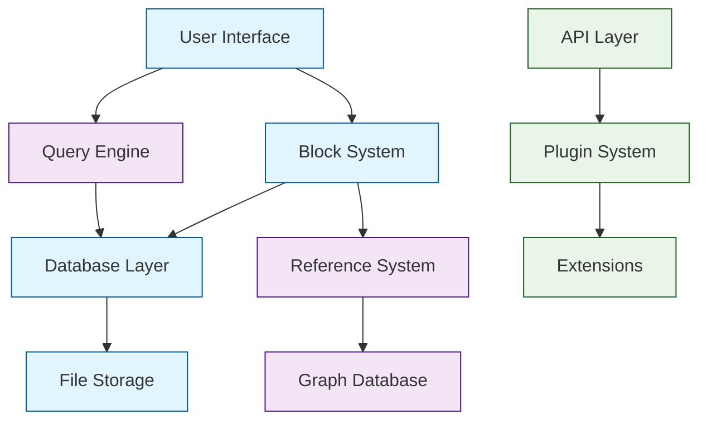

# SiYuan Tutorial: Privacy-First Knowledge Management

> This tutorial is AI-generated! To learn more, check out [Awesome Code Docs](https://github.com/johnxie/awesome-code-docs)

SiYuan[View Repo](https://github.com/siyuan-note/siyuan) is a privacy-first personal knowledge management system that focuses on building a completely self-hosted, local-first knowledge base. Unlike cloud-based solutions, SiYuan gives you full control over your data while providing powerful features for organizing and connecting your thoughts.

SiYuan combines the best of note-taking apps with advanced features like block-based editing, bi-directional linking, and powerful query capabilities. It's designed for serious knowledge workers who value privacy and data ownership.

## Tutorial Chapters

Welcome to your journey through SiYuan's architecture! This tutorial explores how to build privacy-first knowledge management systems with local data control.

1. **[Chapter 1: Getting Started with SiYuan](01-getting-started.md)** - Installation, basic setup, and core concepts
2. **[Chapter 2: Block-Based Architecture](02-block-architecture.md)** - Understanding SiYuan's unique block system
3. **[Chapter 3: Data Storage & Persistence](03-data-storage.md)** - How SiYuan manages your knowledge base
4. **[Chapter 4: Query System & Search](04-query-system.md)** - Advanced search and data retrieval
5. **[Chapter 5: Plugin Architecture](05-plugin-architecture.md)** - Extending SiYuan with custom functionality
6. **[Chapter 6: Synchronization & Backup](06-synchronization.md)** - Multi-device sync and data safety
7. **[Chapter 7: Advanced Features](07-advanced-features.md)** - SQL queries, API integration, and automation
8. **[Chapter 8: Production Deployment](08-production-deployment.md)** - Self-hosting and enterprise deployment

## What You'll Learn

By the end of this tutorial, you'll be able to:

- **Build local-first knowledge systems** with complete data ownership
- **Implement block-based editing** with rich content types
- **Create powerful query systems** for knowledge discovery
- **Develop plugin architectures** for extensible applications
- **Design data synchronization** strategies for multi-device usage
- **Deploy self-hosted knowledge platforms** with enterprise features
- **Implement privacy-preserving** data management patterns
- **Build graph-based knowledge** connections and relationships

## Prerequisites

- Basic programming knowledge (Go or TypeScript helpful)
- Understanding of databases and data structures
- Familiarity with web technologies
- Interest in knowledge management and productivity

## Learning Path

### 🟢 Beginner Track
Perfect for developers new to knowledge management:
1. Chapters 1-2: Installation and basic block concepts
2. Focus on understanding SiYuan's core philosophy

### 🟡 Intermediate Track
For developers building knowledge applications:
1. Chapters 3-5: Storage, queries, and plugin development
2. Learn to extend and customize SiYuan

### 🔴 Advanced Track
For enterprise deployment and customization:
1. Chapters 6-8: Sync, advanced features, and production deployment
2. Master enterprise-grade knowledge management

---

**Ready to explore privacy-first knowledge management? Let's begin with [Chapter 1: Getting Started](01-getting-started.md)!**

*Generated by [AI Codebase Knowledge Builder](https://github.com/The-Pocket/Tutorial-Codebase-Knowledge)*
