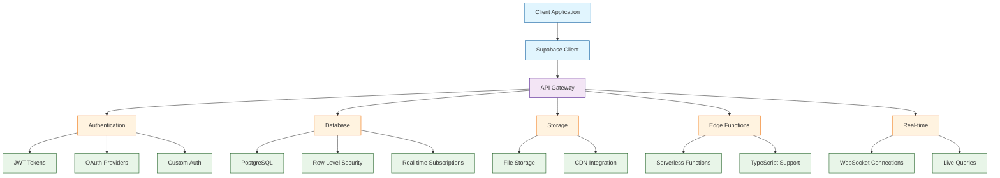

# Supabase Tutorial: Building Modern Backend Applications

> This tutorial is AI-generated! To learn more, check out [Awesome Code Docs](https://github.com/johnxie/awesome-code-docs)

Supabase[View Repo](https://github.com/supabase/supabase) is an open-source Firebase alternative that provides a complete backend-as-a-service platform with PostgreSQL database, real-time subscriptions, authentication, storage, and edge functions. It combines the power of enterprise-grade databases with the simplicity of modern development workflows.

Supabase transforms how developers build applications by providing a complete backend infrastructure that scales automatically while maintaining full control and customization capabilities.

## Tutorial Chapters

Welcome to your journey through modern backend development! This tutorial explores how to build scalable, secure applications with Supabase's comprehensive platform.

1. **[Chapter 1: Getting Started with Supabase](01-getting-started.md)** - Project setup, database creation, and first API calls
2. **[Chapter 2: Database Design & Management](02-database-design.md)** - PostgreSQL schema design, migrations, and data modeling
3. **[Chapter 3: Authentication & Authorization](03-authentication.md)** - User management, OAuth integration, and security
4. **[Chapter 4: Real-time Features](04-realtime-features.md)** - Live subscriptions, real-time updates, and WebSocket connections
5. **[Chapter 5: Storage & File Management](05-storage-management.md)** - File uploads, CDN integration, and media handling
6. **[Chapter 6: Edge Functions](06-edge-functions.md)** - Serverless functions, API routes, and custom logic
7. **[Chapter 7: Advanced Queries & RLS](07-advanced-queries.md)** - Complex queries, Row Level Security, and performance optimization
8. **[Chapter 8: Production Deployment](08-production-deployment.md)** - Scaling, monitoring, and production best practices

## What You'll Learn

By the end of this tutorial, you'll be able to:

- **Set up complete backend infrastructure** with Supabase's platform
- **Design and manage PostgreSQL databases** with advanced features
- **Implement secure authentication systems** with multiple providers
- **Build real-time applications** with live data synchronization
- **Manage file storage and delivery** with global CDN
- **Create serverless functions** for custom business logic
- **Implement complex security policies** with Row Level Security
- **Deploy production applications** with monitoring and scaling

## Prerequisites

- Basic JavaScript/TypeScript knowledge
- Understanding of REST APIs and databases
- Familiarity with React, Vue, or similar frontend framework
- Basic understanding of SQL (helpful but not required)

## Learning Path

### 🟢 Beginner Track
Perfect for developers new to backend development:
1. Chapters 1-2: Project setup and basic database operations
2. Focus on understanding Supabase's core functionality

### 🟡 Intermediate Track
For developers building full-stack applications:
1. Chapters 3-5: Authentication, real-time features, and storage
2. Learn to build interactive, secure applications

### 🔴 Advanced Track
For production application development:
1. Chapters 6-8: Edge functions, advanced security, and production deployment
2. Master enterprise-grade backend development

---

**Ready to build modern backend applications with Supabase? Let's begin with [Chapter 1: Getting Started](01-getting-started.md)!**

*Generated by [AI Codebase Knowledge Builder](https://github.com/The-Pocket/Tutorial-Codebase-Knowledge)*
