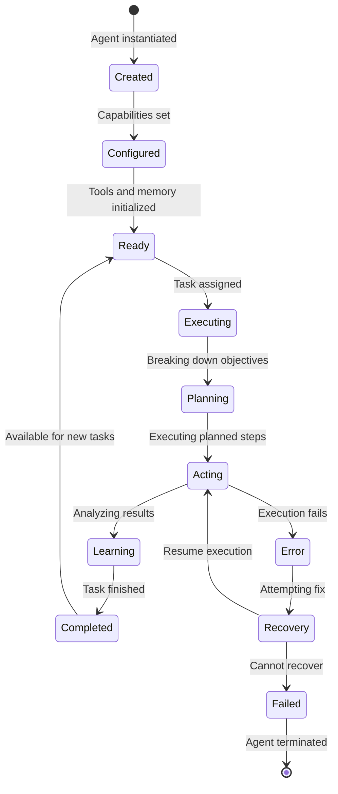

# Chapter 1: Getting Started with SuperAGI

Welcome to SuperAGI! If you've ever wanted to build AI agents that can think, plan, and execute complex tasks autonomously, you're in the right place. SuperAGI provides a production-ready framework for creating sophisticated autonomous agents that can operate independently in real-world applications.

## What Makes SuperAGI Special?

SuperAGI revolutionizes AI agent development by:
- **True Autonomy** - Agents that operate independently without constant supervision
- **Production Ready** - Built for real-world deployment and scaling
- **Advanced Reasoning** - Sophisticated planning and decision-making capabilities
- **Tool Integration** - Seamless connection to external APIs and services
- **Learning Systems** - Continuous improvement through experience and feedback
- **Multi-Agent Coordination** - Teams of agents working together on complex tasks

## Installation Options

### Docker Installation (Recommended)

```bash
# Clone the repository
git clone https://github.com/TransformerOptimus/SuperAGI.git
cd SuperAGI

# Start with Docker Compose
docker-compose up -d

# Access the web interface at http://localhost:3000
```

### Local Development Setup

```bash
# Clone the repository
git clone https://github.com/TransformerOptimus/SuperAGI.git
cd SuperAGI

# Install Python dependencies
pip install -r requirements.txt

# Install Node.js dependencies
cd frontend
npm install
npm run build
cd ..

# Set up environment variables
cp .env.example .env
# Edit .env with your API keys

# Start the backend
python -m uvicorn main:app --host 0.0.0.0 --port 8000

# Start the frontend (in another terminal)
cd frontend
npm run dev
```

### Manual Installation

```bash
# Install system dependencies
sudo apt-get update
sudo apt-get install python3.9 python3-pip nodejs npm

# Clone and setup
git clone https://github.com/TransformerOptimus/SuperAGI.git
cd SuperAGI

# Install Python packages
pip install -r requirements.txt

# Install frontend dependencies
cd frontend
npm install
npm run build
cd ..

# Configure environment
cp config_template.yaml config.yaml
# Edit config.yaml with your settings
```

## Your First Autonomous Agent

Let's create your first AI agent that can work independently:

### Step 1: Access SuperAGI Interface

```bash
# After installation, access the web interface
open http://localhost:3000

# Or if using Docker
open http://localhost:3000
```

### Step 2: Create Your First Agent

```python
from superagi import Agent, Tool, Memory
from superagi.tools import WebSearchTool, FileOperationsTool

# Create a research agent
agent = Agent(
    name="ResearchAssistant",
    description="An AI assistant that conducts research and analysis",
    goal="Help users find and analyze information effectively",
    role="Research Specialist",
    tools=[
        WebSearchTool(),
        FileOperationsTool(),
    ],
    memory=Memory(type="vector", capacity=1000),
    llm_config={
        "model": "gpt-4",
        "temperature": 0.3,
        "max_tokens": 2000
    }
)

print(f"🤖 Agent '{agent.name}' created successfully!")
```

### Step 3: Configure Agent Capabilities

```python
# Define agent capabilities
agent_capabilities = {
    "research": {
        "web_search": True,
        "data_analysis": True,
        "report_generation": True
    },
    "communication": {
        "email_sending": False,
        "slack_integration": False,
        "api_calls": True
    },
    "file_operations": {
        "read_files": True,
        "write_files": True,
        "process_data": True
    }
}

# Configure the agent
agent.configure_capabilities(agent_capabilities)

# Set operational constraints
agent.set_constraints({
    "max_execution_time": 3600,  # 1 hour
    "max_api_calls": 100,
    "allowed_domains": ["*.wikipedia.org", "*.arxiv.org", "*.github.com"],
    "safety_level": "high"
})
```

### Step 4: Give Your Agent a Task

```python
# Define a research task
task = {
    "description": "Research the latest developments in quantum computing and create a summary report",
    "objectives": [
        "Find recent papers on quantum computing breakthroughs",
        "Analyze current state of quantum hardware",
        "Identify key players and their achievements",
        "Create a comprehensive summary report"
    ],
    "constraints": {
        "time_limit": 1800,  # 30 minutes
        "quality_threshold": 0.8,
        "sources_required": 5
    },
    "deliverables": [
        "research_summary.pdf",
        "key_findings.json",
        "sources_list.txt"
    ]
}

# Execute the task
result = agent.execute_task(task)

print("✅ Task completed!")
print("📄 Results:", result)
```

### Step 5: Monitor Agent Performance

```python
# Get agent status
status = agent.get_status()
print(f"🔄 Agent Status: {status['state']}")
print(f"📊 Tasks Completed: {status['completed_tasks']}")
print(f"⚡ Success Rate: {status['success_rate'] * 100}%")

# View execution logs
logs = agent.get_execution_logs()
for log in logs[-5:]:  # Last 5 log entries
    print(f"[{log['timestamp']}] {log['level']}: {log['message']}")

# Check resource usage
resources = agent.get_resource_usage()
print(f"🧠 Memory Usage: {resources['memory_mb']} MB")
print(f"🔗 API Calls: {resources['api_calls']}")
print(f"⏱️ Execution Time: {resources['total_time']} seconds")
```

## Understanding SuperAGI Architecture

### Core Components

```
SuperAGI System
├── Agent Core - Central intelligence and decision making
├── Tool System - External capability integration
├── Memory System - Context and experience storage
├── Planning Engine - Task decomposition and strategy
├── Execution Engine - Action implementation and monitoring
├── Learning System - Continuous improvement and adaptation
└── Management Interface - Configuration and monitoring
```

### Agent Lifecycle



### Agent Types

```python
# Research Agent
research_agent = Agent(
    name="ResearchAgent",
    role="Research Specialist",
    capabilities=["web_search", "data_analysis", "report_generation"],
    tools=[WebSearchTool(), DataAnalysisTool()],
    memory=VectorMemory(capacity=2000)
)

# Development Agent
dev_agent = Agent(
    name="DevAgent",
    role="Software Developer",
    capabilities=["code_generation", "testing", "deployment"],
    tools=[CodeGenerationTool(), TestingTool(), DeploymentTool()],
    memory=CodeMemory(language="python")
)

# Business Agent
business_agent = Agent(
    name="BusinessAgent",
    role="Business Analyst",
    capabilities=["market_analysis", "financial_modeling", "strategy_planning"],
    tools=[MarketAnalysisTool(), FinancialTool()],
    memory=DocumentMemory(capacity=5000)
)
```

## Working with Tools

### Built-in Tools

```python
from superagi.tools import (
    WebSearchTool,
    FileOperationsTool,
    EmailTool,
    DatabaseTool,
    APITool,
    CodeExecutionTool
)

# Web search tool
web_tool = WebSearchTool(
    name="web_search",
    description="Search the web for information",
    config={
        "search_engine": "google",
        "max_results": 10,
        "timeout": 30
    }
)

# File operations tool
file_tool = FileOperationsTool(
    name="file_ops",
    description="Read, write, and manipulate files",
    config={
        "allowed_extensions": [".txt", ".md", ".json", ".py"],
        "max_file_size": "10MB"
    }
)

# API integration tool
api_tool = APITool(
    name="api_integration",
    description="Make API calls to external services",
    config={
        "base_url": "https://api.example.com",
        "auth_type": "bearer",
        "rate_limit": 100
    }
)
```

### Custom Tools

```python
from superagi import BaseTool

class CustomAnalysisTool(BaseTool):
    name = "custom_analysis"
    description = "Perform custom data analysis"

    def __init__(self, config=None):
        super().__init__(config)
        self.analysis_model = self.load_model()

    def execute(self, input_data):
        """Execute the custom analysis"""
        try:
            # Perform analysis
            result = self.analysis_model.analyze(input_data)

            # Log the execution
            self.log_execution({
                "input_size": len(input_data),
                "analysis_type": "custom",
                "result_quality": result.get("confidence", 0)
            })

            return result

        except Exception as e:
            self.log_error(f"Analysis failed: {str(e)}")
            return {"error": str(e)}

    def load_model(self):
        """Load the analysis model"""
        # Implementation for loading your custom model
        return CustomAnalysisModel()
```

## Memory Systems

### Memory Types

```python
from superagi.memory import (
    VectorMemory,      # For semantic search and similarity
    DocumentMemory,    # For document storage and retrieval
    KeyValueMemory,    # For simple key-value storage
    GraphMemory        # For relationship-based storage
)

# Vector memory for semantic search
vector_memory = VectorMemory(
    capacity=1000,
    embedding_model="text-embedding-ada-002",
    similarity_threshold=0.8
)

# Document memory for content storage
doc_memory = DocumentMemory(
    capacity=5000,
    chunk_size=1000,
    overlap=100
)

# Graph memory for relationships
graph_memory = GraphMemory(
    max_nodes=10000,
    relationship_types=["related_to", "depends_on", "references"]
)
```

### Memory Operations

```python
# Store information
agent.memory.store({
    "type": "experience",
    "content": "Successfully completed research task",
    "metadata": {
        "task_type": "research",
        "success_rate": 0.95,
        "duration": 1800
    }
})

# Retrieve relevant memories
relevant_memories = agent.memory.retrieve(
    query="research task experiences",
    limit=5,
    similarity_threshold=0.7
)

# Update memory
agent.memory.update(
    memory_id="mem_123",
    updates={"success_rate": 0.98}
)

# Delete old memories
agent.memory.cleanup(older_than_days=30)
```

## Configuration and Deployment

### Environment Configuration

```python
# Production configuration
production_config = {
    "agent": {
        "name": "ProductionAgent",
        "log_level": "INFO",
        "max_concurrent_tasks": 5,
        "timeout": 3600
    },
    "llm": {
        "provider": "openai",
        "model": "gpt-4",
        "temperature": 0.3,
        "max_tokens": 2000,
        "rate_limit": 100
    },
    "memory": {
        "type": "vector",
        "capacity": 10000,
        "persistence": True,
        "backup_interval": 3600
    },
    "tools": {
        "max_parallel": 3,
        "timeout": 300,
        "retry_attempts": 3
    }
}

# Apply configuration
agent.configure(production_config)
```

### Deployment Options

```bash
# Deploy as a service
superagi deploy agent \
  --name "research-agent" \
  --config production_config.yaml \
  --port 8080 \
  --workers 4

# Deploy to cloud
superagi deploy cloud \
  --provider aws \
  --region us-east-1 \
  --instance-type t3.medium \
  --auto-scaling true

# Deploy with Docker
docker build -t superagi-agent .
docker run -p 8080:8080 \
  -e OPENAI_API_KEY=your-key \
  -v /data:/app/data \
  superagi-agent
```

## Monitoring and Observability

### Agent Metrics

```python
# Get performance metrics
metrics = agent.get_metrics()

print("📊 Agent Performance Metrics:")
print(f"Tasks Completed: {metrics['tasks_completed']}")
print(f"Success Rate: {metrics['success_rate'] * 100}%")
print(f"Average Response Time: {metrics['avg_response_time']}s")
print(f"Memory Usage: {metrics['memory_usage_mb']} MB")
print(f"API Calls Made: {metrics['api_calls_total']}")

# Get detailed logs
logs = agent.get_logs(
    level="INFO",
    since="2024-01-01",
    limit=100
)

for log in logs:
    print(f"[{log['timestamp']}] {log['level']}: {log['message']}")
```

### Health Monitoring

```python
# Check agent health
health = agent.health_check()

if health["status"] == "healthy":
    print("✅ Agent is healthy")
    print(f"Last activity: {health['last_activity']}")
    print(f"Active tasks: {health['active_tasks']}")
else:
    print("⚠️ Agent health issues detected:")
    for issue in health["issues"]:
        print(f"  - {issue}")

# Auto-healing
if not health["status"] == "healthy":
    agent.auto_heal()
    print("🔧 Attempting auto-healing...")
```

## What We've Accomplished

Congratulations! 🎉 You've successfully:

1. **Installed SuperAGI** and set up your development environment
2. **Created your first autonomous AI agent** with custom capabilities
3. **Understood the core architecture** of SuperAGI's agent system
4. **Worked with different tools and memory systems** for enhanced functionality
5. **Configured agents for production deployment** with proper monitoring
6. **Implemented basic monitoring and observability** for agent performance

## Next Steps

Now that you have a working SuperAGI setup, let's explore the agent architecture in more detail. In [Chapter 2: Agent Architecture](02-agent-architecture.md), we'll dive into the design patterns and components that make SuperAGI agents so powerful.

---

**Practice what you've learned:**
1. Create agents with different roles and capabilities
2. Experiment with various tools and memory systems
3. Try deploying an agent with different configurations
4. Monitor agent performance and health metrics

*What kind of autonomous agent would you build first with SuperAGI?* 🤖
