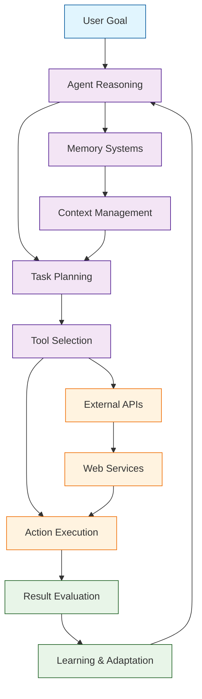

# SuperAGI Tutorial: Production-Ready Autonomous AI Agents

> This tutorial is AI-generated! To learn more, check out [Awesome Code Docs](https://github.com/johnxie/awesome-code-docs)

SuperAGI[View Repo](https://github.com/TransformerOptimus/SuperAGI) is a production-ready autonomous AI agent framework that enables developers to build sophisticated AI agents capable of performing complex tasks independently. It provides a comprehensive platform for creating, deploying, and managing autonomous agents with advanced reasoning, tool integration, and self-improvement capabilities.

SuperAGI combines the power of large language models with practical agent architectures, enabling agents to plan, execute, and learn from their experiences in real-world applications.

## Tutorial Chapters

Welcome to your journey through autonomous AI agent development! This tutorial explores how to build production-ready autonomous agents with SuperAGI.

1. **[Chapter 1: Getting Started with SuperAGI](01-getting-started.md)** - Installation, setup, and your first autonomous agent
2. **[Chapter 2: Agent Architecture](02-agent-architecture.md)** - Understanding SuperAGI's agent design patterns
3. **[Chapter 3: Tool Integration](03-tool-integration.md)** - Connecting agents to external tools and APIs
4. **[Chapter 4: Memory & Learning](04-memory-learning.md)** - Implementing persistent memory and learning systems
5. **[Chapter 5: Task Planning](05-task-planning.md)** - Advanced planning and goal decomposition
6. **[Chapter 6: Multi-Agent Systems](06-multi-agent-systems.md)** - Coordinating multiple agents for complex tasks
7. **[Chapter 7: Deployment & Scaling](07-deployment-scaling.md)** - Production deployment and performance optimization
8. **[Chapter 8: Advanced Features](08-advanced-features.md)** - Custom agents, plugins, and enterprise integrations

## What You'll Learn

By the end of this tutorial, you'll be able to:

- **Build autonomous AI agents** that can execute complex tasks independently
- **Design agent architectures** with reasoning, planning, and execution capabilities
- **Integrate external tools and APIs** for enhanced agent functionality
- **Implement memory systems** for context retention and learning
- **Create multi-agent systems** that collaborate on complex objectives
- **Deploy agents at scale** with proper monitoring and optimization
- **Customize agent behavior** through plugins and configuration
- **Manage agent lifecycles** from development to production

## Prerequisites

- Python 3.8+
- Basic understanding of AI/ML concepts
- Familiarity with async programming (helpful but not required)
- Knowledge of API integration patterns

## Learning Path

### 🟢 Beginner Track
Perfect for developers new to autonomous agents:
1. Chapters 1-2: Setup and basic agent architecture
2. Focus on understanding agent design principles

### 🟡 Intermediate Track
For developers building agent applications:
1. Chapters 3-5: Tool integration, memory, and planning
2. Learn to build sophisticated autonomous systems

### 🔴 Advanced Track
For production autonomous agent development:
1. Chapters 6-8: Multi-agent systems, deployment, and advanced features
2. Master enterprise-grade autonomous agent frameworks

---

**Ready to build production-ready autonomous AI agents? Let's begin with [Chapter 1: Getting Started](01-getting-started.md)!**

*Generated by [AI Codebase Knowledge Builder](https://github.com/johnxie/awesome-code-docs)*
